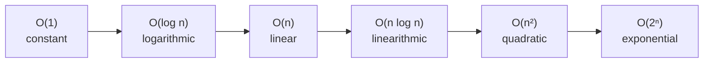
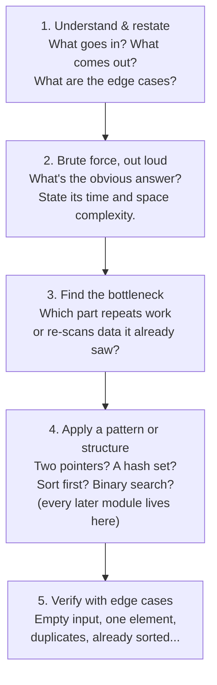

# 01 — Big-O & Foundations

## Why this exists

Two programs can give the exact same answer. One finishes in 1
millisecond, the other takes an hour — on the same input, on the same
machine. The difference isn't the CPU. It's the *shape* of the work
each program does as the input grows. Big-O is how we predict that
shape **before running anything** — from reading the code alone. Every
pattern, data structure, and "can you do better?" in this course comes
back to this one skill.

## The RAM model, in one paragraph

We pretend the computer is a simple machine where reading a variable,
writing a variable, comparing two values, or doing one arithmetic
operation each cost exactly **1 "op"**. We don't care whether that op
takes a nanosecond on your laptop or a picosecond on a supercomputer —
we only care how the **number of ops grows** as the input size `n`
grows. That growth rate is what Big-O measures.

## The growth-rate ranking



*What to notice: each arrow is a step up in "how fast the ops explode
as n grows." O(1) doesn't care about n at all; O(2ⁿ) becomes
unusable after n gets past a few dozen.*

Concretely, for **n = 1,000,000**:

| Complexity | Ops for n = 1,000,000 | Feel |
| --- | --- | --- |
| O(1) | 1 | instant, always |
| O(log n) | ~20 | instant |
| O(n) | 1,000,000 | a few ms |
| O(n log n) | ~20,000,000 | well under a second |
| O(n²) | 1,000,000,000,000 | minutes to hours |
| O(2ⁿ) | more than atoms in the universe | never finishes |

That jump from O(n log n) to O(n²) is the line most interview
problems live on: brute force lands you on the wrong side of it, and
the whole game is finding the pattern that gets you back across.

## How to recognize it

Before you trace through an example, these cues often tell you the
complexity straight from the problem statement or the shape of the
code:

- Work that never depends on the size of the input at all →
  **O(1)**.
- A single pass over every element, start to finish → **O(n)**.
- Each step throws away half of what's left (a search, not a scan) →
  **O(log n)**.
- Sorting first, or a linear pass paired with a halving step →
  **O(n log n)**.
- One loop running inside another over the same collection →
  **O(n²)**.
- Branching recursion where each call spawns two more, shrinking the
  problem by only 1 each time → **O(2ⁿ)**.
- Steps that happen one after another ADD; steps nested inside each
  other MULTIPLY. Almost every case above falls out of that one rule.

## Reading complexity from code

Three rules cover almost everything you'll see in this course:

**Sequential steps ADD.** Two loops back-to-back, each touching every
element once:

```python
for x in nums:      # n ops
    total += x
for x in nums:       # n ops
    print(x)
# n + n = 2n  ->  O(n).  Constants (the 2) get dropped.
```

**Nested steps MULTIPLY.** A loop inside a loop:

```python
for a in nums:        # n ops
    for b in nums:      # n ops, EVERY time the outer loop ticks
        pairs.append((a, b))
# n * n = n²  ->  O(n²)
```

**Halving is LOG.** Any loop or recursion that throws away half the
remaining work each step:

```python
lo, hi = 0, len(arr) - 1
while lo <= hi:
    mid = (lo + hi) // 2
    if arr[mid] == target:
        return mid
    elif arr[mid] < target:
        lo = mid + 1
    else:
        hi = mid - 1
# search space halves each iteration -> O(log n)
```

## Space complexity

Space complexity counts **extra** memory your algorithm allocates —
never the input itself. A function that loops over `nums` and returns
a running total uses O(1) extra space (one variable, `total`), even
though `nums` itself takes O(n) memory to store. A function that
builds a brand-new list the same size as `nums` uses O(n) extra space.
Always ask: "space *beyond* what I was handed."

## Amortized cost — a teaser

Sometimes one operation is occasionally expensive, but rare enough
that it doesn't matter *on average*. Picture an array that starts tiny
and **doubles its capacity** whenever it runs out of room. Most
appends just drop a value in an open slot — O(1). Every so often, an
append triggers a full doubling — O(current size). That sounds
worrying, but doublings get exponentially rarer as the array grows, so
the *average* cost per append, over many appends, still works out to
O(1). This is called **amortized O(1)**, and it's exactly how Python's
own `list.append` behaves. Module 02 builds this array from scratch;
`ex04` in this module lets you see the numbers for yourself.

## The 5-step problem-solving framework

This is the single most important diagram in the whole course. Every
module from here on is really just teaching you new answers to step 4.



*What to notice: step 2 is not optional filler — naming the brute
force AND its complexity is what lets you recognize, in step 3,
exactly which part of it is slow. Skipping straight to "the trick" is
how you memorize solutions instead of learning to derive them.*

You'll walk this exact framework in `ex05` of this module, and your
instructor (via `CLAUDE.md`) will keep pulling you back to it any time
you jump straight to code.

### Worked example: does a pair sum to a target?

`nums = [5, 1, 9, 3]`, `target = 4`. Walking steps 1–4: restate as
"does some pair of different positions add up to 4?"; the brute force
checks every pair, O(n²); the bottleneck is that for each `x` we
rescan the whole array hunting for its partner; the pattern is to
remember every value we've already visited in a set, so each new `x`
only needs a single lookup for its complement (`target - x`):

| Step | x | complement (target - x) | in `seen`? | seen after this step |
| --- | --- | --- | --- | --- |
| 1 | 5 | -1 | no | {5} |
| 2 | 1 | 3 | no | {5, 1} |
| 3 | 9 | -5 | no | {5, 1, 9} |
| 4 | 3 | 1 | **yes → return true** | {5, 1, 9, 3} |

Step 5 (verify): what about an empty array? A single element? A
target with no matching pair at all (e.g. `[5, 1]`, target `100`)?
`ex05` has you build exactly this.

## Gotchas

- **Constants don't matter — until they do.** O(2n) and O(n) are both
  "O(n)," but if n is small and the constant is huge, the "worse"
  complexity can run faster in practice. Big-O describes what happens
  as n gets large, not what happens at n = 10.
- **Best, worst, and average case are different numbers.** Searching
  an unsorted list for a value you find at index 0 is O(1) *best
  case*, but the algorithm is still O(n) — we describe algorithms by
  their worst case unless stated otherwise, because that's the
  guarantee you can actually rely on.
- **"n" must be named.** "O(n)" is meaningless until you say what n
  counts — the length of an array? The number of nodes in a tree? The
  value of an integer itself (which is very different from the number
  of *digits* in it)? Always say "n = ..." before quoting a complexity.

## Try it now

→ `exercises/ex01_growth_rates.py` through
`exercises/ex05_target_pair.py`, then `checkpoint_01.py`.
Check with `uv run pytest 01-big-o-foundations`.
