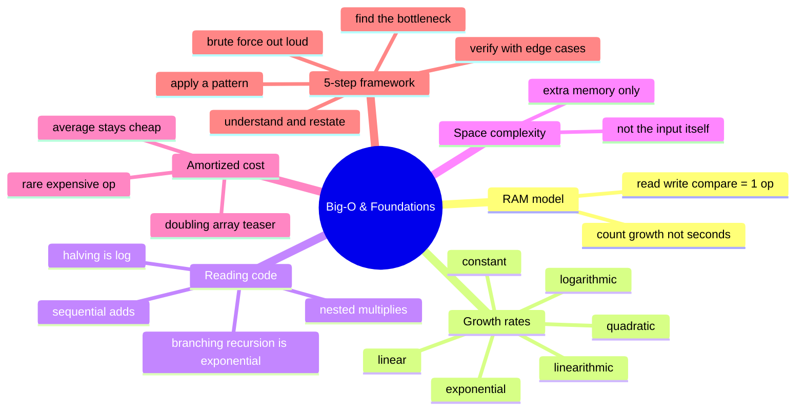

# 01 — Big-O & Foundations · Cheat-sheet

## Concept map

*What to notice: everything in this module funnels into the 5-step
framework at the bottom -- growth rates and code-reading are how you
fill in step 2 (name the brute force complexity), and every pattern
from module 04 onward is an answer to step 4.*

## Growth rates, with real numbers (n = 1,000,000)

| Complexity | Ops for n = 1,000,000 | Feel |
| --- | --- | --- |
| O(1) | 1 | instant, always |
| O(log n) | ~20 | instant |
| O(n) | 1,000,000 | a few ms |
| O(n log n) | ~20,000,000 | well under a second |
| O(n^2) | 1,000,000,000,000 | minutes to hours |
| O(2^n) | astronomically large | never finishes |

## Reading complexity from code

| Code shape | Rule | Example |
| --- | --- | --- |
| Two loops back-to-back | ADD then drop constants | `for..for` each O(n) -> O(n) |
| A loop inside a loop | MULTIPLY | O(n) * O(n) -> O(n^2) |
| Loop/recursion that halves the remaining work | LOG | binary search -> O(log n) |
| Recursion that branches into 2+ calls per level | roughly EXPONENTIAL | generate all subsets -> O(2^n) |

## Space complexity

Count **extra** memory only -- never the input you were handed.
A running total (`total = 0`) is O(1) extra space. A brand-new list the
same size as the input is O(n) extra space.

## The 5-step framework

1. **Understand & restate** -- what's the input, output, edge cases?
2. **Brute force, out loud** -- the obvious answer, and its complexity.
3. **Find the bottleneck** -- what repeats or re-scans wastefully?
4. **Apply a pattern or structure** -- this is where the rest of the
   course lives.
5. **Verify with edge cases** -- empty, single element, duplicates,
   already sorted, all equal.

## Gotchas

- Constants don't matter for Big-O, but they matter in real life at
  small n.
- Big-O usually means **worst case** unless stated otherwise.
- Always name what "n" counts before quoting a complexity.

## Self-quiz

1. In the RAM model, what counts as one "op"?
2. Two loops that each scan the whole input, one after another -- what
   complexity, and why do you ADD instead of MULTIPLY?
3. Why does a loop that halves its range each iteration give O(log n)?
4. A function loops over an n-element input and returns a running sum.
   What's its space complexity, and why isn't it O(n)?
5. What does "amortized O(1)" mean for a doubling dynamic array, if
   individual appends can cost O(n)?
6. Why do we usually describe an algorithm by its worst case instead
   of its best case?
7. Name the 5 steps of the problem-solving framework, in order.
8. Which step of the framework does "two pointers" or "a hash set"
   belong to?

Answers

1. A read, a write, a comparison, or one arithmetic operation.
2. O(n). Sequential steps ADD (n + n = 2n), and constants get dropped,
   so 2n is still O(n). You only MULTIPLY when one loop runs *inside*
   another.
3. Each iteration throws away half of what's left to search, so the
   number of iterations is however many times you can halve n before
   reaching 1 -- that's floor(log2(n)) + 1.
4. O(1) -- the running total is one variable that doesn't grow with
   the input. Space complexity only counts memory *beyond* the input;
   the input itself isn't charged to the algorithm.
5. Individual appends can spike to O(n) when a resize happens, but
   resizes get exponentially rarer as the array grows, so the total
   cost over n appends stays proportional to n -- an *average* of O(1)
   per append, even though no single append is guaranteed O(1).
6. Because worst case is the guarantee you can actually rely on --
   best case can be misleadingly optimistic (e.g. finding a value at
   index 0 doesn't mean the search is fast in general).
7. Understand & restate -> brute force out loud -> find the bottleneck
   -> apply a pattern/structure -> verify with edge cases.
8. Step 4 -- applying a pattern or structure is exactly where a named
   technique like two pointers or a hash set gets chosen.

## Pattern-recognition drill

For each one-liner, name the **complexity class** it describes (not a
pattern -- that starts next module). Answers in `
`.

1. A function that returns `arr[len(arr) // 2]`.
2. A function that checks every possible pair in a list of n items.
3. Binary search on a sorted array of n items.
4. Sorting a list of n items with Python's `sorted()`, then printing
   each item once.
5. A recursive function that, for an input of size n, makes two
   recursive calls on inputs of size n - 1 (no memoization).
6. A function with a single `for` loop over an n-element list, doing
   constant work per iteration.
7. A function with three independent `for` loops over the same
   n-element list, one after another.

Answers

1. O(1) -- indexing is a direct lookup, regardless of list length.
2. O(n^2) -- nested "every pair" comparison.
3. O(log n) -- halves the search space each step.
4. O(n log n) -- the sort dominates; the scan afterward is only O(n).
5. O(2^n) -- two branches per level, roughly n levels deep.
6. O(n) -- one pass, constant work each step.
7. O(n) -- three sequential O(n) loops add to 3n, and constants drop.

## Try it now

-> `exercises/ex01_growth_rates.py` through
`exercises/ex05_target_pair.py`, then `checkpoint_01.py`.
Check with `uv run pytest 01-big-o-foundations`.
