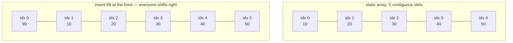
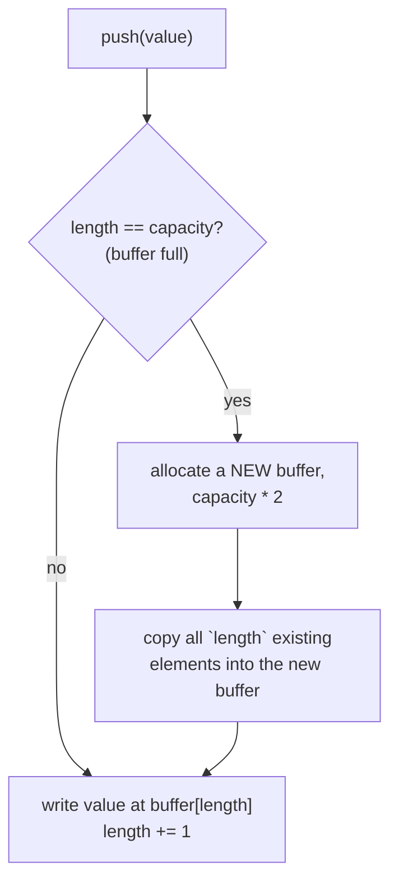

# 02 — Arrays & Dynamic Arrays

## Why this exists

The array is the structure everything else in this course gets measured
against. It gives you O(1) index access — jump straight to element 500
with no searching — because elements sit in contiguous memory at a
known stride. The price: insert or delete in the middle costs O(n),
because every element after the gap has to shift to close (or open) it.
Almost every other data structure exists to dodge that one weakness
while trying to keep the O(1) index.

## Static array memory layout



*What to notice: reading `S2` is one memory access — address = base +
2 * element_size, no searching. But inserting at the front (`InsertFront`)
has to move all 5 existing elements one slot over before the new value
can go in slot 0 — that's O(n) work for a single insert, no matter how
small the array.*

## How to recognize it

Reach for array/index thinking when a problem statement says:

- "**in place**" or "**O(1) extra space**" on an array/string problem —
  you'll be shuffling elements with indices, not building a new
  container.
- "**shift**", "**rotate**", or "**partition**" a list.
- "remove/compact/dedupe" while keeping relative order — smells like a
  reader/writer sweep.
- Two sorted lists/arrays need combining — smells like a linear merge.
- Row/column/diagonal work on a grid — index gymnastics in 2D.

## Dynamic arrays: capacity vs length

A static array's size is fixed at creation. A **dynamic array** (Python's
`list`, Java's `ArrayList`, C++'s `vector`) *feels* infinitely growable
because it manages a static array underneath and swaps in a bigger one
when it runs out of room.

Two numbers matter:
- **length** (or size) — how many elements are actually stored.
- **capacity** — how many slots the backing buffer currently has.
  `capacity >= length` always; the extra slots are pre-allocated room to
  grow into without a resize.

This is exactly the `append_costs` simulation from module 01: most
pushes are O(1) (there's room, just write and bump length), but every
so often the buffer is full and a push has to pay for a full copy.
**Doubling** the capacity on every resize (instead of growing by a fixed
amount) is what keeps the *average* cost of a push at O(1) — see
Complexity, below.

## Resize flowchart



*What to notice: the copy step (`D`) only runs when the buffer is
completely full — that's the expensive O(n) case. Every push in between
two resizes takes the cheap O(1) path (`B` → `E`) directly.*

## The template: reader/writer two-index sweep

A huge share of "modify an array in place" problems share one skeleton:
one index (`read`) scans every element once, a second index (`write`)
only advances when the current element should survive. Preview: this is
also the backbone of the two-pointer pattern in module 04.

```python
def compact_in_place(nums: list[int], keep) -> int:
    """Keep only elements where keep(x) is True, packed at the front.
    Returns the new logical length."""
    write = 0
    for read in range(len(nums)):
        if keep(nums[read]):
            nums[write] = nums[read]
            write += 1
    return write
```

`read` never looks back, `write` never looks ahead of `read` — so it's
always safe to overwrite `nums[write]`, even though `read` and `write`
point into the same array.

## Worked example: dedupe-sorted, traced

`dedupe_sorted([1, 1, 2, 2, 2, 3])` — remove duplicates in place from a
sorted array, survivors packed at the front.

| step | read | nums[read] | write | nums[write-1] (last kept) | action | nums so far |
| --- | --- | --- | --- | --- | --- | --- |
| start | – | – | 1 | 1 | – | `[1, 1, 2, 2, 2, 3]` |
| 1 | 1 | 1 | 1 | 1 | 1 == 1, skip | `[1, 1, 2, 2, 2, 3]` |
| 2 | 2 | 2 | 1 | 1 | 2 != 1, keep → write=2 | `[1, 2, 2, 2, 2, 3]` |
| 3 | 3 | 2 | 2 | 2 | 2 == 2, skip | `[1, 2, 2, 2, 2, 3]` |
| 4 | 4 | 2 | 2 | 2 | 2 == 2, skip | `[1, 2, 2, 2, 2, 3]` |
| 5 | 5 | 3 | 2 | 2 | 3 != 2, keep → write=3 | `[1, 2, 3, 2, 2, 3]` |

Final: `write == 3`, so `nums[:3] == [1, 2, 3]` is the deduped result.
Everything from index 3 on is leftover junk the caller should ignore.

## Strings: build, don't concatenate

Strings are immutable in Python — `s += "x"` doesn't mutate `s`, it
allocates a brand-new string and copies the old contents into it plus
`"x"`. Doing that inside a loop is the classic O(n²) trap: n
concatenations, each copying an ever-longer string, totals O(n²)
character copies.

```python
# O(n^2) — avoid: each += copies everything built so far
result = ""
for ch in source:
    result += transform(ch)

# O(n) — build a list of pieces, join once at the end
pieces = []
for ch in source:
    pieces.append(transform(ch))
result = "".join(pieces)
```

`"".join(pieces)` walks every piece exactly once. This build-then-join
shape is used everywhere in `ex05`.

## Complexity

| Operation | Static array | Dynamic array |
| --- | --- | --- |
| Index `get`/`set` | O(1) | O(1) |
| Push/pop at the **end** | n/a (fixed size) | O(1) amortized |
| Insert/delete at **front or middle** | O(n) | O(n) |
| Search (unsorted) | O(n) | O(n) |

**Why push is O(1) amortized:** say capacity doubles every time it's
hit. Between two consecutive resizes, capacity was just doubled from
`c` to `2c`, and the next resize won't happen until another `c` cheap
pushes fill it. Spread that one O(c) copy over the `c` cheap pushes that
earned it, and each push "pays" O(1) on average — even though any
*single* push might trigger the full copy. This only works because
growth is *multiplicative* (doubling); growing by a fixed amount (e.g.
+1 each time) would make every single push O(n).

## Common gotchas

- **Off-by-one on `stop`** — slice/loop bounds are usually
  half-open (`[start, stop)`); forgetting that reads one element too
  many or too few.
- **`length` vs `capacity`** — after a `pop`, capacity does NOT shrink
  in this course's `DynamicArray`; only `length` changes. Confusing the
  two leads to phantom "leftover" elements past the logical end.
- **Aliasing vs copying** — `new_grid = grid` gives you a second name
  for the *same* list; mutating one mutates both. `transpose` and
  `merge` must build genuinely new lists, not aliases.
- **`k > n` in rotations** — always reduce `k %= n` first (and guard
  `n == 0` before the modulo), or you'll do far more work than needed
  and may index out of range.
- **Reading past what you just overwrote** — in `merge_into` (ex04),
  writing front-to-back would clobber `a` values before they've been
  read; that's exactly why it fills from the back.

## Try it now

→ `exercises/ex01_dynamic_array.py` through `exercises/ex06_matrix_walk.py`,
then `checkpoint_02.py`.
Check with `uv run pytest 02-arrays-dynamic-arrays`.
