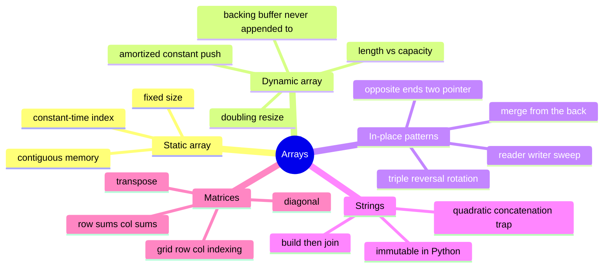

# 02 — Arrays & Dynamic Arrays · Cheat-sheet

## Concept map

*What to notice: every branch is a way of trading "allocate something
new" for "shuffle indices in what you already have" — that trade is the
theme of the whole module.*

## Op-cost table

| Operation | Front | Middle | Back |
| --- | --- | --- | --- |
| Index (`get`/`set`) | O(1) | O(1) | O(1) |
| Search (unsorted) | O(n) | O(n) | O(n) |
| Insert | O(n) — shift everything right | O(n) — shift the tail right | O(1) amortized (dynamic array) |
| Delete | O(n) — shift everything left | O(n) — shift the tail left | O(1) |

## Resize rules (dynamic array)

- Start at capacity 1.
- When `length == capacity` and a push arrives: allocate a new buffer at
  `capacity * 2`, copy every existing element over, THEN write the new
  value.
- Capacity only grows on push; `pop` never shrinks it in this course's
  implementation.
- Doubling (multiplicative growth) is what makes push O(1) *amortized*.
  Growing by a fixed amount instead would make every push O(n).

## In-place pattern checklist

| Pattern | Shape | Used in |
| --- | --- | --- |
| Reader/writer sweep | `write` only advances on a "keep" | `remove_value`, `dedupe_sorted`, `compact` |
| Opposite-ends two pointer | `left`/`right` swap and close in | `reverse` |
| Triple-reversal rotation | reverse all, then reverse each half | `rotate_right`, `rotate_display` |
| Merge from the back | write the shared buffer high-to-low | `merge_into` |

## String-building rule

Never `+=` a string inside a loop (each concatenation copies everything
built so far — O(n²) total). Collect pieces in a list, then
`"".join(pieces)` once — O(n) total.

## Self-quiz

1. Why is indexing an array O(1) but inserting at the front O(n)?
2. What's the difference between a dynamic array's `length` and its
   `capacity`?
3. Why does doubling capacity give amortized O(1) push, while growing
   by a fixed +1 each time does not?
4. In a reader/writer sweep, why is it safe to write into `nums[write]`
   even though `read` and `write` index the same array?
5. What problem does the triple-reversal trick solve, and why does it
   need zero extra arrays?
6. Why does `merge_into` fill from the back instead of the front?
7. Why is repeatedly doing `result += piece` in a loop O(n²) for
   strings specifically, and how does build-then-join avoid it?
8. `transpose([[1, 2, 3], [4, 5, 6]])` — what are the dimensions of the
   result, and why?

Answers

1. Indexing computes a memory address directly (`base + i * size`) — one
   step. Inserting at the front has to shift every existing element one
   slot over first, so the work scales with n.
2. `length` is how many elements are actually stored (what `size()`
   returns); `capacity` is how many slots the backing buffer currently
   has allocated. `capacity >= length` always.
3. With doubling, resizes get exponentially rarer as the array grows, so
   the total copying work across n pushes is O(n) — averaging to O(1)
   per push. With fixed +1 growth, EVERY push triggers a full copy, so n
   pushes cost O(n²) total, i.e. O(n) per push.
4. `write` never moves ahead of `read` — every element `nums[write]` is
   about to be overwritten has already been read (or was already
   decided not to be kept), so nothing needed later gets lost.
5. Rotating an array by k positions without a second array. Reversing
   the whole thing puts every element in its final wrapped-around order
   but backwards within each segment; reversing each segment separately
   fixes the internal order, using only O(1) extra space throughout.
6. The destination buffer overlaps the source data (`a`'s own tail is
   the unused space). Writing front-to-back would overwrite `a` values
   before they've been compared/read; writing back-to-front only ever
   overwrites already-consumed slots.
7. Each `+=` allocates a new string and copies everything built so far
   PLUS the new piece — do that n times and you've copied O(n²)
   characters total. `"".join(pieces)` computes the final size once and
   copies each piece exactly once — O(n) total.
8. `3 x 2` (3 rows, 2 columns) — the original is `2 x 3` (2 rows, 3
   columns); transposing swaps rows and columns, so an r x c grid
   becomes c x r.

## Pattern-recognition drill

For each one-liner, name the pattern/structure before checking the
answer.

1. "Given a sorted array, remove duplicates in place and return the new
   length."
2. "Shift every element of an array k positions to the right, using no
   extra array."
3. "You're asked to build a container that supports adding elements
   with amortized O(1) time, without knowing the final size up front."
4. "Given two sorted arrays where one has extra trailing empty space,
   merge the second into the first without allocating anything new."
5. "Given a sentence with irregular spacing, normalize it and reverse
   the word order."
6. "Compress a string by replacing runs of the same character with the
   character plus a count."
7. "Given a matrix, return a new matrix with rows and columns swapped."
8. "Remove every occurrence of a target value from an array in place,
   packing survivors at the front."

Answers

1. In-place two-index sweep (reader/writer), specialized for sorted
   input — dedupe.
2. Triple-reversal rotation.
3. Dynamic array (doubling resize, amortized analysis).
4. Merge from the back (in-place merge into spare capacity).
5. String build-then-join (`split()` + reversed `join`).
6. Run-length encoding (build-then-join over character runs).
7. Matrix transpose (grid walk into a new grid).
8. In-place two-index sweep (reader/writer) — remove by value.

