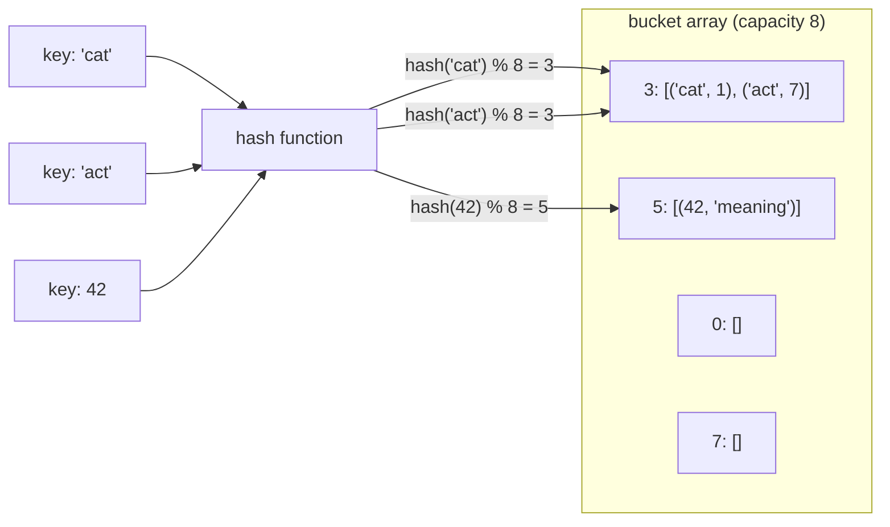
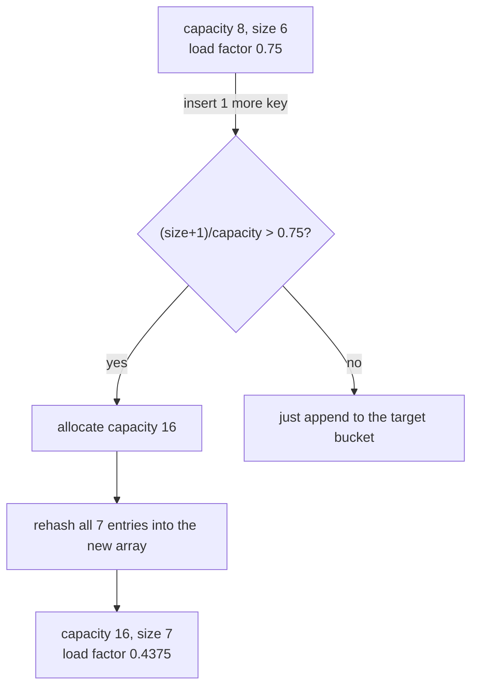

# 03 — Hashing

## Why this exists

"Have I seen this before?" and "what's the complement of this?" are two
of the most common questions in problem-solving, and scanning an array
to answer them is O(n) every single time you ask. A hash map answers
both in O(1) average time by trading space (an extra table) for time
(no scanning). Once you see it, you'll notice it everywhere: counting,
lookups, deduplication, grouping. A rough rule of thumb: half of all
"can you make this faster?" interview follow-ups are answered with "throw
a hash map at it."

## How it works

A hash map is an array of **buckets**. A **hash function** turns a key
into a number, and `number % bucket_count` picks which bucket the entry
lives in. Two different keys can land in the same bucket — that's a
**collision** — so each bucket holds a small list of `(key, value)`
pairs (**chaining**), and finding your key inside a bucket means
scanning that short list.



*What to notice: `"cat"` and `"act"` hash to different numbers but the
SAME bucket index (3) once you take `% 8` — that's a collision. Both
entries just sit in bucket 3's list; a lookup for `"cat"` scans that
list and compares keys until it finds a match.*

As you add entries, buckets fill up and their lists get longer, which
slows lookups back toward O(n). The **load factor**
(`size / bucket_count`) tracks this. When it crosses a threshold
(commonly 0.75), the map **resizes**: it allocates a bigger bucket
array (usually double) and rehashes every existing entry into it,
because `hash(key) % new_capacity` gives a different bucket than
before.



*What to notice: resizing is triggered by a NEW key pushing the load
factor over the threshold — overwriting an existing key's value never
triggers it, because size doesn't grow.*

This is why average-case lookup/insert/delete is **O(1)**: with a good
hash function and a load factor kept below ~1, each bucket holds a
small, roughly constant number of entries. The **worst case is still
O(n)** — a bad hash function (or an adversarial input) could dump every
key into one bucket, turning every operation into a linear scan of a
list with n entries. Python's built-in `dict`/`set` behave exactly this
way under the hood.

## How to recognize it

Reach for a hash map (or set) when the problem statement says:

- "Have I seen this value before?" / "does X exist somewhere in this
  collection?" → a set for pure membership, a map if you also need a
  count or an index.
- "Count occurrences of..." / "how many times does X appear?" → a
  counting map.
- "Find two things that add up to / combine to a target" → complement
  lookup (check `target - x` in the map before adding `x`).
- "Group items that share some property" → a map from canonical
  key → list of items.
- No hint of sorted order, and no requirement to process items in a
  particular sequence → a strong hash-map signal (if the input WERE
  sorted, two pointers is often better — see module 04).

## Templates

**Counting** — tally occurrences:

```python
counts: dict[str, int] = {}
for item in items:
    counts[item] = counts.get(item, 0) + 1
```

**Complement lookup** — the two-sum shape:

```python
seen: dict[int, int] = {}
for i, value in enumerate(nums):
    complement = target - value
    if complement in seen:
        return (seen[complement], i)
    seen[value] = i
```

**Grouping** — cluster by a canonical key:

```python
groups: dict[str, list[str]] = {}
for item in items:
    key = canonical(item)
    groups.setdefault(key, []).append(item)
```

## Worked example: two-sum, traced

`pair_sum([2, 7, 11, 15], target=9)` using the complement-lookup
template. `seen` starts empty.

| i | value | complement (9 - value) | complement in `seen`? | action | `seen` after |
| --- | --- | --- | --- | --- | --- |
| 0 | 2 | 7 | no | store 2 → 0 | `{2: 0}` |
| 1 | 7 | 2 | **yes** (2 → 0) | return `(0, 1)` | — |

One pass, no nested loop: by the time we look at `7`, we already know
whether its partner showed up earlier.

## Complexity

Every template above is **O(n) time, O(n) space**: one pass over the
input, and the map holds at most n entries. Compare that to the
brute-force nested loop from module 01, which is O(n²) time but O(1)
extra space — hashing is the classic time-for-space trade.

**What makes a bad key:**

- **Mutable keys** (a `list`, or any object you plan to mutate later) —
  if the key changes after insertion, its hash changes too, and the
  map can no longer find it in the bucket it was actually stored in.
  Python enforces this partially by refusing to hash lists at all; use
  a `tuple` instead.
- **Floats**, especially computed ones — `0.1 + 0.2 != 0.3` in
  floating point, so two keys that "should" be equal may hash
  differently. Round or scale to integers first if you must key on a
  float.

## Gotchas

- **Iteration order assumptions.** Python dicts preserve insertion
  order (3.7+), but don't rely on that for correctness unless the
  problem specifically wants it — a set has no meaningful order at
  all, and other languages' hash maps make no promises either.
- **Hashing mutable objects.** If you build a canonical key out of a
  list (e.g. sorted letters), turn it into a `str` or `tuple` before
  using it as a dict key — Python will raise `TypeError` on a raw
  `list` key, which is a helpful guardrail, not a bug to work around
  by switching to something unhashable-adjacent.
- **Colliding canonical forms.** Two different logical groups can
  accidentally share a canonical key if you're not careful (e.g. using
  a case-sensitive vs case-insensitive key inconsistently). Decide the
  canonicalization rule once and apply it everywhere.

## Try it now

→ `exercises/ex01_first_unique.py` through `exercises/ex06_build_hash_map.py`,
then `checkpoint_03.py`.
Check with `uv run pytest 03-hashing`.
