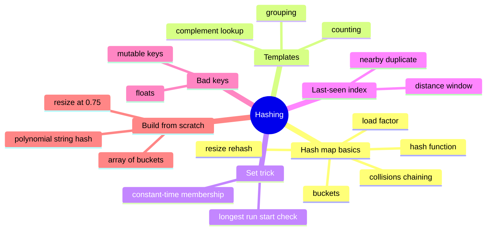

# 03 — Hashing · Cheat-sheet

## Concept map



*What to notice: every exercise in this module is one of the three
templates (counting / complement / grouping), a set-membership trick,
or the last-seen-index variant -- five shapes cover the whole module.*

## The three templates

```python
# Counting
counts: dict[str, int] = {}
for item in items:
    counts[item] = counts.get(item, 0) + 1

# Complement lookup
seen: dict[int, int] = {}
for i, value in enumerate(nums):
    complement = target - value
    if complement in seen:
        return (seen[complement], i)
    seen[value] = i

# Grouping
groups: dict[str, list[str]] = {}
for item in items:
    groups.setdefault(canonical(item), []).append(item)
```

## Hash map operation cost

| Operation | Average | Worst case | Why worst case happens |
| --- | --- | --- | --- |
| `get` / `set` / `delete` (by key) | O(1) | O(n) | every key collides into one bucket |
| membership (`in`) | O(1) | O(n) | same as above |
| iterate all entries | O(n) | O(n) | always visits every entry once |
| resize (amortized per insert) | O(1) | O(n) for that one insert | doubling means resizes get rarer as size grows |

## Set vs map

| | stores | use for |
| --- | --- | --- |
| `set` | just keys | "have I seen this?", dedup, fast membership, set math (union/intersection) |
| `dict` | key -> value | you need to look something UP by key -- a count, an index, a group |

Rule of thumb: if you never read a value back out by key, you don't
need a map -- a set is lighter and says what you mean.

## Load-factor rule

Resize (typically double the bucket array) once
`size / bucket_count` crosses **0.75**. Too low a threshold wastes
memory on mostly-empty buckets; too high lets chains grow long and
degrades O(1) toward O(n). 0.75 is the common default (Java's
`HashMap`, and the one this module's `HashMap` build uses) because it
balances both.

## Gotchas

- Mutable keys (lists) aren't hashable in Python -- use tuples.
- Floats as keys are risky; rounding errors make "equal" values hash
  differently.
- Don't rely on dict iteration order for correctness unless the
  problem asks for insertion order specifically.

## Self-quiz

1. Why is a hash map's average lookup O(1) but its worst case O(n)?
2. What triggers a resize, and what does resizing actually do to every
   existing entry?
3. In the complement-lookup template, why do we check for the
   complement BEFORE adding the current value to the map?
4. When should you reach for a `set` instead of a `dict`?
5. Why can't you use a `list` as a dict key in Python? What do you use
   instead?
6. Two strings are anagrams. Name two different valid canonical keys
   for grouping them.
7. What's the load-factor threshold this module's `HashMap` resizes
   at, and why not just resize at 1.0 (completely full)?
8. `longest_consecutive` only starts counting from numbers where
   `num - 1` is NOT in the set. Why does that keep the whole function
   O(n) instead of O(n^2)?

<details><summary>Answers</summary>

1. Average case assumes a good hash function spreads keys evenly, so
   each bucket holds ~O(1) entries. Worst case is when many/all keys
   collide into the same bucket, making that bucket a plain list scan.
2. A new key that would push `size / bucket_count` above the load
   factor (0.75) triggers it. Resizing allocates a bigger bucket array
   and rehashes every existing entry, because `hash(key) % capacity`
   changes when `capacity` changes.
3. Because the pair might be found "in the wrong order" otherwise -- if
   you add first and check second, you'd never notice `nums[i]` pairs
   with itself unless it appears twice; checking first also naturally
   guarantees two DISTINCT indices.
4. When you only need "have I seen this?" / uniqueness / set math, and
   never need to look up an associated value by key.
5. Lists are mutable, so their contents (and hash) could change after
   insertion, breaking the map's ability to find them again. Use a
   `tuple` (immutable) instead.
6. The letters sorted into a string (`"".join(sorted(word))`), or a
   26-length count tuple/array of letter frequencies.
7. 0.75. Resizing only at 1.0 would let buckets fill almost completely
   before growing, so chains get long and lookups degrade toward O(n)
   right before every resize -- 0.75 leaves headroom.
8. Because every number is only ever walked as part of ITS OWN run,
   starting exactly once (from its run's true start). Across the whole
   function, each number is visited a constant number of times total,
   not once per candidate start -- that's what makes the total work
   O(n) instead of O(n) run-starts times O(n) walk-length each.

</details>

## Pattern-recognition drill

For each one-liner, name the pattern/structure you'd reach for first.

1. "Given a list of ticket IDs, find the one ID that appears exactly
   once; every other ID appears exactly twice."
2. "Given a SORTED array, find two numbers that add up to a target."
3. "Given a list of log lines, find how many times each error code
   appears."
4. "Given two strings, determine if one is a rearrangement of the
   other's letters."
5. "Given a stream of page visits, detect the same visitor ID within
   the last 100 events."
6. "Given an array, find the length of the longest run of consecutive
   integers (order doesn't matter)."
7. "Given a list of words, cluster the ones that are anagrams of each
   other."
8. "Given an array of daily temperatures, find, for each day, how many
   days until a warmer temperature."

<details><summary>Answers</summary>

1. Counting map (or XOR trick, covered later in bit manipulation) --
   count occurrences, the value with count 1 is the answer.
2. **Not this module** -- sorted input + pair target is the two
   pointers cue (module 04); a hash map still works but two pointers
   gets you O(1) space too.
3. Counting map -- tally by key (error code).
4. Anagram check -- sort both strings (or compare 26-letter count
   tuples) and compare.
5. Last-seen-index map -- has_nearby_duplicate shape, keyed on visitor
   ID with a distance window.
6. The set trick -- put everything in a set, only start counting a run
   from a true run-start (`num - 1` not in the set).
7. Grouping by canonical key (sorted letters or letter-count tuple).
8. **Not this module** -- "next greater/warmer element" with a distance
   answer is the monotonic stack cue (module 06), not hashing.

</details>
