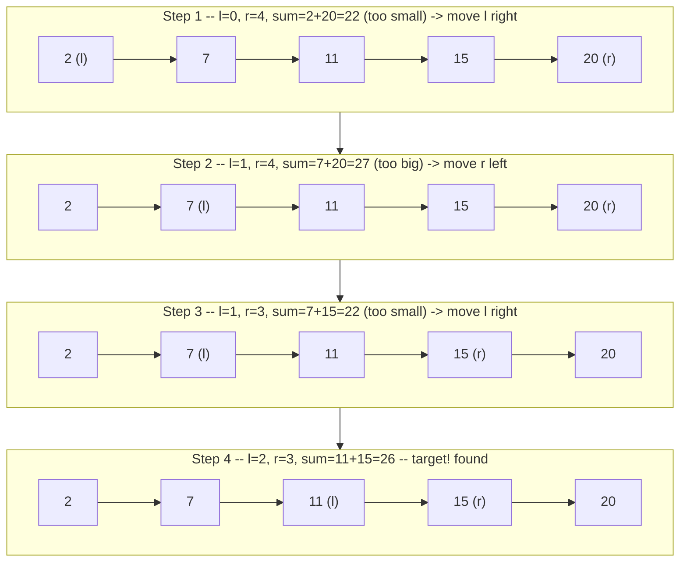
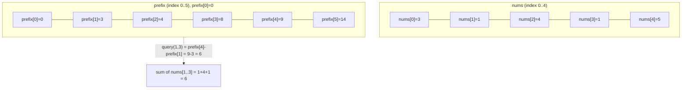

# 04 — Two Pointers & Prefix Sums

## Why this exists

Module 03 solved "find a pair that sums to a target" with a hash set:
one pass, O(n) time, O(n) extra space. But a plain nested loop —
"for every `i`, for every `j`, check the pair" — is the naive
alternative most people reach for first: O(n²) time, because it
re-checks combinations it already ruled out.

When the input is **sorted** (or can cheaply be made so), you don't
need a hash set at all. Two indexes starting at opposite ends and
walking toward each other can only ever take O(n) total steps between
them, and at every step the sort order tells you exactly which pointer
to move. Same O(n) time as hashing, but O(1) extra space.

The second half of this module solves a different repeated-work
problem: answering "what's the sum of this range?" over and over on a
**fixed** array. Recomputing the sum each time is O(n) per query.
**Prefix sums** precompute once in O(n), then answer any range query
in O(1).

## Two pointers: opposite ends

The idea: start `left` at index 0, `right` at the last index. Look at
`nums[left] + nums[right]`. If it's too small, the only way to grow it
is to move `left` up (everything to `right`'s left is smaller or
equal). If it's too big, move `right` down. Either way, one pointer
advances every step, so the loop ends in at most `n` steps.



*What to notice: at every step exactly one rule fires — "too small,
move `l`" or "too big, move `r`" — never both, and never backward.
That's what caps the total work at O(n).*

## How to recognize two pointers

- The input is **sorted**, or the problem lets you sort it first
  (check whether sorting would destroy information you need, like
  original indices).
- "Find a pair/triplet that sums to / is closest to a target."
- Palindrome checks — compare from both ends inward.
- "In place," "without extra space" on an array/string problem.
- Partition / segregate — group elements matching a rule before
  elements that don't (evens before odds, non-zero before zero).
- Reader/writer compaction — scan once, keep a second index for where
  the next "kept" element goes.

## Templates

**Opposite ends** — pointers start at the two ends and close in:

```python
def opposite_ends_template(nums: list[int], target: int) -> tuple[int, int] | None:
    left, right = 0, len(nums) - 1
    while left < right:
        current = nums[left] + nums[right]
        if current == target:
            return left, right
        if current < target:
            left += 1  # too small -> need a bigger value -> move left up
        else:
            right -= 1  # too big -> need a smaller value -> move right down
    return None
```

**Same-direction (reader/writer)** — both pointers start at 0, `read`
scans ahead, `write` marks the next slot to fill:

```python
def reader_writer_template(nums: list[int], keep) -> int:
    write = 0
    for read in range(len(nums)):
        if keep(nums[read]):
            nums[write], nums[read] = nums[read], nums[write]
            write += 1
    return write  # nums[:write] holds the kept elements, original order
```

## Worked example: sorted pair-sum

`nums = [2, 7, 11, 15, 20]`, `target = 26`:

| step | l | r | nums[l] | nums[r] | sum | vs target | move |
| --- | --- | --- | --- | --- | --- | --- | --- |
| 1 | 0 | 4 | 2 | 20 | 22 | too small | `l += 1` |
| 2 | 1 | 4 | 7 | 20 | 27 | too big | `r -= 1` |
| 3 | 1 | 3 | 7 | 15 | 22 | too small | `l += 1` |
| 4 | 2 | 3 | 11 | 15 | 26 | match! | return `(2, 3)` |

## Complexity (two pointers)

O(n) time — `left` and `right` together take at most `n` steps before
they meet, and each step is O(1) work. O(1) extra space — just two
integers, no auxiliary structure. Compare to the hash-set approach
from module 03: same time, but this trades the O(n) hash set for the
requirement that the input already be sorted.

## Prefix sums

Precompute a running total once: `prefix[0] = 0`, and
`prefix[k] = prefix[k-1] + nums[k-1]` — so `prefix[k]` is the sum of
the first `k` elements. The sum of any inclusive range `nums[i..j]` is
then just a subtraction: `prefix[j+1] - prefix[i]`.



*What to notice: `prefix` has one MORE slot than `nums` —
`prefix[0] = 0` is the empty-range base case. An inclusive query
`(i, j)` is always `prefix[j+1] - prefix[i]`, no loop, no matter how
wide the range.*

## How to recognize prefix sums

- "Sum of a range/subarray," asked **many times** on the same array.
- "How many subarrays sum to X" — pair it with a hash map of prefix
  values seen so far (works even with negative numbers).
- "Equal split point" / "pivot index" — find where the left side and
  right side balance.
- The array doesn't change between queries (prefix sums assume a
  static array; if the array is updated, module 21's Fenwick/segment
  tree is the right tool instead).

## Complexity (prefix sums)

Build: O(n) time, O(n) space for the prefix array. Each query after
that: O(1) time. Why: the one-time O(n) walk moves all the repeated
addition work up front, so no query ever re-scans a range again.

## Gotchas

| Gotcha | What happens | Fix |
| --- | --- | --- |
| `<=` instead of `<` in the opposite-ends `while` | when you need two *distinct* indices, the pointers can land on the same one | use `left < right` for pair problems; `<=` is fine only when a single crossing/middle index is meaningful (e.g. palindrome check) |
| Forgetting to skip duplicate values in 3-sum | the same triplet of *values* gets emitted more than once | after a match (or a move), skip forward while the next value equals the current one |
| Prefix array off-by-one | indexing `prefix` with the same index you'd use on `nums` silently reads the wrong slot | remember `prefix` is length `n + 1`; range `(i, j)` inclusive is `prefix[j + 1] - prefix[i]` |
| Reader/writer swap on the same index | swapping `nums[write]` with `nums[read]` when `write == read` is harmless but easy to overthink | it's a no-op swap — no special case needed, just always swap |

## Try it now

→ `exercises/ex01_sorted_pair_target.py` through
`exercises/ex07_subarray_sum_k.py`, then `checkpoint_04.py`.
Check with `uv run pytest 04-two-pointers-prefix-sums`.
