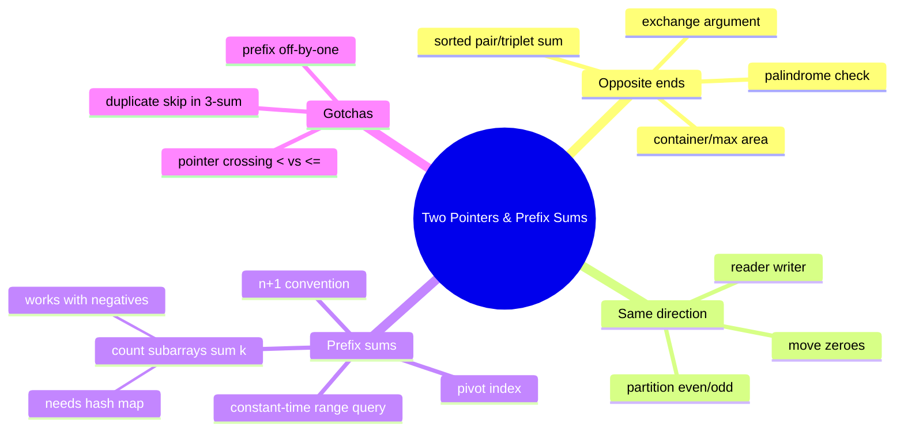

# 04 — Two Pointers & Prefix Sums · Cheat-sheet

## The two templates, side by side

| | Opposite ends | Same direction (reader/writer) |
| --- | --- | --- |
| Start | `left = 0`, `right = len - 1` | `write = 0`, `read` scans `0..n-1` |
| Moves toward | each other | `write` trails `read` |
| Use for | pair/triplet sums, palindromes, container/area | in-place filtering, compaction, partitioning |
| Loop guard | `while left < right` | `for read in range(len(nums))` |
| Classic tell | "sorted" + "pair/triplet target" | "in place," "move/remove/partition" |

```python
# opposite ends
left, right = 0, len(nums) - 1
while left < right:
    if too_small(nums[left], nums[right]):
        left += 1
    elif too_big(nums[left], nums[right]):
        right -= 1
    else:
        ...  # found it

# reader/writer
write = 0
for read in range(len(nums)):
    if keep(nums[read]):
        nums[write], nums[read] = nums[read], nums[write]
        write += 1
```

## When sorted matters

Two pointers on a sorted array works because the sort order tells you
which single pointer to move — you never have to check both
directions. Unsorted input either needs sorting first (O(n log n),
fine if you don't need the original indices) or a hash-based approach
(module 03) instead.

## Prefix sum recipe

1. Build once: `prefix[0] = 0`; `prefix[k] = prefix[k-1] + nums[k-1]`.
   Array is length `n + 1` — don't forget the `+1`.
2. Query any inclusive range `(i, j)` in O(1): `prefix[j+1] - prefix[i]`.
3. "How many subarrays sum to X" → pair prefix sums with a hash map
   counting how many times each prefix value has been seen so far.

**Decision note:** counting subarrays with a target sum —
**negatives present?** → prefix sum + hash map (this module).
**All positive (or all same sign)?** → a sliding window (next module)
does it with O(1) space instead of O(n), because the sum then grows
and shrinks monotonically as the window moves.



*What to notice: "count subarrays with sum k" sits under prefix sums
but pulls in a hash map too — it's the bridge exercise into hashing +
prefix combos you'll see again later.*

## Self-quiz

1. Why does the opposite-ends two-pointer scan need the array to be
   sorted, but the reader/writer scan doesn't?
2. In the container-water problem, why is it always safe to move the
   pointer at the SHORTER wall, and never the taller one?
3. `prefix` has `n + 1` elements for an `n`-element array. What does
   `prefix[0]` represent, and why does that make the range-sum formula
   `prefix[j+1] - prefix[i]` work without a special case for `i == 0`?
4. In 3-sum, after finding a valid triplet, why do we skip forward past
   duplicate values at both inner pointers before continuing?
5. Why can't `count_subarrays_with_sum` be solved with a sliding
   window when negative numbers are allowed?
6. You need "first and last occurrence of a mismatch" while comparing
   a string against its reverse. Should the opposite-ends loop use
   `left < right` or `left <= right`, and why?
7. `pivot_index` can be solved with a running total in O(1) extra
   space instead of building a full `prefix` array. What's the trick?
8. A problem says "array of daily temperatures, answer Q queries: what
   was the total temperature between day i and day j?" What pattern
   fits, and what's the one-time cost vs. the per-query cost?

<details><summary>Answers</summary>

1. The opposite-ends scan decides which pointer to move by comparing
   the current sum to the target — that comparison is only meaningful
   if moving a pointer has a predictable effect on the sum, which
   requires sorted order. Reader/writer just tests one element at a
   time against a keep/discard rule, independent of order.
2. The shorter wall is always the bottleneck — water can never rise
   above it. Keeping it in place and moving the taller wall only
   shrinks the width while the height cap stays the same (or gets
   worse), so that move can never beat the current area. Moving the
   shorter wall is the only move that can possibly find something
   taller and improve the answer.
3. `prefix[0] = 0` represents the sum of an empty range (zero
   elements before index 0). That's exactly what's needed so a range
   starting at `i = 0` still works with the same formula: `prefix[j+1]
   - prefix[0]` is just `prefix[j+1]`, the sum of everything up to
   `j`.
4. Without skipping duplicates, the same triplet of *values* would be
   found again from the next occurrence of an identical value at that
   position, and get appended to the output more than once — the
   values are equal even though the indices differ.
5. A sliding window relies on the window's sum shrinking every time
   you remove an element from the left, so you know when to stop
   shrinking. With negative numbers, removing an element can make the
   sum go up, so there's no reliable rule for when the window has
   shrunk "enough" — the monotonic assumption breaks.
6. `left < right` — the loop is comparing two DIFFERENT characters
   each iteration. `left <= right` would let the loop body run once
   more with `left == right`, comparing a character to itself, which
   is a wasted (though harmless) extra step for palindrome checks and
   an outright bug for problems that need two distinct indices (like
   pair sums).
7. Track a running `left_sum` as you scan left to right. The right
   side's sum is always `total - left_sum - nums[i]` (everything minus
   the left side minus the current element) — no second array or
   second pass needed.
8. Prefix sums. One-time cost: O(n) to build the prefix array. Each of
   the Q queries after that: O(1). Total: O(n + Q), instead of O(n *
   Q) if every query re-summed its range from scratch.

</details>

## Pattern-recognition drill

For each one-liner, name the pattern (two pointers — opposite ends;
two pointers — reader/writer; prefix sum; or "hash map, not this
module's pattern") before checking the answer.

1. "Given a sorted array of scores, find two that differ by exactly
   `d`."
2. "Remove all instances of a given value from an array in place and
   return the new length."
3. "Given an array, answer 10,000 queries of 'what's the sum from
   index i to j?'"
4. "Given an unsorted array, find two numbers that add up to a target
   — return their original indices."
5. "Count how many subarrays have a sum divisible by k." (numbers can
   be negative)
6. "Given a string, check if it's a palindrome ignoring case."
7. "Given an array of heights, find the two bars that trap the most
   water between them."
8. "Given an array, find an index where removing that one element
   makes the sum of everything before it equal the sum of everything
   after it." (this is exactly `pivot_index`, restated)

<details><summary>Answers</summary>

1. Two pointers, opposite ends — sorted input, pair target (a
   difference target still lets one comparison decide which pointer to
   move).
2. Two pointers, reader/writer — in-place removal/compaction, order
   preserved.
3. Prefix sum — static array, many repeated range-sum queries.
4. Hash map (module 03), not this module's pattern — unsorted input
   with no mention of sorting being allowed, and original indices are
   needed, which sorting would scramble.
5. Prefix sum + hash map — "count subarrays with a property" plus
   negatives present is the signature combo from `ex07`.
6. Two pointers, opposite ends — classic palindrome check.
7. Two pointers, opposite ends — container/max-area, exchange
   argument on the shorter wall.
8. Prefix sum — this is `pivot_index`: balance the running left sum
   against the total minus the current element.

</details>
