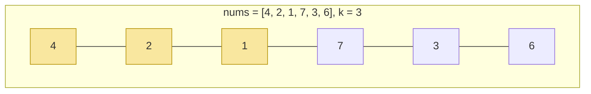
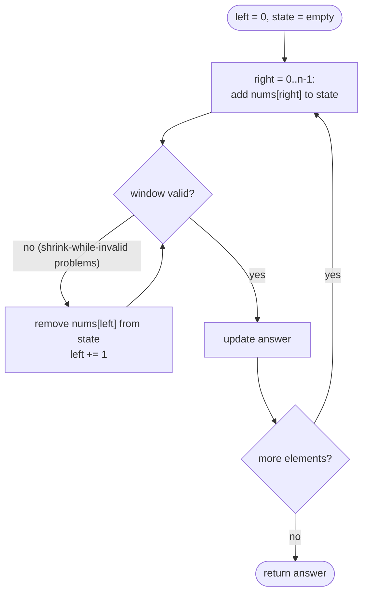

# 05 — Sliding Window

## Why this exists

Lots of problems ask for the best *contiguous* run: "longest substring
without repeats", "max sum of any 5 numbers in a row", "shortest run
that covers a budget". The brute force checks every start and every
end — O(n²) windows, and if you re-sum or re-scan each one, often
O(n²) or O(n³) total.

A **sliding window** reuses the work from the last window instead of
starting over: slide one edge, update the window's state by adding
one element and removing one element, done in O(1). Check every
window once, O(n) total. Two pointers (module 04) mark the edges; the
new idea is *what state you carry between steps* — a running sum, a
frequency map, a running max.

## The window in motion



*What to notice: sliding the window right by one means TWO O(1)
updates — add `nums[3]=7` entering on the right, drop `nums[0]=4`
leaving on the left. The sum for `[2,1,7]` is `(4+2+1) - 4 + 7`, never
recomputed from scratch.*

## Fixed-size windows

Size `k` never changes. Slide by exactly one step at a time: add the
element entering on the right, remove the element leaving on the
left, update the answer.

```python
window_sum = sum(nums[:k])
best = window_sum
for right in range(k, len(nums)):
    window_sum += nums[right] - nums[right - k]
    best = max(best, window_sum)
```

## Variable-size windows

Size grows and shrinks based on a condition. The loop shape:

1. Grow the right edge every step (always — add `nums[right]` to the
   window's state).
2. While the window is **invalid** (or, for shortest-window problems,
   while it's still **valid**), shrink the left edge — remove
   `nums[left]` from the state, then `left += 1`.
3. Update the answer at the right moment (see gotchas below).



*What to notice: the right edge only ever moves forward once per
outer step, but the `while` shrink loop can fire zero, one, or many
times — total left-pointer moves across the WHOLE run are still
bounded by n, which is why this is O(n), not O(n²).*

## How to recognize it

- The problem asks for the **longest / shortest / max / min**
  substring or subarray that satisfies some condition X, and the
  answer must be **contiguous**.
- X is checkable from a small, incrementally-updatable piece of state
  (a running sum, a count map, a running max-frequency) — not
  something you'd need to re-scan the whole window to know.
- **Monotonicity test** (the key check before reaching for shrink):
  once the window is invalid, does making it *smaller* ever fix it,
  and does making it *bigger* only ever make it worse? If growing the
  window can never repair a violation, sliding the left edge forward
  is safe and never needs to backtrack.
- Counter-example: sums with **negative numbers** break this — a
  bigger window can have a *smaller* sum, so shrink-while-invalid
  isn't safe. That's a prefix-sum + hash-map problem instead (module
  04, ex07), not a sliding window.

## The template

The canonical variable window, tracking state in a hash map:

```python
def variable_window(items, is_valid):
    state: dict = {}
    left = 0
    best = 0  # or float("inf") for a shortest-window search
    for right, item in enumerate(items):
        # 1. grow: add item to state
        state[item] = state.get(item, 0) + 1

        # 2. shrink while the window breaks the rule
        while not is_valid(state):
            left_item = items[left]
            state[left_item] -= 1
            if state[left_item] == 0:
                del state[left_item]
            left += 1

        # 3. update the answer — window [left, right] is valid here
        best = max(best, right - left + 1)
    return best
```

## Worked example: longest run without a repeated character

`s = "abcabcbb"`. Window state is "last-seen index of each character".

| right | char | window (`s[left:right+1]`) | left moves? | best so far |
| --- | --- | --- | --- | --- |
| 0 | `a` | `a` | no | 1 |
| 1 | `b` | `ab` | no | 2 |
| 2 | `c` | `abc` | no | 3 |
| 3 | `a` | `bca` | `left: 0→1` (drop old `a`) | 3 |
| 4 | `b` | `cab` | `left: 1→2` (drop old `b`) | 3 |
| 5 | `c` | `abc` | `left: 2→3` (drop old `c`) | 3 |
| 6 | `b` | `bc` | `left: 3→5` (jump past stale `b`) | 3 |
| 7 | `b` | `b` | `left: 5→7` (drop repeat `b`) | 3 |

Answer: **3** (`"abc"`). Notice `left` sometimes jumps more than one
step — the last-seen-index trick moves it directly past the
duplicate instead of shrinking one character at a time.

## Complexity

O(n) time: each index enters the window once (via `right`) and leaves
it at most once (via `left`), so the total work across the whole run
is O(n) even though there's a nested loop. Space is O(1) for numeric
running state (sum, max) or O(k) for a frequency map over an alphabet
of size k.

## Gotchas

- Shrink with `while`, never `if` — a single step might need to drop
  several elements before the window is valid again (see `right=6`
  above).
- Update the answer at the **right moment**: for
  longest-window-that's-valid problems, update *after* shrinking
  (window is valid then); for shortest-window-that's-valid problems,
  update *while* the window is still valid, before you shrink further.
- Window state must be O(1)-updatable per element (add/remove), or
  you've just moved the O(n²) cost into the state update.
- Empty input / `k` larger than the array — decide and document the
  contract; don't let it silently return a wrong answer.
- A frequency map can go **stale** without breaking correctness — see
  ex04's docstring for the classic example.

## Try it now

→ `exercises/ex01_fixed_window_stats.py` through
`exercises/ex07_min_cover_window.py`, then `checkpoint_05.py`.
Check with `uv run pytest 05-sliding-window`.
