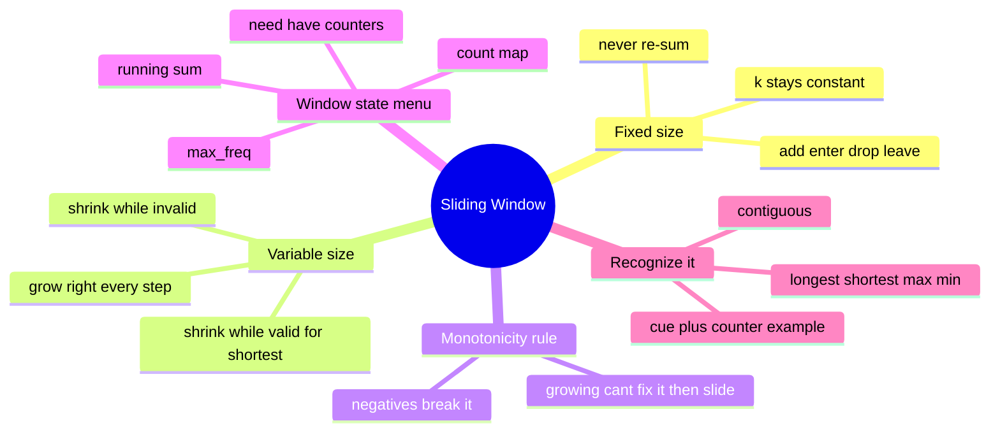

# 05 — Sliding Window · Cheat-sheet

## Concept map



*What to notice: every branch is a decision you make before writing a
line of code — size fixed or variable, what state to carry, which
shrink rule (while-invalid vs while-valid) the question demands.*

## Fixed vs variable template, side by side

| | Fixed-size window | Variable-size window |
| --- | --- | --- |
| Size | constant `k` | grows and shrinks |
| Loop shape | one `for`, slide by exactly one | `for` (grow) + inner `while` (shrink) |
| When to shrink | never — always drop the oldest | while invalid (longest) or while valid (shortest) |
| Example | `max_window_sum`, `moving_averages` | `longest_unique`, `min_window_cover` |

```python
# fixed
window_stat = seed(items[:k])
best = window_stat
for right in range(k, len(items)):
    window_stat = update(window_stat, add=items[right], drop=items[right - k])
    best = compare(best, window_stat)

# variable — longest valid window
left = 0
state = {}
for right, item in enumerate(items):
    add(state, item)
    while not is_valid(state):
        remove(state, items[left]); left += 1
    best = max(best, right - left + 1)

# variable — shortest valid window (inverted shrink rule)
left = 0
state = {}
for right, item in enumerate(items):
    add(state, item)
    while is_valid(state):
        best = min(best, right - left + 1)
        remove(state, items[left]); left += 1
```

## The monotonicity rule

> When growing the window can never fix a violation, shrinking the
> left edge forward is always safe — you never need to backtrack it.

That's what makes the `while` shrink loop O(n) in total instead of
O(n²): each element leaves the window at most once, ever.

**Counter-example — negatives break it.** A window's sum with
negative numbers isn't monotone in size (a bigger window can have a
*smaller* sum), so "shrink while sum too big" can skip past a valid
answer. That's a prefix-sum + hash-map problem instead (module 04,
ex07), not a sliding window.

## Window-state menu

| State | Tracks | Used in |
| --- | --- | --- |
| running sum | total of the current window | `max_window_sum`, `longest_within_budget` |
| count map | frequency of each item in the window | `longest_unique`, `contains_permutation` |
| `max_freq` | highest single-item count seen so far (allowed to go stale) | `longest_uniform_with_k_edits` |
| need / have counters + a `matched`/`satisfied` tally | whether every requirement is currently met | `min_window_cover`, `has_pattern_burst` |

## Gotchas recap

- `while`, never `if`, for the shrink step.
- Longest-valid vs shortest-valid: the shrink condition and the
  answer-update point flip between them — mixing them up silently
  gives the wrong window.
- A frequency-based `max_freq` can be stale after a shrink and still
  be correct — don't "fix" it by recomputing (that's what makes
  `longest_uniform_with_k_edits` O(n) instead of O(n·alphabet)).

## Self-quiz

1. Why is a `while` loop required for shrinking, not an `if`?
2. What breaks the monotonicity assumption behind shrink-while-invalid,
   and what technique replaces sliding window for that case?
3. For a *shortest*-window search, does the shrink loop run while the
   window is valid or while it's invalid? Why is that the opposite of
   a longest-window search?
4. In `longest_uniform_with_k_edits`, why is it safe for `max_freq` to
   be wrong for the current (shrunken) window?
5. What's the total number of times the left pointer can move across
   an entire run of length n, and why does that make the algorithm
   O(n) despite the nested loop?
6. Give an example of a window-state update that would secretly make
   an otherwise-O(n) sliding window O(n²).
7. Why does `max_profit` (best-trade) count as a sliding window even
   though there's no explicit `while` shrink loop?
8. For `min_window_cover`, what do the `need` and `have` counters
   represent, and what does `satisfied == required` mean?

<details><summary>Answers</summary>

1. A single step can require dropping several elements before the
   window is valid again — an `if` only ever drops one, which would
   leave the window invalid.
2. Negative numbers break it (a bigger window can have a smaller sum);
   use prefix sums + a hash map of prefix values instead (module 04).
3. While it's still valid — you record the answer each time it's
   valid, then keep shrinking to see if an even shorter valid window
   exists. A longest-window search does the opposite: shrink while
   invalid, then record the answer once it's valid again.
4. `max_freq` only ever needs to be an upper bound that's at least as
   strict as reality — a stale (too-high) value can only make the
   validity check *stricter*, so it never lets an actually-invalid
   window pass as valid, and the reported best length never shrinks
   below one already found.
5. At most n — each index enters the window once via `right` and
   leaves it at most once via `left`, so total work across the whole
   run is bounded by 2n even though there's a nested loop.
6. Recomputing the window's full state from scratch after every shrink
   (e.g. re-summing the window, or rebuilding a frequency table
   instead of incrementally updating it).
7. The running minimum price IS the window's effective left edge —
   it's a window that only ever "resets" forward, so the add/track
   step is doing the same job as an explicit shrink, just without a
   literal loop.
8. `need[ch]` is how many of `ch` the target requires; `have[ch]`
   (the window count) is how many the current window contains.
   `satisfied` counts how many distinct characters currently have
   `have[ch] >= need[ch]`; `satisfied == required` means every
   character in `t` is fully covered by the window.

</details>

## Pattern-recognition drill

For each one-liner, name the pattern before peeking: sliding window
(fixed or variable), two pointers, prefix sums, or hash map / counting.

1. "Find the maximum sum of any 4 consecutive readings in a sensor
   log."
2. "Given a sorted array, find two numbers that add up to a target."
3. "Find the length of the longest substring with no repeated
   characters."
4. "Given an array that can include negative numbers, count how many
   subarrays sum to exactly k."
5. "Find the smallest window in a string that contains every character
   of another string, with multiplicity."
6. "Given the number of steps between successive checkpoints, answer
   many queries asking for the total steps between checkpoint i and
   checkpoint j."
7. "You may change at most k characters in a string — find the
   longest run you can make all one character."
8. "Buy a stock once and sell it once, later, to maximize profit."

<details><summary>Answers</summary>

1. Fixed-size sliding window (k = 4, add/drop, never re-sum).
2. Two pointers, opposite ends (sorted input is the cue).
3. Variable-size sliding window, shrink-while-invalid, state = last-seen
   index or a set of characters.
4. Prefix sums + hash map — negatives rule out sliding window; the cue
   is "count subarrays that sum to exactly k" with arbitrary signs.
5. Variable-size sliding window (HARD variant) with need/have counters,
   shrink-while-satisfied.
6. Prefix sums — "many range-sum queries" is the classic cue (module
   04).
7. Variable-size sliding window with a `max_freq` state
   (window_size − max_freq ≤ k is the validity check).
8. Sliding window in disguise — same-direction sweep where the left
   edge is "minimum price seen so far" (no explicit shrink loop
   needed).

</details>
