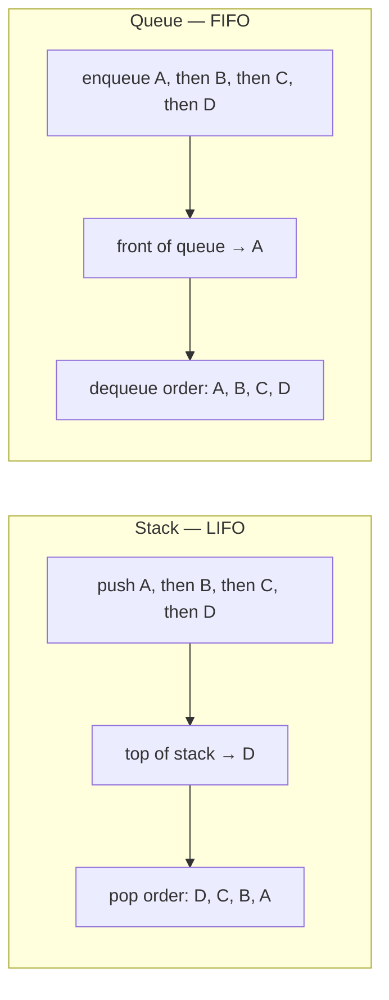
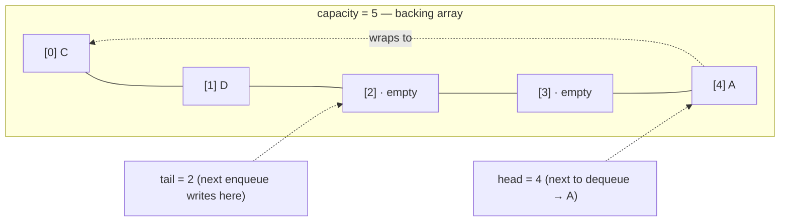
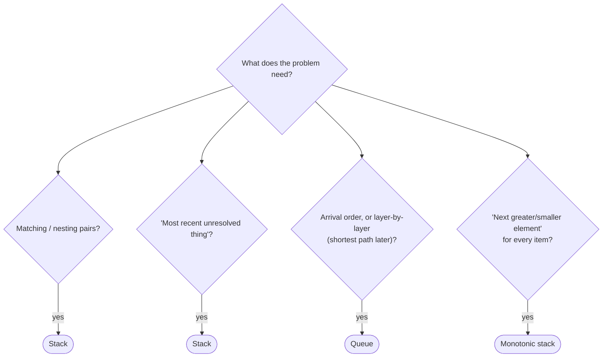

# 06 — Stacks & Queues

## Why this exists

Some problems only ever care about the MOST RECENT thing that happened:
undo history, matching brackets, the function call stack. Others only
ever care about the OLDEST thing still waiting: a print queue, BFS
later in the course. A plain list *can* answer both questions, but it
answers them slowly at one end or the other. Restricting access to
"only the top" or "only the front" is what makes O(1) guarantees
possible — the restriction is the feature, not a limitation.

- Stack: **L**ast **I**n, **F**irst **O**ut.
- Queue: **F**irst **I**n, **F**irst **O**ut.



*What to notice: same four elements, same insertion order, opposite
exit order. That's the entire difference between the two structures —
everything else below is just "how do we make that O(1)?"*

## Stack: array-backed, everything O(1)

A stack is the easy one: wrap a dynamic array (module 02's territory)
and only ever touch the last slot.

| Operation | Does | Complexity |
| --- | --- | --- |
| `push(x)` | append `x` at the end | O(1) amortized |
| `pop()` | remove & return the last element | O(1) |
| `peek()` | look at the last element, don't remove it | O(1) |
| `is_empty()` | any elements left? | O(1) |

Every language's real call stack works exactly like this: calling a
function pushes a new frame; returning pops it. "Stack overflow" is a
literal underflow-in-reverse — too many pushes, not enough pops.

## Queue: why naive front-removal is O(n)

`list.pop(0)` looks innocent but it isn't: removing the front element
means every remaining element shifts one slot left to close the gap —
O(n) per dequeue. Do that n times and you've paid O(n²) for what
should be O(n) work.

The fix: never shift. Keep a fixed-capacity backing array and two
pointers, `head` (next slot to read) and `tail` (next slot to write).
Dequeue just moves `head` forward — nothing else in the array moves.
When a pointer walks off the end, it wraps back to index 0 — hence
**circular** (or "ring") buffer.



*What to notice: `A` and `B` were dequeued off the front already;
`C` and `D` were enqueued after, wrapping past the end of the array
back to index 0. Nothing shifted — only `head` and `tail` moved, each
step computed as `(index + 1) % capacity`.*

## How to recognize it

- Brackets/tags/parens that must **nest and match** → stack.
- "Undo the most recent thing," "the innermost unresolved call" →
  stack (LIFO = *the last thing you opened is the first thing you
  must close*).
- Process items in **arrival order**, or expand a search **layer by
  layer** (shortest path on an unweighted graph, later in the course)
  → queue (FIFO).
- "For every element, find the **next greater/smaller** element" (in
  an array, or in time — daily temperatures) → **monotonic stack**.
- Fixed-size sliding buffer with O(1) push/pop at *both* ends → deque
  (a queue you can also push/pop from the front — you'll meet
  `collections.deque` properly in module 21).



*What to notice: three of these four branches are all "use a stack" —
the CUE in the wording (nesting vs. "next greater") is what tells you
which flavor.*

## Monotonic stack

A monotonic stack stays sorted (increasing or decreasing) by popping
anything that would break the order before pushing the new element.
Whatever gets popped just found its answer — that's the whole trick.

**Template** (finding, for each index, the next *greater* value —
stack stays *decreasing* top-to-bottom, so we pop everything smaller
than the incoming value):

```python
def next_greater(nums: list[int]) -> list[int]:
    result = [-1] * len(nums)
    stack: list[int] = []          # indexes, values at those indexes are decreasing
    for i, value in enumerate(nums):
        while stack and nums[stack[-1]] < value:
            result[stack.pop()] = value   # the popped index just found its answer
        stack.append(i)
    return result
```

**Decision rule:** looking for the next *greater* element → keep the
stack *decreasing* (pop smaller-or-equal). Looking for the next
*smaller* element → keep the stack *increasing* (pop larger-or-equal).
Store **indexes**, not values — you almost always need the distance
or need to write the answer back into a result array by position.

### Worked example: `days_until_warmer([73, 74, 75, 71, 69, 72, 76, 73])`

Stack holds indexes; "warmer" = value at that index.

| i | temps[i] | action | stack after (indexes) | result written this step |
| --- | --- | --- | --- | --- |
| 0 | 73 | push 0 | [0] | — |
| 1 | 74 | 74 > 73 → pop 0, result[0]=1; push 1 | [1] | result[0] = 1 |
| 2 | 75 | 75 > 74 → pop 1, result[1]=1; push 2 | [2] | result[1] = 1 |
| 3 | 71 | 71 < 75 → push 3 | [2, 3] | — |
| 4 | 69 | 69 < 71 → push 4 | [2, 3, 4] | — |
| 5 | 72 | 72 > 69 → pop 4, result[4]=1; 72 > 71 → pop 3, result[3]=2; 72 < 75 → push 5 | [2, 5] | result[4]=1, result[3]=2 |
| 6 | 76 | 76 > 72 → pop 5, result[5]=1; 76 > 75 → pop 2, result[2]=4; push 6 | [6] | result[5]=1, result[2]=4 |
| 7 | 73 | 73 < 76 → push 7 | [6, 7] | — |

Indexes never popped (`6`, `7`) keep `result = 0` — no warmer day
ahead. Final: `[1, 1, 4, 2, 1, 1, 0, 0]`.

## Complexity

Every element is pushed exactly once and popped **at most** once —
across the whole pass that's `2n` stack operations, each O(1), so the
total is O(n) time even though a single step can pop many elements.
This is the same amortized argument as a dynamic array's resize (see
module 01): individual steps vary, the total across all `n` steps is
linear. Space is O(n) for the stack in the worst case (a strictly
increasing/decreasing input never pops early, so everything sits on
the stack at once).

## Common gotchas

- **Peeking/popping an empty stack or queue** is a bug, not a normal
  path — raise, don't return a sentinel like `None` or `-1` (that
  value could collide with real data).
- **Sentinel values** (an extra `0` appended to a histogram, a `-1`
  guard index) exist to force the *last* real elements out of the
  stack without special-casing the end of the loop — see `ex07`.
- **Index vs. value**: default to storing indexes on a monotonic
  stack. You can always recover the value with `nums[i]`, but you
  can't recover the position from a bare value — and most answers
  ("how many days until," "what's the width") are position math.
- **`min_removals_to_balance`-style counting**: you don't always need
  a real stack — sometimes a plain counter of "how many unmatched
  openers so far" is enough, and it's O(1) space instead of O(n).

## Try it now

→ `exercises/ex01_build_stack_queue.py` through
`exercises/ex07_histogram_max_rect.py`, then `checkpoint_06.py`.
Check with `uv run pytest 06-stacks-queues`.
