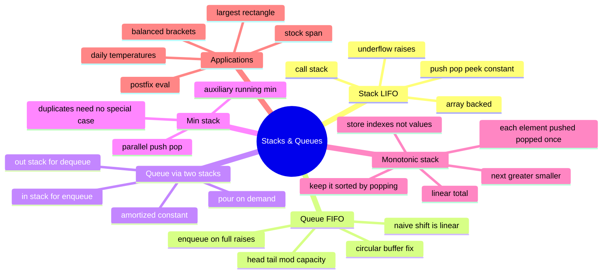

# 06 — Stacks & Queues · Cheat-sheet

## Concept map



*What to notice: everything under "Applications" is really just one of
the four structures above wearing a costume — recognizing the costume
is the actual skill.*

## Stack vs. queue op table

| | Stack (LIFO) | Queue (FIFO) |
| --- | --- | --- |
| Add | `push(x)` — end of array | `enqueue(x)` — at `tail` |
| Remove | `pop()` — end of array | `dequeue()` — at `head` |
| Peek | `peek()` — last in | `front()` — first in |
| Naive array cost | O(1) both ends... it's the SAME end | O(1) push, **O(n) naive pop-front** (shifting) |
| Fix | none needed — array's own end is fine | circular buffer (ring) |
| Real-world twin | the call stack, undo history | print queue, task scheduler |

## Ring-buffer index math

A `CircularQueue` of `capacity` c keeps a fixed array of length c, plus
`head` (next to dequeue) and a `count` (how many slots are full).

```python
tail_write_index = (head + count) % capacity   # where enqueue writes
head = (head + 1) % capacity                    # after a dequeue
is_full  = count == capacity
is_empty = count == 0
```

The `% capacity` is the whole trick: it makes index `capacity - 1`
followed by index `0` look adjacent, exactly like a clock face wrapping
from 11 back to 12.

## Monotonic-stack template

```python
def next_greater(nums: list[int]) -> list[int]:
    result = [-1] * len(nums)
    stack: list[int] = []                    # indexes; values decreasing
    for i, value in enumerate(nums):
        while stack and nums[stack[-1]] < value:
            result[stack.pop()] = value      # popped index just found its answer
        stack.append(i)
    return result
```

**Increasing or decreasing?**

| Looking for... | Keep the stack... | Pop while... |
| --- | --- | --- |
| next **greater** element | decreasing top-to-bottom | top is smaller than incoming |
| next **smaller** element | increasing top-to-bottom | top is bigger than incoming |

**Store-index rule:** push indexes, not values. You can always recover
a value with `nums[i]`; you can't recover a position from a bare value
— and most answers need the position (a distance, a width, a spot to
write the result back into).

## Self-quiz

1. Why is `list.pop(0)` O(n) but `list.pop()` (no argument) O(1)?
2. What's the ring-buffer formula for where the NEXT enqueue writes?
3. In the two-stack queue, why is dequeue "amortized" O(1) instead of
   plain O(1)?
4. `MinStack` pushes onto a second stack every single call, even when
   the new value isn't a new minimum. Why not skip pushing when it's
   not a new min?
5. Why does `is_balanced("([)]")` return `False` even though every
   bracket type appears exactly once on each side?
6. For "next greater element," should the monotonic stack stay
   increasing or decreasing, and why?
7. In `largest_rectangle`, what job does the sentinel height of 0 do?
8. Why does a monotonic stack give O(n) total time even though it has
   a nested `while` loop inside a `for` loop?

<details><summary>Answers</summary>

1. `pop()` only touches the last slot — O(1). `pop(0)` removes the
   first element, so every remaining element must shift one slot left
   to close the gap — O(n).
2. `(head + count) % capacity`.
3. Most dequeues just pop from a non-empty `out` stack — O(1). Only
   when `out` is empty does a dequeue trigger the O(n) pour from `in`.
   But each element is poured at most once in its whole lifetime, so
   spread across n operations the pour work averages out to O(1) per
   call — that's what "amortized" means.
4. Because then popping would need to know whether the value it just
   removed WAS the minimum, to decide whether to reveal the next one —
   extra bookkeeping. Pushing `min(value, current_min)` every time
   keeps `_mins[-1]` always correct with zero special cases, at the
   cost of O(n) space instead of possibly less.
5. A closer must match the MOST RECENT unclosed opener. In `"([)]"`,
   when `)` arrives the most recent opener is `[`, not `(` — mismatch,
   even though counts of `(`, `)`, `[`, `]` are each balanced overall.
6. Decreasing (top-to-bottom). You pop everything smaller than the
   incoming value because THIS value is their "next greater" — keeping
   only values still waiting (nothing bigger has appeared yet) means
   the stack itself must be trending downward.
7. It forces every bar still on the stack when the real input ends to
   get popped and have its rectangle computed — without it you'd need
   a separate cleanup loop after the main pass.
8. Each index is pushed exactly once (once per `for` iteration) and
   popped at most once (ever, across the whole run) — so total pushes
   + pops across the ENTIRE algorithm is at most `2n`, not `n` per
   outer iteration. The `while` loop's cost is paid for by elements it
   removes, not by the outer index.

</details>

## Pattern-recognition drill

For each one-liner, name the pattern/structure before peeking.

1. "Verify that every opening tag in this HTML snippet has a matching
   closing tag, correctly nested."
2. "Given a stream of stock prices, and for today's price find the
   number of consecutive prior days (including today) with a price
   less than or equal to today's."
3. "Process customer support tickets in the order they arrived, one at
   a time."
4. "Given a sorted array, find two numbers that add up to a target."
   *(decoy)*
5. "For every building's height in a skyline, find the largest
   rectangle that fits under the skyline."
6. "Given a string of digits, find the length of the longest substring
   with no repeated characters." *(decoy)*
7. "Implement the 'back' button in a browser, including the ability to
   go 'forward' again after going back."
8. "Given an array, compute the sum of every subarray of length k."
   *(decoy)*

<details><summary>Answers</summary>

1. Stack — nesting/matching cue ("correctly nested").
2. Monotonic stack (stock span) — "consecutive prior days ... less
   than or equal to today's" is next-smaller-to-the-left in disguise.
3. Queue — "in the order they arrived" is the FIFO cue.
4. Two pointers (module 04) — sorted array + pair target, not a
   stack/queue problem.
5. Monotonic stack — the histogram / largest-rectangle pattern.
6. Sliding window (module 05) — "longest substring with no repeats" is
   a variable-size window, not a stack/queue problem.
7. Two stacks (back stack + forward stack) — going back pushes onto
   forward; a new navigation after going back clears the forward
   stack, the exact undo/redo subtlety from this module's checkpoint.
8. Sliding window / prefix sums (modules 04–05) — fixed-size window
   sum, not a stack/queue problem.

</details>
