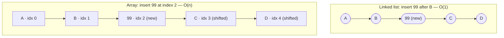
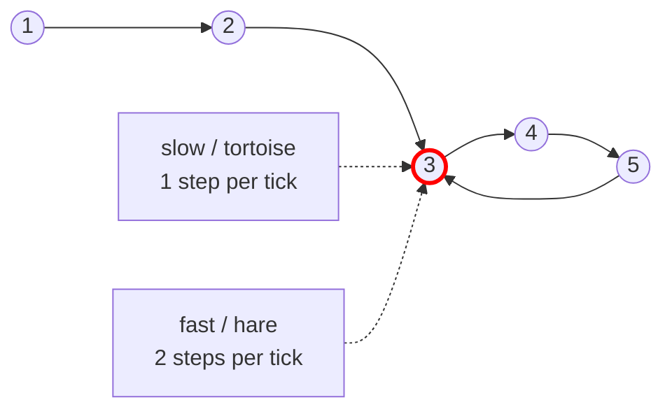

# 07 — Linked Lists

## Why this exists

An array pays O(n) to insert or delete in the middle — every element
after the gap has to physically shift over. A linked list pays O(1) for
that same insert or delete, **if you already hold the node** next to
where you're operating. The trade: you give up O(1) indexing. `a[500]`
is instant on an array; on a linked list you must walk 500 pointers to
get there.

That trade is the whole chapter. Every exercise here is either "build
the structure that makes the trade" or "use the trade to solve a
problem an array would make expensive."

## Nodes & pointers



*What to notice: the linked list only rewrites two pointers
(`B.next`, `99.next`) — C and D never move. The array has to physically
shift every element after the insertion point, which is why inserting
in the middle of an array is O(n) but inserting in the middle of a
linked list (node in hand) is O(1).*

## Array vs linked list

| Operation | Array | Linked list |
| --- | --- | --- |
| Index access `a[i]` | O(1) | O(n) |
| Search (unsorted) | O(n) | O(n) |
| Insert/delete at front | O(n) — shift everything | O(1) |
| Insert/delete at back | O(1) amortized (dynamic array) | O(1) with a tail pointer |
| Insert/delete in the middle, **node already in hand** | O(n) — shift | O(1) |
| Insert/delete in the middle, only a value/index known | O(n) | O(n) to find it, O(1) to splice |
| Cache friendliness | high — contiguous memory | low — pointer chasing, scattered nodes |
| Extra memory per element | none | one pointer (singly) or two (doubly) |

## Pointer surgery rules

Three rules keep you out of trouble. Draw the before/after on paper (or
in `playground/`) before touching code — a linked-list bug is almost
always "I reassigned a pointer in the wrong order and lost the rest of
the list."

**1. Save before you overwrite.** Once you set `node.next = something`,
the old `node.next` is gone unless you saved it first.

```python
def insert_after(node: ListNode, value: int) -> None:
    new_node = ListNode(value)
    new_node.next = node.next   # 1. point the newcomer forward FIRST
    node.next = new_node        # 2. THEN splice it in
```

**2. Deleting is just "skip the victim."** You never need to touch the
victim at all — only its neighbor.

```python
def delete_after(prev: ListNode) -> None:
    victim = prev.next
    prev.next = victim.next     # victim is now unreachable
```

**3. A dummy (sentinel) head removes the "is this the first node?"
special case.** Point a throwaway node at the real head, do all your
work through the dummy, and return `dummy.next` at the end.

```python
dummy = ListNode(0, next=head)
# ... walk/splice using dummy as a stable starting point ...
return dummy.next   # the real head, whether or not it changed
```

## How to recognize it

- The problem hands you nodes explicitly — "given the head of a linked
  list..." — not an indexable sequence.
- "Remove/insert this node in O(1)" or "you're given the node, not the
  index" → doubly linked list, keep the node reference.
- "Find the middle", "detect a cycle", "find where the cycle starts" —
  especially with an O(1)-space constraint → fast & slow pointers.
- "Reverse", "reorder", "rotate" a list **in place** → pointer surgery,
  never allocate new nodes.
- "Most recently used", "evict the oldest", "move to front on access"
  → LRU pattern: hash map (O(1) lookup) + doubly linked list (O(1)
  reorder).
- **Decoy:** "k-th largest element", "is this sorted" on a plain array
  → that's heaps/sorting (later modules), not a linked-list pattern,
  even though the input is loosely called a "list."

## Fast & slow pointers

Two pointers walk the same chain at different speeds: `slow` moves one
node per tick, `fast` moves two. Three payoffs from one trick:

- **Middle:** when `fast` reaches the end, `slow` is at the middle —
  found in one pass, no length-counting pass needed.
- **Cycle detection:** if there's a cycle, `fast` is walking in a loop
  and will eventually lap `slow` from behind — they land on the same
  node. If `fast` (or `fast.next`) hits `None`, there's no cycle.
- **Cycle start:** once `slow` and `fast` meet, reset a third pointer
  to `head` and advance it and `slow` one step at a time — they meet
  again exactly at the cycle's start. (Short reason why: the distance
  from `head` to the cycle start equals the distance from the meeting
  point to the cycle start, going forward around the loop — a
  consequence of `fast` having traveled exactly twice as far as `slow`
  when they met.)



*What to notice: this freezes the moment slow and fast meet — both
land on node 3, which is also where the cycle begins in this example.
That's not a coincidence in general (see the note above), but you
still need Floyd's phase 2 to find the start when it ISN'T the meeting
point.*

Both tricks are O(n) time, O(1) space — the whole reason they beat "walk
the list once to count length, walk it again to the midpoint" or
"stash every visited node in a set" (which would be O(n) *space*).

## Worked example: reversing `[1, 2, 3]`

Iterative reversal keeps three pointers: `prev` (built so far, starts
`None`), `cur` (node being relinked), and a temporary `next` (saved
before `cur.next` is overwritten).

| Step | prev | cur | next (saved) | after `cur.next = prev` |
| --- | --- | --- | --- | --- |
| start | `None` | `1` | — | — |
| 1 | `None` | `1` | `2` | `1.next = None` |
| 2 | `1` | `2` | `3` | `2.next = 1` |
| 3 | `2` | `3` | `None` | `3.next = 2` |
| end | `3` | `None` | — | loop stops when `cur` is `None` |

Return `prev` (`3`) as the new head: `3 → 2 → 1 → None`.

## Complexity, and why

Every build/reverse/merge/reorder exercise in this module is O(n) time
because each touches every node once, and O(1) *extra* space because
none of them allocate new nodes or auxiliary structures proportional to
`n` — they only rewire existing pointers. Fast & slow pointers stay
O(n) time even though there are "two" pointers: they still each take at
most one pass (fast just takes half as many *ticks*), and O(1) space
because there's no extra memory that grows with input size.

## Gotchas

| Gotcha | What happens | Fix |
| --- | --- | --- |
| Overwriting `.next` before saving it | the rest of the list is lost forever, no way back | save `next = cur.next` BEFORE `cur.next = ...` |
| Off-by-one around a dummy head | wrong node deleted, or you return the dummy itself | always return `dummy.next`, never `dummy` |
| Forgetting to fix the tail pointer | `self.tail` still "points" at a removed node — the next `push_back` corrupts the list | after removing the last node, update `self.tail` (or set it to `None` if the list is now empty) |
| `fast.next.next` without checking `fast.next` first | crashes when `fast.next` is `None` | loop while `fast and fast.next`, in that order |
| Comparing nodes with `==` for "is this the same node" | works by accident here (no custom `__eq__`), but reads like a value comparison | compare identity with `is` when you mean "same node object" |

## Try it now

→ `exercises/ex01_build_singly_list.py` through
`exercises/ex07_lru_cache.py`, then `checkpoint_07.py`.
Check with `uv run pytest 07-linked-lists`.
