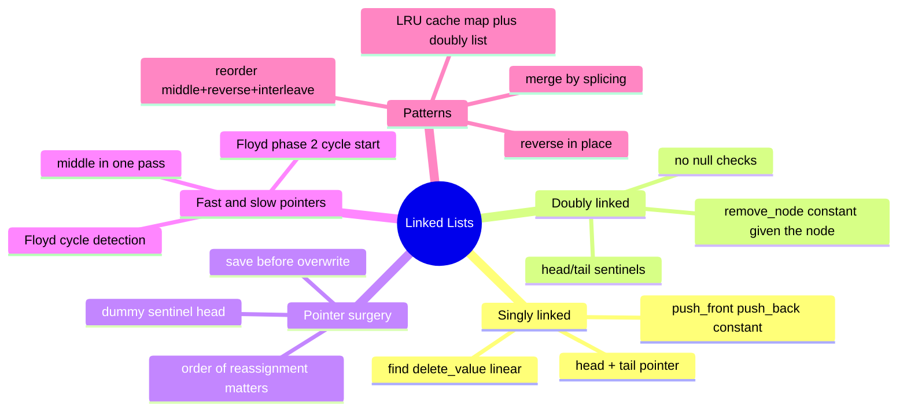

# 07 — Linked Lists · Cheat-sheet

## Concept map

*What to notice: every branch is either "a structure" (singly/doubly) or
"a technique you run on top of it" (pointer surgery, fast/slow) — the
patterns at the bottom all combine techniques from the branches above
them.*

## Array vs linked list (condensed)

| | Index `a[i]` | Insert/delete at front | Insert/delete, node in hand |
| --- | --- | --- | --- |
| Array | O(1) | O(n) | O(n) |
| Linked list | O(n) | O(1) | O(1) |

## Pointer-surgery checklist

- Draw the before/after before you write any code.
- **Save first, overwrite second** — capture `node.next` in a local
  variable before you reassign it.
- Order of reassignment matters: point the new/incoming link *before*
  you cut the old one, or you strand the rest of the list.
- Use a **dummy (sentinel) head** whenever the operation might change
  the head itself (delete the head, insert before the head) — then
  return `dummy.next`, never the dummy.
- After removing the last node, fix any `tail` pointer you're
  maintaining — a stale tail corrupts the next `push_back`.

## Fast & slow recipes

| Goal | Setup | Loop condition | Result |
| --- | --- | --- | --- |
| Middle (2nd of two middles) | `slow = fast = head` | `while fast and fast.next` | `slow` |
| Has a cycle | `slow = fast = head` | `while fast and fast.next`, check `slow is fast` each tick | `True`/`False` |
| Cycle start | after `slow is fast`, reset `pointer = head` | advance `pointer` and `slow` together `while pointer is not slow` | `pointer` |
| N-th from the end | `lead` starts `n` steps ahead of `trail` (from a dummy head) | move both together `while lead.next` | `trail` sits just before the target |

## LRU cache anatomy (in words)

- A **hash map** from key to **doubly linked node** — this is what
  makes `get` O(1): no scanning to find a key.
- A **doubly linked list with sentinels**, ordered by recency: front =
  most recently used, back = least recently used.
- **`get(key)`**: look up the node in O(1); if found, unlink it and
  re-insert it at the front (it's now the most recently used); return
  its value, or -1 if missing.
- **`put(key, value)`**: if the key exists, same move-to-front dance
  with the new value. If it's new and the cache is full, `pop_back()`
  the doubly linked list (the least recently used entry) AND delete
  that key from the hash map, then insert the new entry at the front.
- Every step is O(1) because the hash map skips the search and the
  doubly linked list skips the shifting — this is exactly why the two
  structures are paired.

## Gotchas (quick recap)

- Save `next` before you overwrite `.next`.
- Return `dummy.next`, never `dummy`.
- Fix `tail`/sentinel links after removing the last real node.
- Loop while `fast and fast.next` — in that order.

## Self-quiz

1. Why is inserting in the middle of an array O(n) but O(1) for a
   linked list (node in hand)? What do you give up in exchange?
2. What's the one-line reason a dummy head removes special-casing the
   real head?
3. Why does `middle_node` return the SECOND middle for an even-length
   list with the standard `slow`/`fast` setup — walk through
   `[1, 2, 3, 4]`.
4. In Floyd's cycle detection, why must the loop check `fast and
   fast.next` (both), not just `fast`?
5. What does Floyd's "phase 2" do once slow and fast meet, and why does
   resetting one pointer to `head` work?
6. Why can `merge_sorted` be done with zero new node allocations?
7. What are the three sub-steps of `reorder`, and which two earlier
   exercises does it reuse?
8. Why is a doubly linked list (not singly) required for O(1) removal
   given an arbitrary node — what would break with only `.next`?

Answers

1. An array insert must shift every element after the insertion point
   to keep the sequence contiguous — O(n). A linked list insert just
   rewrites two pointers — O(1), but ONLY because you already hold the
   node next to the insertion point; finding that node in the first
   place, if all you have is a value, still costs O(n). The trade is
   giving up O(1) indexing (`a[i]`), which linked lists can't do at
   all.
2. It gives every real node — including the current head — a
   predecessor, so "delete/insert before the head" becomes the exact
   same code path as "delete/insert before any other node."
3. `slow=1,fast=1` → step: `fast.next`(2) exists, so `slow=2, fast=3`.
   Next: `fast.next`(4) exists, so `slow=3, fast=4.next=None`. Loop
   condition `fast and fast.next` now fails (`fast.next` is `None`), so
   we stop with `slow` at node `3` — the second middle.
4. If you only checked `fast`, `fast.next.next` would try to access
   `.next` on `None` whenever `fast.next` was `None` (odd-length lists
   at the last step) and crash.
5. Phase 2 walks a pointer from `head` and the existing `slow` pointer
   forward one step at a time; they're guaranteed to meet at the
   cycle's start. This works because the distance from `head` to the
   cycle's start equals the distance from the meeting point forward
   around the loop back to the start — a consequence of `fast` having
   covered exactly twice the distance `slow` did when they first met.
6. Both input lists are already sorted, so at every step you only need
   to compare the two current front nodes and re-point one existing
   node's `.next` at the other — there's never a need to create a node
   to hold a "new" value, because no new values are being introduced.
7. Find the middle and split into two halves; reverse the second half;
   interleave the two halves node by node. It reuses `middle_node`
   (ex03) and `reverse_list` (ex02).
8. Deleting a node given only itself requires updating its
   predecessor's `.next` — but a singly linked node has no way to reach
   its predecessor, so you'd have to walk from the head to find it
   first, which is O(n). A doubly linked node holds `.prev` directly,
   making the update O(1).

## Pattern-recognition drill

For each prompt, name the pattern/structure before checking the answer.

1. "Given the head of a singly linked list, return the head after
   reversing it."
2. "Given a linked list, determine if it contains a cycle."
3. "You're given a node inside a doubly linked list (not the head) —
   delete it in O(1)."
4. "Design a cache that evicts the least recently used item when full,
   with O(1) get and put."
5. "Given the heads of two sorted linked lists, merge them into one
   sorted list."
6. "Find the k-th largest element in an unsorted array."
7. "Given the head of a linked list, remove the n-th node from the end
   in one pass."

Answers

1. In-place pointer-surgery reversal (ex02): walk once, flip each
   `.next`, track `prev`/`cur`/saved `next`.
2. Fast & slow pointers, Floyd's cycle detection (ex03): if `fast` ever
   equals `slow`, there's a cycle.
3. Doubly linked list, O(1) removal given the node (ex06): relink
   `node.prev.next` and `node.next.prev` directly — no search needed.
4. LRU cache pattern (ex07): hash map (key → node) for O(1) lookup +
   doubly linked list (recency order) for O(1) move-to-front/evict.
5. Merge by splicing (ex04): dummy head, two pointers, always attach
   the smaller current node, no new allocations.
6. **Decoy** — this is an array/heap problem (quickselect or a
   min-heap of size k, covered in module 12), not a linked-list
   pattern, even though the input is casually called a "list."
7. Two pointers with a fixed gap of `n` (ex04): advance a lead pointer
   `n` steps ahead, then move both together until the lead falls off
   the end.

