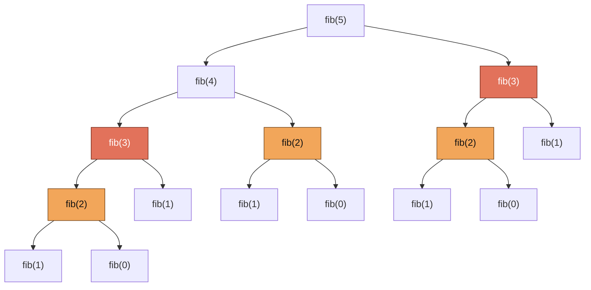
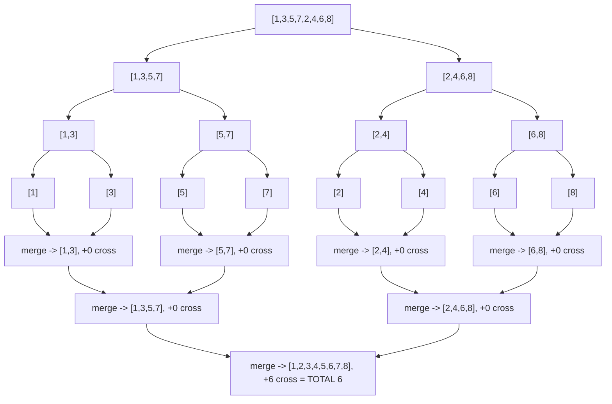

# 08 — Recursion & Divide and Conquer

## Why this exists

Some problems are defined in terms of smaller versions of themselves:
"the sum of a list is its first element plus the sum of the rest," "a
folder's size is the size of its files plus the size of its
sub-folders." Recursion lets your code mirror that definition directly,
instead of hand-rolling a loop that fights the shape of the problem.

The naive alternative — an explicit loop with your own stack/queue — is
always *possible* (that's the whole point of this lesson's "recursion ↔
iteration" section) but often much harder to read for tree- and
nesting-shaped problems. You'll use both: recursion when the shape is
naturally self-similar, an explicit loop when depth or performance
demands it.

## How to recognize it

- The problem statement describes something in terms of a smaller
  version of itself ("a tree's height is 1 + the taller subtree's
  height").
- The data is nested or tree-shaped (parsed JSON, folders, arbitrarily
  nested lists) rather than a flat sequence.
- You can imagine splitting the input into pieces, solving each piece
  the same way, and combining the answers ("divide & conquer" — sorting,
  counting, searching).
- You'd otherwise need to track your own "where was I, what's left to
  do" state by hand — recursion gets that for free from the call stack.
- A brute-force loop-based solution exists but its complexity is worse
  than a split-solve-combine approach would give you (that gap is
  divide & conquer's whole reason to exist — see `count_inversions`
  below, O(n²) naively vs. O(n log n) with it).

## The three rules

Every correct recursive function follows three rules, in this order of
importance:

1. **Base case first.** The smallest input(s) that can be answered
   directly, with no further recursion. Write this check before
   anything else — it's the reason the recursion ever stops.
2. **Progress toward the base case.** Every recursive call must work on
   a *strictly smaller* version of the problem (a smaller number, a
   shorter list, a shallower nesting). If it doesn't shrink, you get
   infinite recursion.
3. **Trust the recursive call — the "leap of faith."** When you write
   `return n * factorial(n - 1)`, don't mentally unwind the whole call
   tree to convince yourself it works. Assume `factorial(n - 1)`
   already correctly computes `(n-1)!` (that's what the base case +
   shrinking step *guarantee*, by induction), and just check: "given a
   correct answer for the smaller problem, does my combining step
   produce a correct answer for this problem?" This leap of faith is
   the single biggest unlock for thinking recursively — stop simulating
   the whole tree in your head.

```python
def factorial(n: int) -> int:
    if n == 0:              # 1. base case
        return 1
    return n * factorial(n - 1)   # 2. n - 1 is strictly smaller
                                   # 3. trust factorial(n - 1) is correct
```

## The call tree of fib(5)

Naive Fibonacci recursion (`fib(n) = fib(n-1) + fib(n-2)`) makes TWO
recursive calls per call, so the same sub-problem gets solved over and
over. Here's every call `fib_naive(5)` makes:



*What to notice: `fib(3)` (orange-red) is computed twice from scratch,
and `fib(2)` (orange) three times — none of them reuse the earlier
work. That's 15 total calls to answer one `fib(5)`, and the blowup gets
exponentially worse as n grows (see the table in "Memoization taste"
below). This exact diagram shape comes back in module 18 when we
formalize memoization vs. tabulation.*

## The call stack: what actually happens

Every function call — recursive or not — pushes a new **stack frame**
holding its local variables and "where to resume" onto the call stack.
A recursive call doesn't return until the one it calls does, so the
frames pile up along the deepest chain of calls before any of them pop.

| Function | Deepest path | Stack depth (space) |
| --- | --- | --- |
| `factorial(n)` | n → n-1 → ... → 0 | O(n) |
| `fib_naive(n)` | n → n-1 → n-2 → ... → 0 (one branch) | O(n) — NOT O(2ⁿ); only the deepest path is ever on the stack at once |
| `count_inversions` (divide & conquer) | halves every call | O(log n) |
| `deep_sum(nested)` | one level per layer of nesting | O(max depth) |

Python's default recursion limit (`sys.getrecursionlimit()`) is 1000
frames — go deeper and you get a `RecursionError`, not silent
corruption. That limit exists because each frame costs real memory, and
the interpreter can't tell "healthy deep recursion" from "forgot the
base case" (an infinite recursion). Be honest with yourself about input
size: 1,000 nested objects is realistic for parsed JSON; a recursive
walk over a 100,000-node linked list is not.

## Recursion ↔ iteration

Any recursion can be rewritten as a loop plus an **explicit stack** — a
plain list you push to and pop from yourself, standing in for what the
call stack was doing automatically. You reach for this when depth would
blow the recursion limit, or when the overhead of real function calls
actually matters.

```python
# Recursive shape:
def countdown_rec(n):
    if n <= 0:
        return []
    return [n] + countdown_rec(n - 1)

# Same shape, explicit stack instead of the call stack:
def countdown_iterative(n):
    result = []
    stack = [n]
    while stack:
        current = stack.pop()
        if current <= 0:
            continue
        result.append(current)
        stack.append(current - 1)
    return result
```

The recipe: whatever you'd pass as a recursive call's argument, `push`
it instead; whatever you'd do after a call returns, do right after you
`pop`. Use this when you *must* — deep, uncertain-depth inputs (a file
tree of unknown depth, a linked list of unknown length) — not as a
default. Recursive code is usually more readable when depth is safely
bounded.

## Divide & conquer

Split the input, solve each piece with the same approach (recursively),
then combine the pieces' answers into the whole answer:

1. **Split** — divide the input into smaller, independent pieces
   (usually halves).
2. **Solve** — recursively solve each piece (leap of faith: trust the
   recursive calls).
3. **Combine** — merge the pieces' answers into the answer for the
   whole input, often doing the real work right here.

```python
def divide_and_conquer(problem):
    if is_base_case(problem):
        return solve_directly(problem)
    left, right = split(problem)
    left_answer = divide_and_conquer(left)     # solve
    right_answer = divide_and_conquer(right)   # solve
    return combine(left_answer, right_answer)  # combine
```

**Worked example: counting inversions.** `count_inversions(nums)`
counts pairs `(i, j)` with `i < j` and `nums[i] > nums[j]` — how far a
list is from sorted. The brute-force pairwise scan is O(n²). Riding
along with merge sort's merge step gets it to O(n log n): recursively
count inversions in each half, then count *cross* inversions while
merging — every time a right-half element is placed before elements
still waiting in the left half, each of those left elements forms an
inversion with it.



*What to notice: every split half here is already internally sorted, so
all 6 inversions surface at the very last merge — but the algorithm
still visits every level regardless of the input (O(log n) levels,
O(n) work merging at each level = O(n log n) total). The split/solve
structure is identical to plain merge sort; counting is just a side
effect of the merge you're already doing.*

The final merge, traced step by step (left = `[1,3,5,7]`, right =
`[2,4,6,8]`):

| Step | Compare | Take | Cross += | Running total |
| --- | --- | --- | --- | --- |
| 1 | 1 vs 2 | 1 (left) | 0 | 0 |
| 2 | 3 vs 2 | 2 (right) | 3 (left has 3,5,7 left) | 3 |
| 3 | 3 vs 4 | 3 (left) | 0 | 3 |
| 4 | 5 vs 4 | 4 (right) | 2 (left has 5,7 left) | 5 |
| 5 | 5 vs 6 | 5 (left) | 0 | 5 |
| 6 | 7 vs 6 | 6 (right) | 1 (left has 7 left) | 6 |
| 7 | 7 vs 8 | 7 (left) | 0 | 6 |
| 8 | (left empty) | 8 (right) | 0 | 6 |

Total: 6 inversions, matching `0 + 0 + 6` from the two (already-sorted)
halves plus this merge.

## Memoization taste

Naive `fib_naive` recomputes overlapping subproblems from scratch —
its call count roughly doubles with every +1 to n. Caching each
computed value (`fib_memo`) means every value from 0 to n gets computed
exactly once:

| n | `fib_naive` calls | `fib_memo` computed values |
| --- | --- | --- |
| 5 | 15 | 6 |
| 10 | 177 | 11 |
| 20 | 21,891 | 21 |
| 30 | 2,692,537 | 31 |

*Naive calls grow like `2 * fib(n+1) - 1` — exponential. Memoized calls
grow like `n + 1` — linear.* This is a first taste; the full
memoization-vs-tabulation framework (state, choice, recurrence, base
case, order of computation) is module 18's job. For now, the takeaway
is purely mechanical: **a cache turns a call tree with repeated
subtrees into a call tree with none.**

## Gotchas

| Gotcha | What happens | Fix |
| --- | --- | --- |
| Missing or wrong base case | infinite recursion → `RecursionError` | write the base case FIRST, and double-check it's actually reachable |
| Work done *before* vs. *after* the recursive call | changes the order side effects happen in (e.g. printing a tree pre-order vs. post-order) | decide deliberately: do you need the sub-result before you can act, or not? |
| Forgetting to `return` the recursive call's result | function silently returns `None` | every branch that should produce a value needs an explicit `return` |
| Mutating a shared object across calls (e.g. a default mutable argument) | later calls see stale/leftover data from earlier ones | pass fresh containers per call, or make sharing explicit and deliberate (like `fib_memo`'s cache, scoped to one top-level call) |
| Off-by-one in the shrinking step (`n` instead of `n - 1`) | doesn't actually shrink → infinite recursion, or skips/repeats an element | trace the smallest 2–3 inputs by hand before trusting the general case |

## Try it now

→ `exercises/ex01_recursion_warmups.py` through
`exercises/ex06_recursion_to_iteration.py`, then `checkpoint_08.py`.
Check with `uv run pytest 08-recursion-divide-conquer`.
