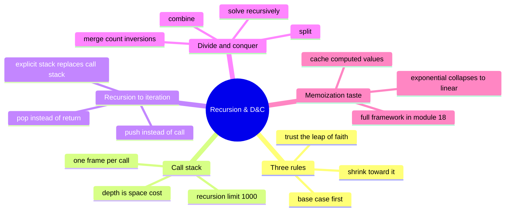

# 08 — Recursion & Divide and Conquer · Cheat-sheet

## Concept map



*What to notice: every branch is a different answer to "what do I do
about the smaller sub-problem?" — recurse trusting the leap of faith,
push it onto an explicit stack, split it in half, or cache it so it's
never recomputed.*

## The three rules

1. **Base case first** — the smallest input(s), answered directly.
2. **Progress toward it** — every call works on a strictly smaller
   problem.
3. **Trust the recursive call** — the leap of faith: assume the smaller
   call is already correct, and check only that your combining step is
   correct given that assumption.

## Call-stack cost

| Shape | Stack depth (space) | Example |
| --- | --- | --- |
| Linear recursion (one call per level) | O(n) | `factorial`, `sum_digits` |
| Tree recursion, unbalanced/naive | O(n) deepest path (calls total can be exponential) | `fib_naive` |
| Tree recursion, balanced split | O(log n) | `count_inversions`, `power` |
| Shape recursion (nesting depth) | O(max depth) | `deep_sum`, `flatten` |

## Divide & conquer template

```python
def divide_and_conquer(problem):
    if is_base_case(problem):
        return solve_directly(problem)
    left, right = split(problem)
    left_answer = divide_and_conquer(left)
    right_answer = divide_and_conquer(right)
    return combine(left_answer, right_answer)
```

## Recursion → iteration recipe

1. Create `stack = [initial_argument]` (or a tuple of arguments/state).
2. Loop `while stack:`.
3. `current = stack.pop()`.
4. Do whatever the base case would do, or `stack.append(...)` whatever
   you'd have passed to the recursive call.
5. Accumulate results in a variable/list outside the loop instead of
   relying on return values to bubble up.

Use it when depth is deep and/or unbounded (unknown-depth trees,
unknown-length chains) — not as a default replacement for recursion.

## When memoization will matter

| Signal in the call tree | What it means | Do this |
| --- | --- | --- |
| Every call has a unique argument | no overlap — plain recursion is fine | nothing to cache |
| The SAME argument recurs across branches (like `fib`'s repeated `fib(3)`, `fib(2)`, ...) | overlapping subproblems | cache by argument → memoization (full DP framework: module 18) |
| Call count grows exponentially with input size | classic sign of uncached overlap | check for a cache-able argument before optimizing anything else |

## Self-quiz

1. State the three rules of recursion, in order.
2. What does "the leap of faith" mean, and why does it matter?
3. Why is `fib_naive`'s stack depth O(n), not O(2ⁿ), even though its
   total call count IS roughly O(2ⁿ)?
4. What's Python's default recursion limit, and what error do you get
   past it?
5. Give the three steps of divide & conquer, in order.
6. In `count_inversions`, what specifically gets counted during the
   merge step (not the split step)?
7. Rewrite (in words, not code) how you'd turn a recursive tree walk
   into an iterative one.
8. Why does caching `fib`'s computed values change its call-count
   growth from exponential to linear?

<details><summary>Answers</summary>

1. Base case first; progress (shrink) toward it; trust the recursive
   call is correct for the smaller input.
2. Assume the recursive call already correctly solves the smaller
   problem, and only verify that your combining step is correct given
   that assumption — instead of mentally simulating the entire call
   tree.
3. Only the calls along the CURRENT deepest active path sit on the
   stack at once; once a branch returns, its frame pops before the next
   branch is even called. Total calls across the whole tree can still
   be exponential.
4. 1000 frames by default (`sys.getrecursionlimit()`); exceeding it
   raises `RecursionError`.
5. Split the input into pieces; solve each piece recursively; combine
   the pieces' answers into the whole answer.
6. Cross-inversions: every time an element from the right half is
   placed before elements still remaining in the left half, each of
   those remaining left elements forms an inversion with it.
7. Replace the call stack with your own list acting as a stack; loop
   while it's non-empty; pop one item, and either handle it directly
   (base case) or push what you would have recursively called with
   (shrinking step) — accumulate the answer in an outer variable
   instead of via return values.
8. Without a cache, the same subproblem (e.g. `fib(3)`) gets solved
   from scratch every time it reappears in the call tree, and the
   number of times values repeat grows exponentially with n. A cache
   makes every distinct value get computed exactly once, so the work
   becomes linear in n.

</details>

## Pattern-recognition drill

For each, name the approach: plain loop, recursion, or divide &
conquer?

1. "Sum every number in a spreadsheet column." (100 cells, one after
   another)
2. "Sum every number in a JSON document, however deeply nested its
   arrays are."
3. "Find the total disk space used by a folder, including every
   sub-folder."
4. "Print numbers 1 through n, in order." (n is small and fixed-depth)
5. "Given a sorted list of size n, find whether x is present, in
   O(log n)."
6. "Given an unsorted list, count how many pairs are out of order."

<details><summary>Answers</summary>

1. **Plain loop.** Flat, one-dimensional data with no self-similar
   substructure — a `for` loop is simpler and just as fast.
2. **Recursion (shape-based).** The nesting depth is unknown/variable —
   the classic "recurse when you see a list" cue from `deep_sum`.
3. **Recursion (shape-based).** A folder's size is defined in terms of
   its sub-folders' sizes — self-similar by definition, same shape as
   the file-tree checkpoint.
4. **Plain loop** (or trivial linear recursion) — a fixed, small,
   sequential count-up has no branching or splitting to exploit;
   recursion here is a style choice, not a requirement.
5. **Divide & conquer (well, its close cousin: binary search, module
   10)** — the sorted-input cue ("in O(log n)") signals halving the
   search space each step. Recognizing the O(log n) cue for "split the
   input in half" is exactly the divide-and-conquer instinct this
   module builds.
6. **Divide & conquer.** "Count pairs" + "unsorted" + a better-than-
   O(n²) implication is the `count_inversions` cue exactly: split,
   solve each half, count cross-pairs while combining.

</details>
