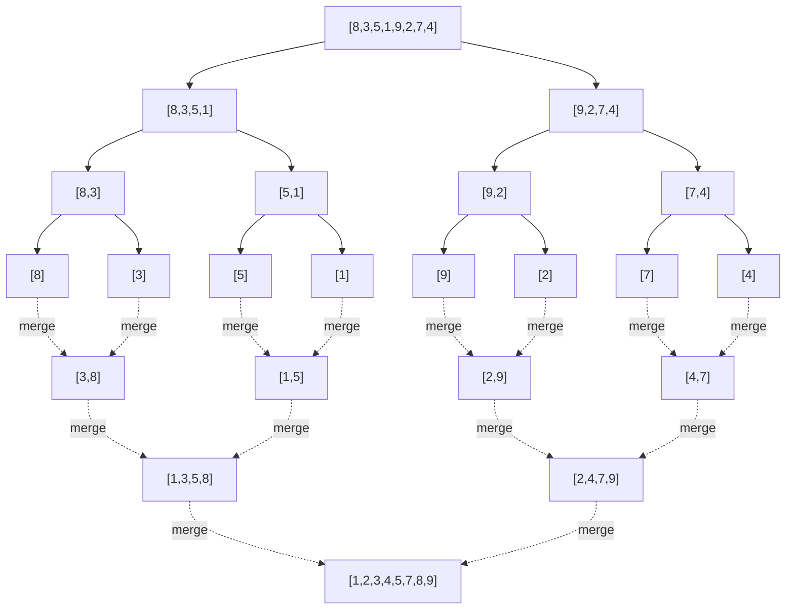
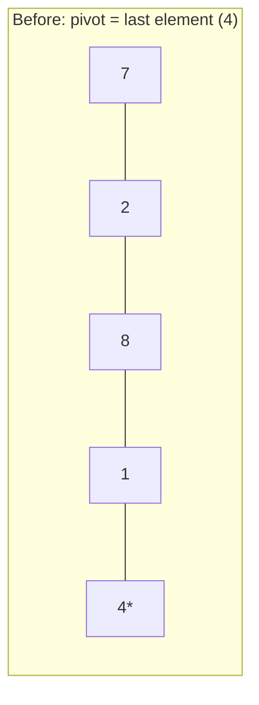

# 09 — Sorting

## Why this exists

Sorted data is a superpower: once an array is sorted, binary search
finds anything in O(log n), two pointers can sweep for pairs, and
greedy algorithms can process "biggest first" or "earliest deadline
first" in one pass. A huge fraction of hard problems become easy the
moment you sort — the trick is knowing that, and knowing which sort to
reach for.

The naive way to sort is "compare everything to everything" —
selection sort, O(n²). That is fine for 20 items and hopeless for
2,000,000. This module builds the O(n log n) algorithms that make
sorting a tool you can use without thinking twice, plus a few
specialized algorithms that beat O(n log n) when your data has extra
structure (a small range of integer values).

## Elementary sorts: insertion & selection

Both are O(n²) — you'll implement them first because they're short,
honest, and teach the vocabulary (`pass`, `shift`, `swap`) that the
faster algorithms build on.

**Selection sort**: repeatedly find the minimum of the unsorted
remainder and swap it to the front. n passes, each scanning what's
left — always O(n²) comparisons, no matter the input. It does the
*fewest swaps* of any comparison sort (at most n-1), which occasionally
matters when writes are expensive (e.g. flash memory).

**Insertion sort**: build the sorted region one element at a time —
take the next element and shift it backward past everything bigger
than it. Its comparisons scale with how *unsorted* the input already
is: on a nearly-sorted array, most elements need zero or one shift, so
it runs close to O(n). On a reversed array it's the full O(n²).

That adaptivity is why insertion sort is genuinely used in production:
as the base case inside merge sort / quick sort for tiny subarrays
(insertion sort beats them below ~10-20 elements — less overhead), and
for data that's "almost sorted" (e.g. a mostly-sorted log stream with
a few late arrivals).

| | good case | bad case | why |
| --- | --- | --- | --- |
| Selection sort | none — always O(n²) | always O(n²) | always scans the whole remainder to find the min |
| Insertion sort | nearly-sorted → ~O(n) | reverse-sorted → O(n²) | shifts only as far as the next smaller element |

## Merge sort

**Idea**: split the array in half, recursively sort each half, then
merge the two sorted halves back together in one linear pass. All the
real work happens in `merge` — combining two already-sorted lists is
O(n) because you only ever need to look at the front of each.



*What to notice: the tree has log2(n) levels (split until singletons),
and every level does O(n) total work merging — that product,
`O(n) work × O(log n) levels`, IS the O(n log n) bound. It's not a
formula to memorize, it's this picture.*

Template:

```python
def merge_sort(nums):
    if len(nums) <= 1:
        return nums[:]                       # base case: already "sorted"
    mid = len(nums) // 2
    left = merge_sort(nums[:mid])
    right = merge_sort(nums[mid:])
    return merge(left, right)                # O(n) linear merge

def merge(left, right):
    result = []
    i = j = 0
    while i < len(left) and j < len(right):
        if left[i] <= right[j]:              # <= (not <) is what makes it STABLE
            result.append(left[i]); i += 1
        else:
            result.append(right[j]); j += 1
    result.extend(left[i:])
    result.extend(right[j:])
    return result
```

Merge sort's worst case is O(n log n) no matter what — it never
degrades, which is exactly the property quick sort is missing.

## Quick sort

**Idea**: pick a pivot, *partition* the array so everything smaller
than the pivot ends up left of it and everything bigger ends up right
of it (the pivot lands in its final sorted position in one pass), then
recurse on the two sides. Unlike merge sort, partitioning happens
in-place and there's no merge step — but the split sizes depend on how
good the pivot was.

**Lomuto partition** — walk the array once, keep a boundary `i` for
"end of the smaller-than-pivot region," and every time you see a value
below the pivot, extend that region:



| step | array (● = i boundary, ▲ = j scanning) | action |
| --- | --- | --- |
| start | `[7, 2, 8, 1, 4*]`, i=-1 | pivot = 4 (last element) |
| j=0 | `7 ▲` &gt; 4 | skip |
| j=1 | `2 ▲` &lt; 4 | i→0, swap(0,1) → `[2, 7, 8, 1, 4]` |
| j=2 | `8 ▲` &gt; 4 | skip |
| j=3 | `1 ▲` &lt; 4 | i→1, swap(1,3) → `[2, 1, 8, 7, 4]` |
| end | swap pivot into place: swap(i+1, last) | `[2, 1, 4, 7, 8]` — 4 is now at its sorted index 2 |

*What to notice: after the pass, everything left of index 2 is ≤ 4 and
everything right is &gt; 4 — the pivot never moves again. Only the two
sides still need sorting.*

**Pivot choice matters.** If you always pick the first (or last)
element as pivot, an already-sorted (or reverse-sorted) input makes
every partition split `1` and `n-1` — that's O(n²) time AND, if you
recurse naively, O(n) recursion depth (a stack overflow risk on large
inputs). The fix is two independent tricks:

1. **Randomize the pivot** (swap a random index to the boundary before
   partitioning) — this makes the O(n²) case astronomically unlikely
   for *any* input, including sorted ones, because the adversary can no
   longer predict which element you'll pick.
2. **Recurse into the smaller side, loop on the larger side** — after
   partitioning, whichever half is smaller gets the recursive call
   (depth +1); the larger half is handled by updating your loop bounds
   and going around again, not by recursing. Because the recursive
   side is always ≤ half the remaining size, recursion depth is
   bounded by O(log n) *no matter how bad the pivots are*.

Quick sort is still worth it over merge sort despite the O(n²) worst
case: it sorts in-place (O(log n) space for the recursion, vs O(n) for
merge sort's extra arrays) and has smaller constants in practice.

## Comparison table

| Algorithm | Best | Average | Worst | Space | Stable? | In-place? |
| --- | --- | --- | --- | --- | --- | --- |
| Selection sort | O(n²) | O(n²) | O(n²) | O(1) | no | yes |
| Insertion sort | O(n) | O(n²) | O(n²) | O(1) | yes | yes |
| Merge sort | O(n log n) | O(n log n) | O(n log n) | O(n) | yes | no |
| Quick sort | O(n log n) | O(n log n) | O(n²)* | O(log n) | no | yes |
| Counting sort | O(n + k) | O(n + k) | O(n + k) | O(n + k) | yes | no |

\* worst case is avoided in practice with randomized pivots; k = the
size of the value range for counting sort.

## Stability: what it means and why it matters

A sort is **stable** if elements that compare equal keep their
original relative order. It matters the moment you sort by one key but
still care about a different, earlier order — the classic case is
sorting by more than one key, one pass at a time, from *least*
important to *most* important.

Worked example — sort employees by department, then (within a stable
sort) they stay ordered by the name-sort you did first:

| Step | Input order | After sort by name | After **stable** sort by dept |
| --- | --- | --- | --- |
| 1 | Bo/Eng, Al/Sales, Cy/Eng | Al/Sales, Bo/Eng, Cy/Eng | Bo/Eng, Cy/Eng, Al/Sales |

*What to notice: within `Eng`, `Bo` still comes before `Cy` — because
the dept-sort was stable, it never disturbed the relative order that
the earlier name-sort had already established. An unstable sort could
have swapped them.*

Selection sort is NOT stable (a swap can leapfrog an equal element).
Insertion sort and merge sort ARE stable (merge's `<=` in the template
above is exactly the line that guarantees it — using `<` instead would
silently break stability). Standard Lomuto/Hoare quick sort is not
stable either.

## Beyond comparisons: counting sort & buckets

Every sort so far only asks "is A less than B?" — a **comparison
sort**. There's a proven lower bound: no comparison sort can beat
**Ω(n log n)** in the worst case, because with n! possible orderings
and each comparison giving at most 1 bit of information, you need at
least log2(n!) ≈ n log n comparisons to pin down which ordering you
have. Merge sort and heap sort (module 12) hit that bound exactly.

**Counting sort breaks the assumption**: it never compares two
elements. If every value is a bounded integer in `[0, k]`, count how
many times each value appears, then use those counts to place every
element directly at its final index — O(n + k) time. It stops being a
comparison sort, so the Ω(n log n) bound simply doesn't apply.

The catch: it only works for a small, known integer range. Sorting
200,000 arbitrary 64-bit integers with counting sort would need a
count array of size 2^64 — worse than useless. Sorting exam scores
0-100, or ages, or single-digit-bucketed values? Perfect. **Bucket
sort** generalizes the idea to non-integer ranges: scatter elements
into a fixed number of buckets by value range, sort each small bucket
(with insertion sort, since buckets are small), then concatenate.

## Quickselect: the kth element without a full sort

Sometimes you don't need the WHOLE array sorted — just "what's the kth
largest?" Sorting everything to answer that is O(n log n) of wasted
work. **Quickselect** reuses quick sort's partition step, but throws
away the side that can't contain the answer instead of recursing into
both:

1. Partition around a (randomized) pivot, same as quick sort.
2. The pivot lands at some index `p`, its final sorted position.
3. If `p` is the index you want — done. If your target is left of
   `p`, recurse only left. If it's right, recurse only right.

Each step does O(current size) work and (on average) throws away
about half the remaining array, giving the classic converging series
`n + n/2 + n/4 + ... = O(n)` average time — no `log n` factor, because
unlike quick sort you never recurse into *both* halves.

## How to recognize it

- "Kth largest/smallest", "median of a stream so far" → quickselect
  (single answer) or a heap (module 12, if you need it repeatedly).
- "Sort by a custom rule" (frequency, string concatenation, a given
  ranking) → a comparator/key function, not a from-scratch algorithm.
- "Values are bounded integers / a small known range" (ages, grades,
  colors, digits) → counting sort beats O(n log n).
- "Sort in place with no extra memory" → quick sort (or insertion sort
  if n is tiny) — merge sort needs O(n) extra space.
- "Must preserve original order of equal items" / "sort by multiple
  keys" → you need a **stable** sort (merge sort, insertion sort, or
  your language's built-in `sort`).
- "Nearly sorted already" / "a few out-of-place elements" → insertion
  sort is genuinely competitive here, not just a toy.

## Gotchas

- **Comparator consistency**: a custom comparator must be a strict
  total order (if `a < b` and `b < c` then `a < c`). An inconsistent
  comparator (e.g. one with a typo'd sign) causes silently wrong sorts
  or, in some languages, a crash.
- **Mutates vs returns new**: in this course, `merge_sort` and
  `counting_sort` return a NEW array; `quick_sort` and `sort_colors`
  sort IN PLACE and return `None` (mirroring Python's own
  `sorted()` vs `list.sort()` split — mixing them up is the #1 bug).
- **Quick sort on sorted input**: a fixed first-element pivot turns
  your "average case" algorithm into worst-case O(n²) time AND
  worst-case O(n) recursion depth on exactly the input pattern
  (already-sorted data) that shows up constantly in real logs and
  re-runs. Randomize the pivot AND bound recursion depth (recurse
  smaller side, loop larger side) — see the quick sort section above.
- **Off-by-one in partition**: Lomuto's boundary index `i` starts at
  `lo - 1`, not `lo` — trace the worked example above with a debugger
  once, it clears this up fast.
- **Counting sort with out-of-range values**: values outside
  `[0, max_value]` will index out of bounds (or silently corrupt
  results if you don't check) — validate the input range.

## Try it now

→ `exercises/ex01_insertion_selection.py` through
`exercises/ex06_comparator_problems.py`, then `checkpoint_09.py`.
Check with `uv run pytest 09-sorting`.
