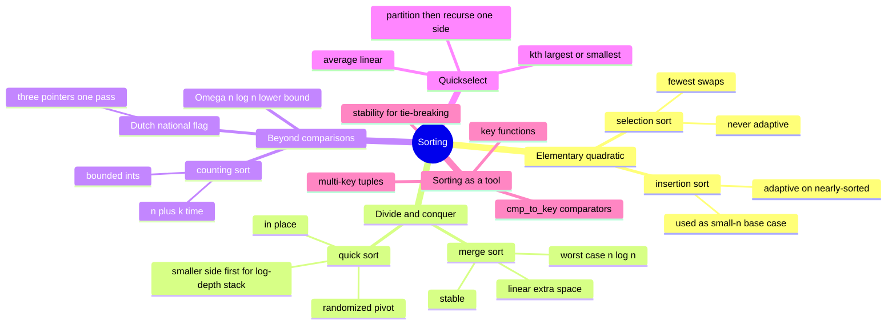

# 09 — Sorting · Cheat-sheet

## Concept map



*What to notice: every branch is either "how do I sort fast" (left
side) or "how do I use sorting to solve a different problem" (right
side) — interview problems live almost entirely on the right.*

## The comparison table (the centerpiece)

| Algorithm | Best | Average | Worst | Space | Stable? | In-place? |
| --- | --- | --- | --- | --- | --- | --- |
| Selection sort | O(n²) | O(n²) | O(n²) | O(1) | no | yes |
| Insertion sort | O(n) | O(n²) | O(n²) | O(1) | yes | yes |
| Merge sort | O(n log n) | O(n log n) | O(n log n) | O(n) | yes | no |
| Quick sort | O(n log n) | O(n log n) | O(n²)* | O(log n) | no | yes |
| Counting sort | O(n + k) | O(n + k) | O(n + k) | O(n + k) | yes | no |

\* practically avoided with a randomized pivot.

## Stability rule

A sort is stable when elements that compare equal never swap relative
order. You need it whenever you sort by more than one key, one pass
at a time — sort by the least important key first, then a stable sort
by the next key preserves that earlier order as a tiebreaker for free.
`merge_sort`, `insertion_sort`, and Python's built-in `sorted()` /
`list.sort()` are all stable. Plain Lomuto/Hoare quick sort and
selection sort are not.

## Quickselect template

```python
def kth_largest(nums, k):
    target = len(nums) - k          # kth largest == (len - k)th smallest
    lo, hi = 0, len(nums) - 1
    while True:
        p = partition(nums, lo, hi)  # same partition as quick sort
        if p == target:
            return nums[p]
        elif p < target:
            lo = p + 1
        else:
            hi = p - 1
```

Only ONE side is ever explored after each partition — that's the
whole reason it's O(n) average instead of O(n log n).

## Comparator recipes (Python)

```python
sorted(items)                          # ascending, default order
sorted(items, reverse=True)            # descending
sorted(items, key=len)                 # sort by a derived value
sorted(items, key=lambda p: (p.score, -p.age))   # multi-key: tuple of keys
                                        #   (negate a numeric key to flip its direction)

from functools import cmp_to_key
def compare(a, b):
    return -1 if a + b > b + a else (1 if a + b < b + a else 0)
sorted(strs, key=cmp_to_key(compare))  # for A-vs-B comparisons that
                                        #   aren't reducible to one key
                                        #   (e.g. "9"+"34" vs "34"+"9")
```

Prefer `key=` (one function per element, O(n) calls) over
`cmp_to_key` (one function per comparison, O(n log n) calls) whenever
the rule reduces to "compute a value per item and compare those" —
`cmp_to_key` is for the rare case where the comparison genuinely needs
BOTH elements at once (like the concatenation trick above).

## Which sort when

| If the problem says... | Reach for |
| --- | --- |
| "no extra memory allowed" | quick sort (or insertion sort if n is tiny) |
| "must be stable" / "multi-key sort" | merge sort, or `sorted()`/`.sort()` |
| "values are bounded ints" (ages, grades, digits) | counting sort |
| "just the kth value", not the whole order | quickselect |
| "nearly sorted already" | insertion sort |
| "sort by a custom/derived rule" | `key=` (or `cmp_to_key` if it needs both elements) |

## Self-quiz

1. Why is insertion sort O(n) on nearly-sorted input but selection
   sort is always O(n²) regardless of input order?
2. What single change to the merge step (`<=` vs `<`) determines
   whether merge sort is stable?
3. An already-sorted array is quick sort's worst case with a
   first-element pivot. Name the TWO independent fixes and what each
   one protects against (time vs. stack depth).
4. Why doesn't counting sort's O(n + k) time violate the Ω(n log n)
   lower bound for sorting?
5. Quickselect and quick sort both partition. What's the one
   structural difference that makes quickselect O(n) average instead
   of O(n log n)?
6. You need "top 5 by score, ties broken by earliest signup." Is this
   a job for a custom algorithm or a multi-key `key=`? Why?
7. Why does the Dutch national flag partition not advance `mid` after
   swapping with `high`, but it DOES advance `mid` after swapping with
   `low`?
8. `sorted(prices, key=lambda p: (-p.rating, p.price))` — describe the
   ordering this produces in one sentence.

<details><summary>Answers</summary>

1. Insertion sort's inner loop only shifts an element as far as the
   next smaller value — on nearly-sorted input that's O(1) per
   element on average. Selection sort always scans the ENTIRE unsorted
   remainder to find the minimum on every pass, no matter how sorted
   the input already is.
2. `<=` makes it stable: on a tie, the left half's element (which came
   first in the original array) is taken first, so equal elements
   never cross each other. `<` would let a right-half element jump
   ahead of an equal left-half element.
3. Randomize the pivot (protects TIME — makes an O(n²) split
   astronomically unlikely for any input) and recurse into the smaller
   side while looping on the larger side (protects SPACE/stack depth —
   bounds recursion to O(log n) even if a pivot choice is bad).
4. Counting sort never compares two elements to each other — it counts
   occurrences and places by index. The Ω(n log n) bound only applies
   to COMPARISON sorts; counting sort sidesteps the assumption
   entirely (at the cost of needing a small, known integer range).
5. Quick sort recurses into BOTH sides after partitioning (has to sort
   everything). Quickselect only recurses into the ONE side that can
   contain the target index, discarding the other side's work
   entirely — that's the `n + n/2 + n/4 + ...  = O(n)` series instead
   of `O(n) x log n` levels.
6. Multi-key `key=` — it reduces cleanly to "compute (score, signup)
   per item and compare those tuples," no need to compare two whole
   records against each other directly.
7. A value swapped in from `high` (the "2" region) is UNEXAMINED and
   must be checked next iteration, so `mid` stays put. A value swapped
   in from `low` is always a "1" that was already scanned (mid only
   swaps with low when it already knows nums[mid] was 0, and whatever
   comes back from low was already verified not to be a 2), so it's
   safe to move past it.
8. Highest rating first (the `-` flips ascending into descending);
   among items with equal rating, lowest price first.

</details>

## Pattern-recognition drill

For each one-liner, name the pattern/structure before peeking.

1. "Find the 3rd smallest element in an unsorted array of a million
   integers, fast."
2. "Sort a list of (student, grade) pairs by grade — ties should keep
   students in their original alphabetical order."
3. "You have exam scores, every one an integer from 0 to 100 — sort
   ten million of them as fast as possible."
4. "Given a list of intervals, sort them so you can sweep left to
   right and merge overlaps." (decoy — which module actually solves
   the sweep itself?)
5. "Arrange these digits to form the smallest possible number."
6. "Sort an array of exactly three distinct colors in one pass with no
   extra memory."

<details><summary>Answers</summary>

1. Quickselect — one order statistic, not a full sort; O(n) average.
2. A stable sort with a `key=` on grade (e.g. `sorted(pairs,
   key=lambda p: p.grade)`) — stability preserves the earlier
   alphabetical order as the tiebreaker.
3. Counting sort — a small, known bounded integer range (0-100) beats
   any O(n log n) comparison sort.
4. Sorting IS the setup step (sort by interval start), but the actual
   merge sweep is a two-pointers/greedy pattern from module 17 — this
   module only gets you to "sorted," not to the merged result.
5. A custom comparator (`cmp_to_key`), same idea as
   `largest_concat_number` but comparing `a+b` vs `b+a` the other
   direction (smallest first) — and watch the leading-zero edge case.
6. Dutch national flag — three pointers, one pass, O(1) space; plain
   counting sort would need two passes instead of one.

</details>
