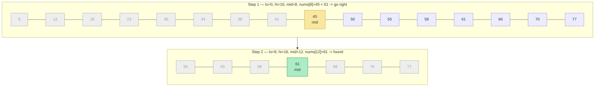
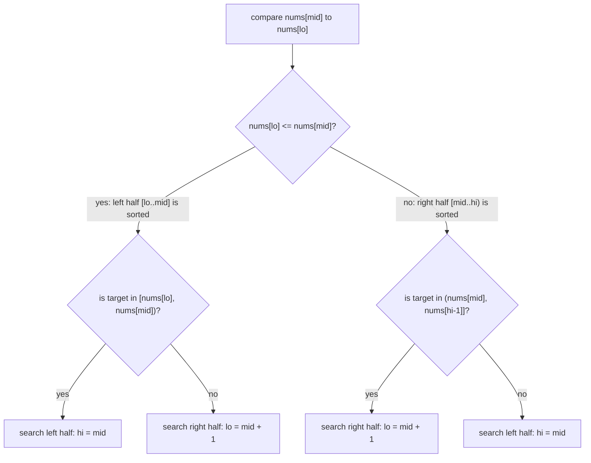
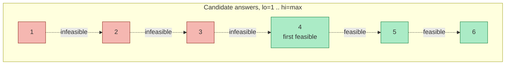

# 10 — Binary Search

## Why this exists

Linear scan answers "does this exist?" in O(n) — you look at every
element until you find it or run out. But if the data is **sorted** (or
just *monotone* — see the end of this lesson), every comparison you make
tells you which half the answer is in, and you can throw the other half
away. That turns O(n) into O(log n): searching a billion-item sorted
list takes about 30 comparisons instead of up to a billion.

The naive alternative is always "just scan it" — O(n) time, O(1) space.
Binary search trades nothing for O(log n) time, same O(1) space, as long
as you can answer one question fast: **"is the thing I want to the left
of here, or the right?"**

## The halving, step by step

Searching for `61` in a sorted 16-element array. Each step asks one
question at `mid` and discards half the remaining range.



*What to notice: after step 1 the left 9 elements (indices 0-8) are gone
for good — the algorithm never looks at them again. Two comparisons
found the answer in a 16-element array; a 1,000,000-element array would
still only take ~20.*

## How to recognize it

- The input is **sorted**, or can be framed as sorted (rotated sorted
  counts — see below).
- You're asked for a **position**: first/last occurrence, insertion
  point, "closest value," "how many times does X appear."
- The problem says **"minimize the maximum"**, **"maximize the
  minimum"**, or **"smallest/largest X such that ... is possible"** —
  that's search on the answer (its own section below).
- You can ask "is `mid` too small, too big, or just right?" and trust
  the answer to rule out an entire half — even if nothing looks sorted
  at first glance (peak-finding, rotated arrays).

## THE template

Pin one shape and use it everywhere — mixing open/closed bounds across
a codebase is where off-by-one bugs live.

```python
def binary_search_template(n: int, feasible) -> int:
    """Return the smallest x in [0, n) with feasible(x) == True.
    Requires feasible to be monotone: False...False, True...True.
    If nothing is feasible, returns n.
    """
    lo, hi = 0, n          # half-open: [lo, hi)
    while lo < hi:
        mid = lo + (hi - lo) // 2     # never (lo+hi)//2 -- can overflow
        if feasible(mid):
            hi = mid        # mid could be the answer -- keep it in range
        else:
            lo = mid + 1     # mid is provably wrong -- exclude it
    return lo               # lo == hi: the boundary
```

**Why this shape avoids infinite loops and off-by-ones:**

- `[lo, hi)` is half-open, so `hi` is never a valid index to inspect —
  no "should this be `<=` or `<`?" debate at the edges.
- The loop condition `lo < hi` and post-condition `lo == hi` mean the
  loop body always shrinks `hi - lo`: `mid < hi` always (so `hi = mid`
  shrinks the range), and `mid >= lo` always (so `lo = mid + 1` also
  shrinks it). Neither branch can leave the range unchanged.
- `mid = lo + (hi - lo) // 2` rounds DOWN. Combined with `lo = mid + 1`
  on the "no" branch, `lo` always makes forward progress even when the
  range is 2 elements wide.

**Exact match as a thin wrapper** around the same template:

```python
def binary_search(nums: list[int], target: int) -> int:
    lo, hi = 0, len(nums)
    while lo < hi:
        mid = lo + (hi - lo) // 2
        if nums[mid] < target:
            lo = mid + 1
        else:
            hi = mid
    if lo < len(nums) and nums[lo] == target:
        return lo
    return -1
```

This is exactly `feasible(i) = nums[i] >= target`, then a check that the
landing spot really holds `target` (it might just be where target
*would* go).

## Boundary searches

Two named variants of the same template, both "smallest index where a
predicate flips from False to True":

| Name | Predicate | Meaning |
| --- | --- | --- |
| `lower_bound(nums, x)` | `nums[i] >= x` | first index `x` could occupy |
| `upper_bound(nums, x)` | `nums[i] > x` | first index *past* every `x` |

`count_occurrences(nums, x) = upper_bound(nums, x) - lower_bound(nums, x)`
— the gap between the two boundaries IS the run of matching values.

Worked example: `nums = [2, 4, 4, 4, 4, 7, 9]`, `x = 4`.

| Step | lo | hi | mid | nums[mid] | `nums[mid] >= 4`? | action |
| --- | --- | --- | --- | --- | --- | --- |
| lower_bound 1 | 0 | 7 | 3 | 4 | yes | `hi = 3` |
| lower_bound 2 | 0 | 3 | 1 | 4 | yes | `hi = 1` |
| lower_bound 3 | 0 | 1 | 0 | 2 | no | `lo = 1` |
| done | **1** | 1 | — | — | — | `lower_bound = 1` |

| Step | lo | hi | mid | nums[mid] | `nums[mid] > 4`? | action |
| --- | --- | --- | --- | --- | --- | --- |
| upper_bound 1 | 0 | 7 | 3 | 4 | no | `lo = 4` |
| upper_bound 2 | 4 | 7 | 5 | 7 | yes | `hi = 5` |
| upper_bound 3 | 4 | 5 | 4 | 4 | no | `lo = 5` |
| done | **5** | 5 | — | — | — | `upper_bound = 5` |

`count = 5 - 1 = 4` — matches the four `4`s at indices 1-4.

## Rotated arrays

A sorted array rotated at an unknown pivot (`[4,5,6,7,0,1,2]`) is no
longer globally sorted — but at every `mid`, **at least one half is
still normally sorted**, and that's enough to decide which way to go.



*What to notice: you never need to know WHERE the rotation pivot is.
Comparing `nums[mid]` against `nums[lo]` tells you which side is
"normal," and a normal sorted side is enough to test containment in O(1).*

`min_in_rotated` is the same idea with a simpler question at each step:
"is `nums[mid]` bigger than the last element? Then the minimum is to the
right. Otherwise it's at `mid` or to the left."

## Search on the answer

The big idea: the array being searched doesn't have to be the input
data at all. If you can define a numeric range `[lo, hi]` and a
predicate `can(x)` that is **monotone** — false for a while, then true
for the rest of the range, never flipping back — you can binary-search
that range directly, even though no array of "candidate answers" ever
gets built.

**How to recognize it:** phrases like *"minimize the maximum..."*,
*"the smallest capacity/speed/size such that..."*, *"find the minimum X
so that Y is possible."* The question isn't "where is this value in an
array" — it's "what's the smallest value for which a yes/no check
passes."



*What to notice: this is the exact same "smallest index where the
predicate flips to True" shape as `lower_bound` — just walking over a
range of possible ANSWERS instead of a range of array indices.*

**Template:**

```python
def search_on_answer(lo: int, hi: int, can) -> int:
    """Smallest x in [lo, hi] with can(x) True. can(hi) must be True."""
    while lo < hi:
        mid = lo + (hi - lo) // 2
        if can(mid):
            hi = mid
        else:
            lo = mid + 1
    return lo
```

`lo` = the smallest answer that could ever work (often `1` or
`max(...)`), `hi` = an answer you already know works (often `max(...)`
or `sum(...)`). `can(x)` usually costs O(n) to check (one pass over the
input), so the whole search is O(n log(hi - lo)).

## Worked example: minimum processing rate

"Machines process `piles` of jobs, one pile per hour at rate `r`; find
the minimum integer `r` so every pile finishes within `h` hours."
Running it through the module 01 framework:

1. **Understand**: pick a rate `r`. Pile `p` takes `ceil(p / r)` hours
   at that rate (a whole hour even for a partial pile). Sum those hours
   across all piles; it must be `<= h`. Find the smallest such `r`.
2. **Brute force**: try `r = 1, 2, 3, ...` and stop at the first one
   that fits within `h` hours. O(n · max(piles)) — for `max(piles)` in
   the millions, that's way too slow.
3. **Bottleneck**: we re-derive "is `r` fast enough?" from scratch for
   every candidate `r`, one at a time, in increasing order.
4. **Pattern**: "smallest rate such that a check passes" — that's the
   cue. Is the check monotone? Yes: a bigger rate only ever needs the
   same or fewer hours per pile, never more. Once `can(r)` is true, it
   stays true for every larger `r`. **Search on the answer.**
5. **Verify**: `lo = 1` (slowest legal rate), `hi = max(piles)`
   (finishes every pile in one hour each — always feasible). Binary
   search for the first feasible `r`.

Trace on `piles = [3, 6, 7, 11]`, `h = 8`:

| lo | hi | mid | hours needed | `<= 8`? | action |
| --- | --- | --- | --- | --- | --- |
| 1 | 11 | 6 | 1+1+2+2 = 6 | yes | `hi = 6` |
| 1 | 6 | 3 | 1+2+3+4 = 10 | no | `lo = 4` |
| 4 | 6 | 5 | 1+2+2+3 = 8 | yes | `hi = 5` |
| 4 | 5 | 4 | 1+2+2+3 = 8 | yes | `hi = 4` |
| **4** | 4 | — | — | — | answer = 4 |

## Complexity

Every variant here is **O(log range) iterations**, each doing O(1) work
(classic search, boundaries, rotated) or O(n) work (search on the
answer's `can(x)`, matrix search's flat-index math is O(1) so it stays
O(log(m·n))). Space is O(1) — the template only ever tracks `lo`, `hi`,
`mid`. WHY log: each iteration provably discards at least half of what's
left, so after `k` iterations at most `range / 2^k` remains; that hits 1
when `k ≈ log2(range)`.

## Common gotchas

- **Overflow**: `(lo + hi) // 2` can overflow in fixed-width-integer
  languages when `lo + hi` exceeds the max int. Python ints don't
  overflow, but `mid = lo + (hi - lo) // 2` is still the habit to build
  — it's what you'll need in C++/Java/TS-with-typed-arrays, and it's
  never wrong here either.
- **Mixing open and closed bounds.** `hi = n` (half-open) vs `hi = n -
  1` (closed) are both valid conventions, but you must stay consistent
  about what "in range" means for every comparison. Picking one
  template (half-open, this lesson) and reusing it everywhere is the
  actual fix.
- **A predicate that isn't really monotone.** If `can(x)` can flip back
  from true to false as `x` grows, binary search silently returns a
  wrong answer instead of crashing — always state *why* the predicate
  is monotone before coding (as in the worked example above).
- **Empty input.** `lo, hi = 0, 0` immediately skips the loop — make
  sure your fallback return value (usually `-1` or `len(nums)`) is
  correct for "nothing here."

## Try it now

→ `exercises/ex01_classic_search.py` through `exercises/ex07_peak_element.py`,
then `checkpoint_10.py`.
Check with `uv run pytest 10-binary-search`.
