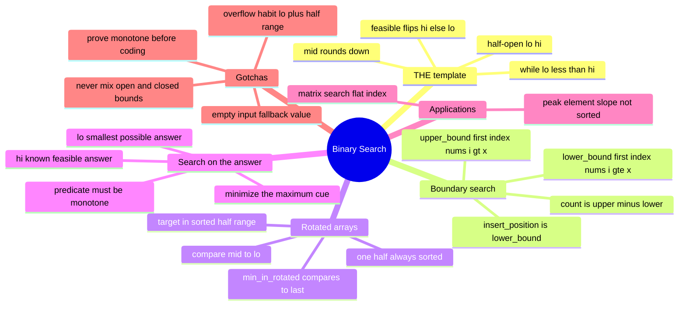

# 10 — Binary Search · Cheat-sheet

## Concept map



*What to notice: every branch is the SAME three-line template underneath
— `lo, hi = 0, n`, `while lo < hi`, `mid = lo + (hi - lo) // 2` — with
only the feasibility check changing.*

## THE template, annotated

```python
lo, hi = 0, n              # half-open [lo, hi) -- hi is never inspected
while lo < hi:
    mid = lo + (hi - lo) // 2   # rounds down; avoids overflow habit
    if feasible(mid):
        hi = mid                 # mid could be the answer -- keep it
    else:
        lo = mid + 1              # mid is provably wrong -- exclude it
# loop ends when lo == hi: that index is the answer
```

`feasible` must be monotone: `False, False, ..., False, True, True, ...,
True`. The template finds the FIRST `True`.

## Boundary recipes

| Goal | feasible(i) | Result if nothing matches |
| --- | --- | --- |
| exact match | `nums[i] >= target`, then verify `nums[lo] == target` | `-1` |
| `lower_bound(x)` | `nums[i] >= x` | `len(nums)` |
| `upper_bound(x)` | `nums[i] > x` | `len(nums)` |
| `insert_position(x)` | same as `lower_bound(x)` | `len(nums)` |
| `count_occurrences(x)` | `upper_bound(x) - lower_bound(x)` | `0` |

## Rotated array decision rules

1. Compare `nums[mid]` to `nums[lo]`.
2. `nums[lo] <= nums[mid]` → left half `[lo..mid]` is normally sorted.
   Check if `target` falls in `[nums[lo], nums[mid])`; if yes go left,
   else go right.
3. Otherwise the right half `[mid..hi]` is normally sorted. Check if
   `target` falls in `(nums[mid], nums[hi]]`; if yes go right, else go
   left.
4. `min_in_rotated`: simpler question, no target — compare `nums[mid]`
   to `nums[hi]`; bigger means the minimum is to the right, otherwise
   `mid` might BE the minimum, so keep it in range.

## Search-on-answer checklist

Before coding, answer all three:

1. **Range** — what are `lo` (smallest answer that could ever work) and
   `hi` (an answer you already know works)?
2. **Predicate** — what does `can(x)` check, and is it O(?) per call?
3. **Monotone proof** — one sentence for WHY a bigger `x` never makes
   `can(x)` flip from true back to false (or vice versa for a "maximize"
   framing).

Cue phrases: *"minimize the maximum..."*, *"the smallest
capacity/speed/size such that..."*, *"find the minimum X so that Y is
possible."*

## Overflow note

Python integers never overflow, so `mid = (lo + hi) // 2` would work
here — but write `mid = lo + (hi - lo) // 2` anyway. It's the version
that's actually correct in fixed-width-integer languages (C++, Java,
32-bit contexts), and there's zero cost to building the habit now.

## Self-quiz

1. Why is `mid = lo + (hi - lo) // 2` preferred over `mid = (lo + hi)
   // 2`, even in a language where it makes no difference?
2. What does `lower_bound(nums, x)` return when every element of
   `nums` is less than `x`?
3. In rotated search, if `nums[lo] <= nums[mid]`, which half is
   guaranteed normally sorted?
4. What three things do you need to pin down before binary-searching
   "on the answer" instead of on an array?
5. Why can `find_peak` binary-search an UNSORTED array?
6. `count_occurrences` is built from two calls to what two functions?
7. What single fact about `grid` lets `search_matrix` treat a 2D grid
   as one flat sorted list?
8. A predicate you binary-search on turns out to be `True, False, True,
   False` as `x` increases. What goes wrong, and why does the bug stay
   silent instead of crashing?

<details><summary>Answers</summary>

1. It can't overflow `lo + hi` in fixed-width integers, and it makes
   the "shrink toward lo" progress obvious by construction.
2. `len(nums)` — the insertion point past the end.
3. The left half, `[lo, mid]`.
4. The range `[lo, hi]` of candidate answers, the predicate `can(x)`,
   and a one-sentence proof that `can` is monotone over that range.
5. Because binary search only needs "exactly one half can be safely
   discarded per step" — comparing `nums[mid]` to `nums[mid + 1]` gives
   a guaranteed-correct discard even without global sortedness.
6. `lower_bound` and `upper_bound` (the count is their difference).
7. `grid[i][0] > grid[i - 1][-1]` for every row after the first, so
   row-major flattening is fully sorted.
8. The predicate isn't monotone, so binary search silently returns
   whichever `False`/`True` boundary it happens to land on instead of
   the real answer — no exception is raised, it just quietly returns a
   wrong index.

</details>

## Pattern-recognition drill

For each, name the technique before checking the answer.

1. "Given a sorted array of unique ints, find the index of value `v`."
2. "Find the smallest number of days to make `m` bouquets, where each
   day one more flower blooms in a fixed order and a bouquet needs `k`
   adjacent bloomed flowers."
3. "An array was sorted, then rotated an unknown number of times. Find
   its minimum value."
4. "Given a sorted array with duplicates, find how many times `v`
   appears."
5. "Find the smallest divisor `d` such that dividing every element by
   `d` and summing the ceilings gives a result `<= threshold`."
6. "Given a mountain-shaped array (strictly increasing then strictly
   decreasing), find the peak index."
7. "Given `n` employees and a list of task durations, find the minimum
   number of work-hours per employee (a capacity) so all tasks finish
   within `k` shifts, tasks assigned in a fixed order."
8. "Find the median of two sorted arrays in `O(log(min(m, n)))`."

<details><summary>Answers</summary>

1. Classic binary search (exact match template).
2. Search on the answer — "smallest number of days such that..." is
   the giveaway, even though "days" sounds like a count, not a size.
3. Rotated array search (`min_in_rotated` shape).
4. Boundary search — `upper_bound - lower_bound`.
5. Search on the answer, over the divisor `d`, `can(d)` = "sum of
   ceilings <= threshold" is monotone in `d`.
6. Binary search on an unsorted array (peak-element shape) — the slope
   at `mid` is the monotone signal, not the values themselves.
7. Search on the answer (capacity-on-answer shape, same predicate as
   `min_capacity`/`split_min_largest`).
8. A DECOY for this module in spirit (it's genuinely binary search, but
   on the PARTITION point across two arrays simultaneously, not a
   single monotone predicate over one range) — worth flagging as
   "binary search," but it's a trickier two-array variant, not
   search-on-answer.

</details>
