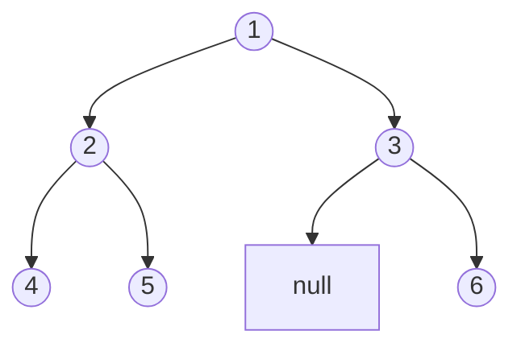
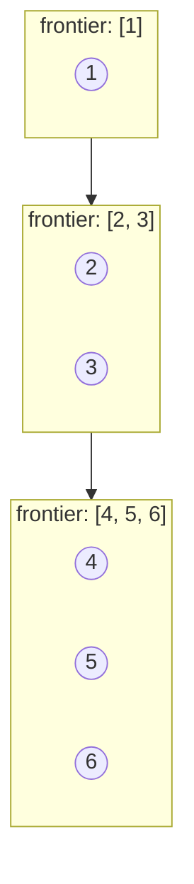
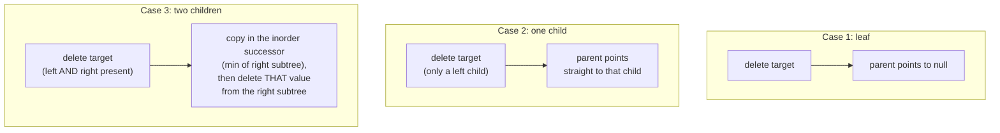

# 11 — Trees & BSTs

## Why this exists

Hierarchies are everywhere: a file system, the DOM, an org chart, a
tournament bracket. A **tree** is the data structure for "one parent,
many descendants, no cycles." A **binary search tree (BST)** adds one
rule — left is smaller, right is bigger — and that single rule buys you
`O(log n)` search, insert, and delete on data that stays sorted the
whole time.

Compare that to the alternatives you already know: a sorted array gives
you fast search (`O(log n)` via binary search from module 10) but slow
insert (`O(n)`, because everything after the gap has to shift). A hash
map gives you fast insert and lookup but no order at all — no "give me
everything between 10 and 20," no "what's the next value up." A BST
gets you `O(log n)` on all three, AND keeps the order, AND makes range
queries and "closest value" queries cheap. That combination is why
trees show up constantly in interviews, even outside the "build a BST"
question itself.

## Vocabulary

| Term | Meaning |
| --- | --- |
| root | the one node with no parent — where every traversal starts |
| leaf | a node with no children |
| edge | the link between a parent and a child |
| depth of a node | number of edges from the root down to that node |
| height of a tree | number of edges on the longest root-to-leaf path (equivalently, `max_depth - 1` in node-count terms) |
| subtree | a node plus everything below it — a tree in its own right |
| balanced | height stays `O(log n)` — no path is dramatically longer than another |
| complete | every level is full except possibly the last, which fills left to right |
| BST invariant | for every node, **every** value in its left subtree is smaller, **every** value in its right subtree is bigger |

## Anatomy of a tree: one shape, four orders



*What to notice: it's the same six nodes every time below — only the
order you visit them in changes.*

| Order | Rule | Result on the tree above |
| --- | --- | --- |
| Preorder | node, left, right | `1, 2, 4, 5, 3, 6` |
| Inorder | left, node, right | `4, 2, 5, 1, 3, 6` |
| Postorder | left, right, node | `4, 5, 2, 6, 3, 1` |
| Level order (BFS) | top to bottom, left to right | `1, 2, 3, 4, 5, 6` |

Preorder is "write the node down as soon as you arrive" — good for
copying/serializing a tree. Postorder is "finish both children before
reporting" — good for deleting a tree bottom-up, or computing something
that depends on children's answers. Inorder on a **BST specifically**
comes out sorted — that's not a coincidence, it's the whole point of
the invariant.

## DFS recursively: trust the subtree

Module 08 taught you to trust the recursive call: assume it correctly
solves the smaller subproblem, and just combine. Trees are the purest
form of that leap of faith. For any node, assume `left` and `right` are
already correctly solved for their own subtrees — your job is just to
combine two answers into one.

```python
def preorder(root):
    if root is None:          # base case: an empty subtree contributes nothing
        return []
    return [root.value] + preorder(root.left) + preorder(root.right)
```

Swap where `root.value` gets inserted relative to the two recursive
calls, and you get inorder or postorder — same template, different
combine step. (The reference solutions use an accumulator list instead
of `+` concatenation — concatenating fresh lists at every call is
`O(n^2)` on a skewed tree, since each `+` copies its left operand.)

## DFS iteratively, and BFS with a queue

Recursion IS a stack (the call stack) — so any recursive DFS can be
rewritten with an explicit `list` used as a stack. Push the way down,
pop-and-visit on the way back up.

BFS is a different shape entirely: it explores level by level, using a
**queue**, not a stack. This is the module-06 queue paying off again.



*What to notice: BFS never "goes deep" — it finishes an entire level
before starting the next one. Snapshot the queue's length at the top of
each loop pass; that's how you know where one level ends and the next
begins.*

## Binary search trees

The invariant, stated precisely (and this is the exercise's trap, so
read it twice): for every node `N`, **every** value in `N`'s left
subtree is `< N.value`, and **every** value in `N`'s right subtree is
`> N.value` — not just `N`'s direct children. A node two levels down
can still break the rule relative to a grandparent even if it looks
fine next to its own parent.

**Search / insert** walk one path from the root: compare, go left or
go right, repeat. That's `O(h)` — height, not size — because you never
look at the subtree you didn't walk into.

**Delete** is the one operation with real cases:



*What to notice: case 3 never actually "deletes" the two-children node
directly — it steals a value from elsewhere (the successor, which is
guaranteed to have at most one child) and turns the problem back into
case 1 or case 2.*

## How to recognize it

- "per level" / "row by row" / "zigzag" / "rightmost node at each
  depth" → **BFS**, a queue, one pass per level.
- "path from root to X" / "combine the answer from both children" /
  "deepest," "longest," "balanced" → **DFS**, usually bottom-up
  recursion (compute children first, combine).
- "sorted order out of a tree" / "k-th smallest" / "range [lo, hi]" /
  "closest value" → lean on the **BST invariant** — inorder traversal
  or ordering-guided pruning, never a plain hash set.
- "reconstruct a tree from its traversals" → preorder/level-order gives
  you roots in visiting order; inorder (on a plain binary tree) or
  value ordering (on a BST) tells you how to split left from right.

## Worked example: iterative inorder, traced step by step

Tree: `5` with left child `3` (which has left child `1`), and right
child `8`.

| Step | Action | Stack (top → right) | Output so far |
| --- | --- | --- | --- |
| 1 | push 5, go left | `[5]` | `[]` |
| 2 | push 3, go left | `[5, 3]` | `[]` |
| 3 | push 1, go left (None) | `[5, 3, 1]` | `[]` |
| 4 | pop 1, visit, go right (None) | `[5, 3]` | `[1]` |
| 5 | pop 3, visit, go right (None) | `[5]` | `[1, 3]` |
| 6 | pop 5, visit, go right to 8 | `[]` | `[1, 3, 5]` |
| 7 | push 8, go left (None) | `[8]` | `[1, 3, 5]` |
| 8 | pop 8, visit, go right (None) | `[]` | `[1, 3, 5, 8]` |

*What to notice: the stack always holds the current path back up to the
root. "Push while going left" is doing the recursion's job of
remembering where to come back to.*

## Complexity

| Operation | Balanced BST | Degenerate (skewed) BST |
| --- | --- | --- |
| search / insert / delete | `O(log n)` | `O(n)` |
| any full traversal (DFS or BFS) | `O(n)` time, `O(n)` space always | same |

`h` (height) is the number on the hook for BST operations. A balanced
tree keeps `h = O(log n)` because each step halves the remaining
candidates, same idea as binary search. A tree built by inserting
already-sorted data degenerates into a straight line — `h = O(n)` — and
every "fast" BST operation quietly becomes linear. Self-balancing trees
(AVL, red-black) exist specifically to prevent that by rebalancing on
every insert/delete; that machinery is out of scope here, but knowing
*why* it exists is the point.

## Gotchas

- **Validate with bounds, not with children.** `node.left.value <
  node.value < node.right.value` only checks one level — it misses a
  grandchild that violates an ancestor's bound. Thread a `(low, high)`
  range through the recursion instead.
- **`None` children are everywhere.** Every leaf has two `None`
  children; every base case in every recursive function on this page
  starts with `if node is None: ...`. Forgetting it is the #1 source of
  `AttributeError: 'NoneType' object has no attribute 'left'`.
- **Recursion depth on skewed trees.** A DFS solution recurses to a
  depth equal to the tree's height. That's `O(log n)` and totally safe
  on a balanced tree, but a skewed or adversarially-built tree can hit
  Python's recursion limit. Worth knowing the iterative version exists
  for exactly this reason.
- **Mutating while you compare.** `is_same_tree`/`is_subtree`-style
  functions should only ever *read* `.value`/`.left`/`.right` — building
  a habit of read-only comparisons now avoids nasty bugs once you're
  also mutating trees (insert, delete, invert) in the same session.

## Try it now

→ `exercises/ex01_build_bst.py` through `exercises/ex08_construct_tree.py`,
in order — each later exercise's tests build trees with `ex01`'s
`tree_from_level_array`/`tree_to_level_array` helpers, so `ex01` comes
first no matter what. Then `checkpoint_11.py`.
Check with `uv run pytest 11-trees-bst`.
