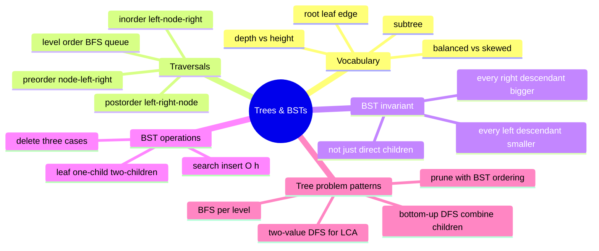

# 11 — Trees & BSTs · Cheat-sheet

## Concept map



*What to notice: every branch traces back to one idea — the invariant
buys ordering, DFS answers "combine children" questions, BFS answers
"per level" questions.*

## Traversal table

| Traversal | Visit order | Use it for | Iterative tool |
| --- | --- | --- | --- |
| Preorder | node, left, right | serialize/copy a tree, "visit root first" problems | explicit stack, push right then left |
| Inorder | left, node, right | sorted output from a BST, k-th smallest | explicit stack, walk-left-then-pop |
| Postorder | left, right, node | delete a tree, compute a value that needs children first | explicit stack (or two-stack trick) |
| Level order | top to bottom, left to right | "per level" problems, shortest path in an unweighted tree/graph | queue (BFS), snapshot length per level |

## BST operation costs

| Operation | Balanced BST | Degenerate (skewed) BST |
| --- | --- | --- |
| search | `O(log n)` | `O(n)` |
| insert | `O(log n)` | `O(n)` |
| delete | `O(log n)` | `O(n)` |
| min / max | `O(log n)` | `O(n)` |
| full traversal | `O(n)` always | `O(n)` always |

## The validate-with-bounds template

```python
def is_valid_bst(root):
    def check(node, low, high):
        if node is None:
            return True
        if not (low < node.value < high):
            return False
        return check(node.left, low, node.value) and check(node.right, node.value, high)
    return check(root, float("-inf"), float("inf"))
```

The bound tightens as you go down — a left child's `high` becomes its
parent's value; a right child's `low` becomes its parent's value. That
threading is what catches a grandchild violation a children-only check
would miss.

## Which traversal, when? (decision list)

1. Need the values in **sorted order** (BST only)? → inorder.
2. Need to **rebuild/serialize** a tree, or process a node before its
   children? → preorder.
3. Need to process **children before the parent** (delete, compute a
   size/height bottom-up)? → postorder.
4. Need answers **grouped by depth**, or "leftmost/rightmost node per
   level," or the **shortest path** on an unweighted structure? → BFS
   / level order.
5. Need to know if a value is **inside a range**, or want to **skip
   whole subtrees**? → BST-ordering-guided traversal (prune, don't
   visit everything).

## Self-quiz

1. What's the difference between a node's *depth* and the tree's
   *height*?
2. Why does an inorder traversal of a BST always come out sorted?
3. What's wrong with checking `node.left.value < node.value <
   node.right.value` to validate a BST?
4. Walk through BST delete for a node with two children — what value
   replaces it, and where does that value come from?
5. Why is BFS implemented with a queue instead of a stack?
6. What's the time complexity of BST search on a balanced tree vs. a
   tree built by inserting already-sorted values, and why the
   difference?
7. `diameter(root)` needs the number of edges on the longest path
   between any two nodes. Why can't you just compute
   `max_depth(root.left) + max_depth(root.right)` once at the root?
8. Reconstructing a tree from preorder + inorder: what does preorder
   tell you, what does inorder tell you, and what does the index map
   save you from doing?

<details><summary>Answers</summary>

1. Depth is measured from the root down TO a specific node (root has
   depth 0). Height is the tree's longest root-to-leaf path, i.e. the
   max depth of any leaf.
2. The BST invariant guarantees every value in a node's left subtree
   is smaller and every value in its right subtree is bigger. Visiting
   left, then the node, then right therefore always visits values in
   increasing order.
3. It only checks one level down — it misses a grandchild that's fine
   relative to its own parent but violates an ancestor's bound (e.g. a
   value under a right child that's still smaller than the root).
4. The inorder successor — the minimum value in the node's right
   subtree — replaces it; that successor value is then deleted from
   the right subtree (where it's guaranteed to be a leaf or have only
   one child).
5. BFS needs to process nodes in the order they were discovered (FIFO)
   to guarantee finishing one level before starting the next. A stack
   (LIFO) would dive into whichever child was pushed last, giving a
   DFS-like order instead.
6. `O(log n)` balanced vs. `O(n)` on sorted-insert data. Search cost is
   proportional to height; a balanced tree keeps height at
   `O(log n)`, but inserting already-sorted values builds a straight
   line where height equals the number of nodes.
7. The longest path doesn't have to pass through the root — it can sit
   entirely inside one subtree. You need the max of
   `left_height + right_height` computed AT EVERY NODE, not just once
   at the top.
8. Preorder's first (remaining) value is always the current subtree's
   root. Inorder tells you which values fall left vs. right of that
   root. A value → inorder-index map turns "find the root's split
   point" from an `O(n)` scan into an `O(1)` lookup, which is what
   gets the whole reconstruction down to `O(n)`.

</details>

## Pattern-recognition drill

For each one-liner, name the pattern/structure before checking the
answer.

1. "Return the values of a binary tree grouped by depth."
2. "Given a BST, return the 3rd smallest value."
3. "Return the deepest leaf's value in a binary tree."
4. "Check whether two binary trees have identical shape and values."
5. "Given preorder and inorder traversals, rebuild the tree."
6. "Sum every BST node with a value between 10 and 50."
7. "Find the lowest common ancestor of two nodes in a BST."
8. "Return the tree's node values as seen from the right side, top to
   bottom."

<details><summary>Answers</summary>

1. BFS / level order — "grouped by depth" is the level-order cue.
2. Inorder traversal with an early stop at the k-th value — the BST
   invariant makes inorder = sorted order.
3. Bottom-up DFS — "deepest" means combining children's depths.
4. DFS in lockstep over both trees (`is_same_tree`) — compare node by
   node, short-circuit on mismatch.
5. Index-map-accelerated recursive construction — preorder gives roots,
   inorder gives the left/right split.
6. Pruned DFS using the BST invariant (`range_sum_bst`) — skip subtrees
   that can't contain values in range.
7. Ordering-guided descent from the root (`lca_bst`) — no need to
   search both subtrees, the BST tells you which way to go.
8. BFS by level, keeping only the last value seen each level
   (`right_side_view`).

</details>
