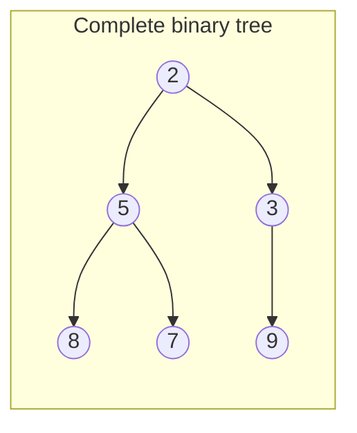
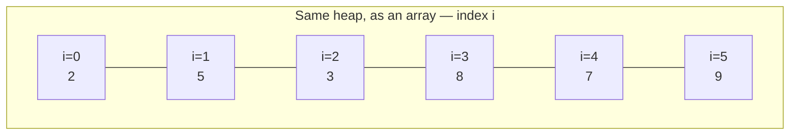
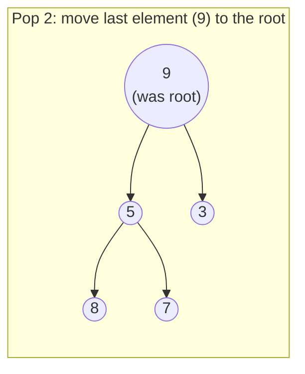
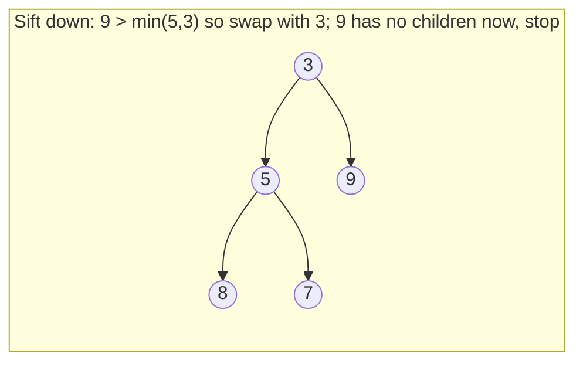

# 12 — Heaps & Priority Queues

## Why this exists

Some problems only ever ask one question: "what's the smallest (or
largest) thing I'm holding onto RIGHT NOW?" — and then they ask it
again and again as the collection changes. Sorting the whole
collection every time someone asks is `O(n log n)` per question. A
**heap** answers "what's smallest?" in `O(1)` and "insert a new item" /
"remove the smallest" in `O(log n)` each — without ever being fully
sorted. That's the trade a priority queue makes: give up full order,
keep instant access to the one element that matters.

Naive alternatives and their cost, for `n` items and `q` queries:

| Approach | Peek min | Insert | Remove min | Notes |
| --- | --- | --- | --- | --- |
| Unsorted list | `O(n)` scan | `O(1)` | `O(n)` scan + remove | cheap insert, expensive read |
| Sorted list | `O(1)` | `O(n)` shift | `O(1)` end / `O(n)` middle | cheap read, expensive insert |
| Re-sort every time | `O(n log n)` | — | — | wasteful — you re-sort things you don't need sorted |
| **Binary heap** | `O(1)` | `O(log n)` | `O(log n)` | the balance point |

## The structure: a complete binary tree, stored flat

A heap is a **complete binary tree** (every level full except
possibly the last, which fills left to right) — and it needs no
pointers at all, because a complete tree's shape is so regular you can
store it in a plain array.

*What to notice: node at index `i` has parent `(i-1)//2` and children
`2i+1`, `2i+2`. No pointers, no wasted space — a sibling's `next` link
is just "add 1 to the index." That's the whole trick that makes a heap
cheap.*

## The heap property (min-heap)

Every parent is `≤` both of its children. That's it — **it is NOT a
sorted array**. Siblings can be in any order relative to each other;
only the parent-child relationship is constrained. This is exactly
enough structure to guarantee the root is always the minimum, and no
more — which is why building one is cheaper than sorting.

A max-heap is the mirror image: every parent `≥` its children, root is
the maximum. Python's `heapq` module only gives you a min-heap — to
get max-heap behavior, negate the values going in and out (see
Gotchas).

## Sift up (push) and sift down (pop)

**Push** = append the new value at the end (keeps the tree complete),
then **sift up**: while it's smaller than its parent, swap with the
parent. Stop when the heap property holds or you reach the root.
Worst case you climb the tree's height: `O(log n)`.

**Pop** = the root is always the answer. Move the LAST element into
the root's slot (keeps the tree complete), drop the size by one, then
**sift down**: while the moved element is bigger than the smaller of
its two children, swap with that smaller child. Stop when it's
smaller than both children or it has none. Also `O(log n)`.

*What to notice: sifting down always swaps with the SMALLER child, never
the larger — swap with the larger child and you'd break the heap
property on that side instead of fixing it.*

## Heapify: O(n), not O(n log n)

You could build a heap by pushing `n` items one at a time —
`O(n log n)` total. **Heapify** does better: dump all `n` items into
the array as-is, then sift down every node that has children, starting
from the LAST parent and working back to the root (`for i in
range((n - 2) // 2, -1, -1): sift_down(i)`). Leaves need no work — they're
already valid single-node heaps.

The honest reason this is `O(n)` and not `O(n log n)`: most nodes are
near the bottom, where a sift-down does almost no work. Only the
`O(1)` nodes near the root can sift `O(log n)` levels. Summing "number
of nodes at height h" × "h" across the whole tree telescopes to `O(n)`
— roughly half the nodes do zero work, a quarter do at most 1 swap, an
eighth do at most 2, and so on, and that series converges to a
constant instead of growing with `log n`.

## How to recognize it

Reach for a heap when you see:
- **"kth largest / kth smallest"** — of a fixed collection or a stream.
- **"top k"** — largest k, smallest k, most/least frequent k.
- **"k closest"** — to a point, to zero, to a target.
- **"merge k sorted"** — lists, streams, files.
- **"running median" / "running max/min" of a stream** — values keep
  arriving, you need a live statistic.
- **"schedule by priority"** — process the most urgent thing next,
  where "urgent" isn't just arrival order.

**The k-size-heap inversion** — this trips everyone up once: to find
the top-k **LARGEST** values, you keep a **MIN-heap of size k**, not a
max-heap. Why: the min-heap's root is the *worst* of your current top-k
— the one item you'd evict the instant something better shows up. A
max-heap's root would be the *best* item, which is useless for
deciding what to kick out. Same inversion in reverse for top-k
smallest: keep a MAX-heap of size k.

## Worked example: top-3 of a stream

Stream: `5, 1, 9, 3, 7, 2` — keep a MIN-heap capped at size 3 (want
top-3 **largest**).

| Value in | Heap after (min-heap, size ≤ 3) | Action |
| --- | --- | --- |
| 5 | `[5]` | push, size < 3 |
| 1 | `[1, 5]` | push, size < 3 |
| 9 | `[1, 5, 9]` | push, size == 3 now |
| 3 | `[3, 5, 9]` | `3 > heap[0]=1` → push 3, pop the old min (1) |
| 7 | `[5, 7, 9]` | `7 > heap[0]=3` → push 7, pop the old min (3) |
| 2 | `[5, 7, 9]` | `2 < heap[0]=5` → skip, 2 can't be in the top 3 |

Final heap holds `{5, 7, 9}` — the three largest values seen, in a
min-heap so the *smallest of the top-3* is always one comparison away
at `heap[0]`.

## Complexity

| Operation | Time | Why |
| --- | --- | --- |
| `peek` | `O(1)` | it's `array[0]`, no search |
| `push` | `O(log n)` | sift up climbs at most the tree height |
| `pop` | `O(log n)` | sift down descends at most the tree height |
| `heapify` | `O(n)` | most nodes are near the bottom and barely move (see above) |

Space is `O(n)` for the array itself, `O(1)` extra for push/pop/peek —
everything happens in place.

## Common gotchas

- **Min vs max.** Need a max-heap but only have a min-heap (like
  Python's `heapq`)? Negate every value on the way in and out, or push
  tuples with a negated priority first: `heapq.heappush(h, (-priority,
  item))`.
- **Tuples for tie-breaking.** Heaps compare whatever you push
  element-by-element. `(priority, item)` breaks ties by comparing
  `item` next — which crashes if `item` isn't comparable (e.g. two
  dicts). Fix: add a tiebreaker field, e.g. an insertion counter or
  arrival timestamp, so the comparison never reaches the
  un-comparable payload: `(priority, tiebreaker, item)`.
- **Not a sorted structure.** Iterating a heap's underlying array
  front-to-back does NOT give you sorted order — only repeated
  pop-the-root does.
- **Lazy deletion.** Real-world priority queues often need to
  "remove an arbitrary item," which a plain heap can't do cheaply.
  The common trick: mark it deleted in a side set and skip it when it
  surfaces at the root, instead of searching the heap for it. (Just
  know this exists — you won't need it below.)

## Try it now

Seven exercises: build a min-heap from scratch, then use heaps to
solve six classic patterns, then a checkpoint that combines priority +
tie-breaking into a triage queue.
