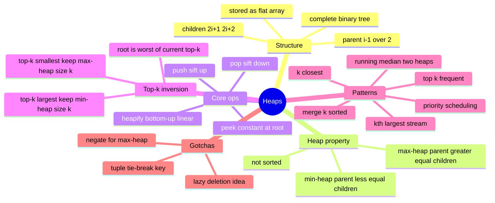

# 12 — Heaps & Priority Queues · Cheat-sheet

## Concept map



*What to notice: every branch traces back to one idea — a heap gives
up full order to keep O(1) access to just the extreme element, and
every pattern below is a different way of spending that trade.*

## Index math

| From index `i` | Formula |
| --- | --- |
| Parent | `(i - 1) // 2` |
| Left child | `2 * i + 1` |
| Right child | `2 * i + 2` |
| Root | `0` |

## Op-cost table

| Operation | Time | Space |
| --- | --- | --- |
| `peek` (min/max) | O(1) | O(1) |
| `push` | O(log n) | O(1) |
| `pop` | O(log n) | O(1) |
| `heapify(nums)` | O(n) | O(1) extra |
| build via n pushes | O(n log n) | — never do this if you can heapify |

## The top-k inversion rule

The one thing that trips everyone: the heap type you keep is the
OPPOSITE of what you're looking for.

| Want | Keep | Why |
| --- | --- | --- |
| top-k **largest** | MIN-heap of size k | root = smallest of your current top-k = first thing to evict |
| top-k **smallest** | MAX-heap of size k | root = largest of your current top-k = first thing to evict |
| single running max | no heap — just track one variable | a heap is overkill for tracking one extreme |

## Tuple-key tie-breaking

Heaps compare pushed items element by element. Pin every field that
matters, in priority order, and add a tiebreaker so equal leading
fields never fall through to comparing something uncomparable (two
dicts, two custom objects):

```python
heapq.heappush(heap, (priority, tiebreaker, payload))
```

Common tiebreakers: an arrival timestamp (FIFO among ties), or an
`itertools.count()` counter (guarantees total order for free).

## `heapq` API map

| Need | `heapq` call |
| --- | --- |
| push | `heapq.heappush(heap, val)` |
| pop smallest | `heapq.heappop(heap)` |
| peek smallest | `heap[0]` |
| build from a list, O(n) | `heapq.heapify(heap)` (mutates in place) |
| push then pop in one O(log n) step | `heapq.heapreplace(heap, val)` (push first, may return the new val) |
| pop then push in one O(log n) step | `heapq.heappushpop(heap, val)` (pop first, cheaper when val may not even belong) |
| max-heap behavior | negate values (or the leading key field) on the way in and out |
| k largest / k smallest of a whole list | `heapq.nlargest(k, it)` / `heapq.nsmallest(k, it)` |

## Gotchas

- A heap's array is NOT sorted — only repeated pops produce sorted
  order.
- `heapq` gives you a min-heap only; simulate max-heap by negating.
- Two equal leading keys + no tiebreaker + a non-comparable payload =
  `TypeError` at the worst possible moment. Always add a tiebreaker
  field when the payload might not be orderable.
- Building a heap by pushing one at a time works but wastes effort —
  `heapify` if you have all the data upfront.

## Self-quiz

1. What index is the parent of index 7? The children of index 2?
2. Why is `heapify` O(n) instead of O(n log n)?
3. You need the 5 largest values from a huge stream. What heap type
   and size do you keep, and why does that feel backwards at first?
4. Two events have the same priority. What do you add to the heap key
   so the tie-break doesn't crash?
5. `heapq` only supports min-heaps. How do you get max-heap behavior?
6. Why does a heap's underlying array print out looking "unsorted"
   even though it's a valid heap?
7. For a running median, what are the two heaps and what invariant do
   you keep between their sizes?
8. Merging k sorted lists with a heap: what's in the heap at any given
   moment, and what does popping and pushing represent?

<details><summary>Answers</summary>

1. Parent of 7: `(7-1)//2 = 3`. Children of 2: `2*2+1 = 5` and
   `2*2+2 = 6`.
2. Most nodes sit near the leaves, where a sift-down barely moves —
   only the few nodes near the root can sift `O(log n)` levels, and
   summing that across the tree telescopes to `O(n)`.
3. A MIN-heap of size 5 — it feels backwards because you'd expect a
   max-heap for "largest," but the min-heap's root is the *worst of
   your current top-5*, exactly the one you need instant access to
   evict.
4. A tiebreaker field (timestamp, insertion counter) placed right
   after the priority in the tuple, so it never needs to compare the
   actual payload.
5. Negate the values (or the leading priority field) going in and
   coming back out.
6. Because only the parent-child relationship is constrained (parent
   `<=` children) — siblings can be in any order, so scanning the
   array left to right isn't a sorted scan.
7. A max-heap (`lows`) for the smaller half, a min-heap (`highs`) for
   the larger half; keep `len(lows) - len(highs)` in `{0, 1}` so the
   median is always at the top of one or both.
8. One "next candidate" per list — the smallest unconsumed element of
   each. Popping emits the next overall smallest; pushing advances
   that same list's pointer by one.

</details>

## Pattern-recognition drill

For each prompt, name the pattern/structure before checking the
answer.

1. "Return the 5 highest-scoring players from a live leaderboard that
   keeps getting new scores."
2. "Merge 12 sorted playlists into one sorted playlist."
3. "Report the running median transaction amount as payments stream
   in."
4. "Find the 3rd smallest element in an ALREADY-SORTED array."
   (decoy)
5. "Process jobs by priority, and jobs of equal priority in the order
    they were submitted."
6. "Find the single largest value in an unsorted array, one pass, no
   further queries." (decoy)
7. "Find the k points closest to a given sensor from a list of sensor
   readings."
8. "Count how many times each word appears, then return the 10 most
   common words."

<details><summary>Answers</summary>

1. Heap — top-k largest from a stream: MIN-heap of size 5.
2. Heap — k-way merge: heap of one "next candidate" per list.
3. Heap — running median: two balanced heaps (max-heap of lows,
   min-heap of highs).
4. NOT a heap — it's already sorted, so it's just `arr[2]` (0-indexed
   3rd smallest), O(1). A heap would be pure overkill.
5. Heap — priority queue with a tuple key `(priority, arrival_order)`
   for FIFO tie-breaking.
6. NOT a heap — a single running max needs one variable and one pass,
   O(n) time O(1) space; building a heap just to read the root once is
   wasted O(n) work for the same answer.
7. Heap — top-k smallest via a MAX-heap of size k, keyed on squared
   distance.
8. Heap — count with a hash map first, then top-k frequent via a
   MIN-heap of size 10 (or bucket sort by count for O(n)).

</details>
