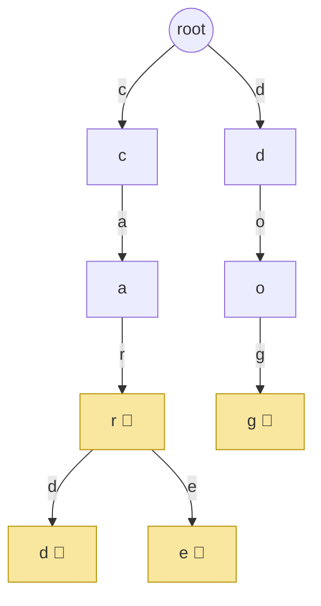
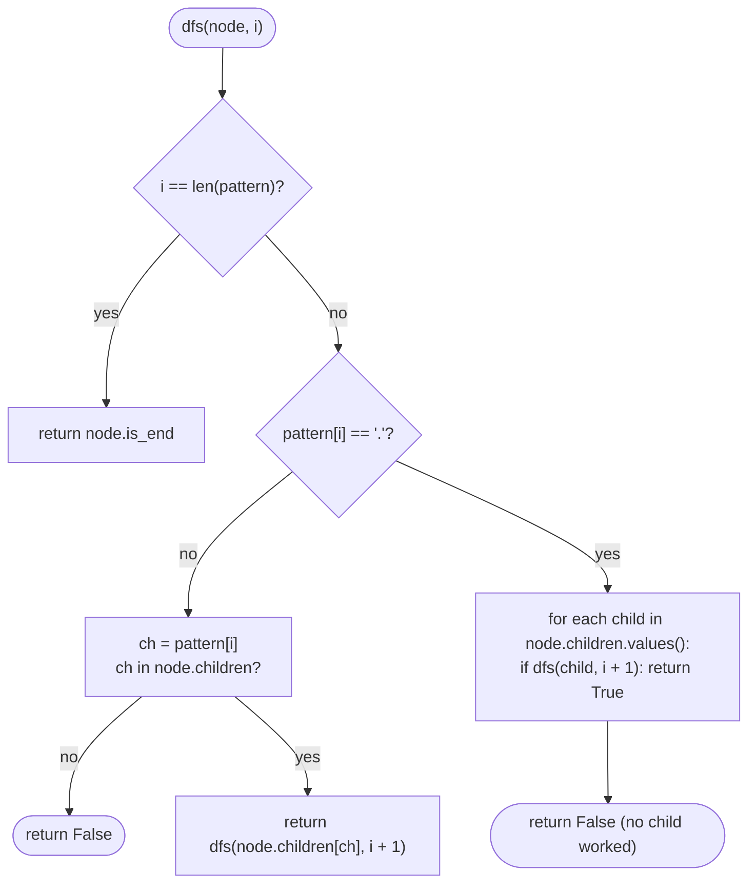

# 13 — Tries

## Why this exists

A hash map answers one question fast: "is this exact word here?" It
cannot answer "what words start with `pre`?" without scanning every
key it holds — hashing throws away any relationship between similar
keys, so `"car"` and `"card"` land in totally unrelated buckets.

A **trie** (prefix tree) stores words by their shared prefixes
instead of by a hash. Every word that starts with `car` walks through
the *same* `c → a → r` chain of nodes before splitting off. That
structural sharing is what makes prefix questions — autocomplete,
"how many words start with...", wildcard dictionary lookup — cheap:
O(L) in the length of the word/prefix, no scanning, no matter how
many thousands of words are stored.

## The shape of a trie



*What to notice: `"car"`, `"card"`, and `"care"` share one `c-a-r`
spine — the tree only branches where the words actually differ. The
🏁 marks are `is_end` flags: `car` is a complete word AND a prefix of
`card`/`care`, so its node is both "an ending" and "a hallway to more
nodes" at the same time.*

## Anatomy

Two pieces, nothing more:

- **Node** — a map from character → child node, plus one flag,
  `is_end`, meaning "a word ends here."
- **Trie** — a single `root` node (representing the empty prefix)
  that every word hangs off of.

```python
class TrieNode:
    def __init__(self):
        self.children: dict[str, "TrieNode"] = {}
        self.is_end = False
```

A `dict` for `children` handles any alphabet (unicode, digits,
punctuation) and only pays for characters actually used. If you know
the alphabet is fixed and small — lowercase `a`-`z` — a **26-slot
array** (`children: list[TrieNode | None]` of length 26, indexed by
`ord(ch) - ord("a")`) is faster and avoids hashing entirely, at the
cost of wasting memory on sparse nodes and only working for that one
alphabet. Course convention: dict-based, called out here so you
recognize the array variant when interviewers ask for it.

## Operations

| Operation | What it does | Complexity |
| --- | --- | --- |
| `insert(word)` | walk/create a node per character, mark the last one `is_end` | O(L) |
| `search(word)` | walk the exact chain, `True` only if it exists AND ends there | O(L) |
| `starts_with(prefix)` | walk the exact chain, `True` if it exists at all | O(L) |

`L` is the length of the word/prefix — **not** the number of words
stored, `n`. That independence from `n` is the headline: a hash set
of a million words still needs `starts_with` to scan every key that
might match, but a trie answers in the same handful of steps whether
it holds ten words or ten million.

## How to recognize it

Reach for a trie when the problem statement smells like:

- "**prefix**" — "starts with", "shares a prefix", "prefix count."
- "**autocomplete**" / "type-ahead suggestions."
- Many words need **character-by-character matching** against a
  dictionary (wildcard search, "does any dictionary word match this
  pattern with `.` as any-char").
- You need to know, cheaply, how many stored words begin with some
  string — a hash set forces an O(n · L) scan for that; a trie does
  it in O(L) if each node carries a pass-through counter.

**Decoy:** if the problem only ever asks "is this exact string
present?" — no prefixes, no wildcards, no autocomplete — a hash set
is simpler and just as fast. Don't reach for a trie just because the
data is strings.

## The template

```python
class Trie:
    def __init__(self):
        self.root = TrieNode()

    def insert(self, word: str) -> None:
        node = self.root
        for ch in word:
            if ch not in node.children:
                node.children[ch] = TrieNode()
            node = node.children[ch]
        node.is_end = True

    def _walk(self, prefix: str) -> "TrieNode | None":
        node = self.root
        for ch in prefix:
            if ch not in node.children:
                return None
            node = node.children[ch]
        return node

    def search(self, word: str) -> bool:
        node = self._walk(word)
        return node is not None and node.is_end

    def starts_with(self, prefix: str) -> bool:
        return self._walk(prefix) is not None
```

Almost every trie exercise is a variation on `_walk`: follow
characters one at a time, bail out the moment a character is
missing, then decide what "found" means at the end (`is_end`? just
"node exists"? collect everything under this node?).

## Worked example: inserting "care" after "car"

Starting trie already has `"car"` inserted (`root → c → a → r🏁`).
Now insert `"care"`:

| step | char | node lookup | action |
| --- | --- | --- | --- |
| 1 | `c` | `root.children["c"]` exists | reuse it, move down |
| 2 | `a` | `c.children["a"]` exists | reuse it, move down |
| 3 | `r` | `a.children["r"]` exists | reuse it, move down (this node is already `is_end=True` from `"car"` — untouched) |
| 4 | `e` | `r.children["e"]` missing | **create** a new node, link it, move down |
| end | — | — | mark the `e` node `is_end = True` |

Result: `"car"` and `"care"` now share the first three nodes and only
diverge at the fourth character. `"car"`'s node keeps `is_end=True` —
inserting `"care"` never touches it.

## Wildcard search: DFS branching at `.`

`WordDictionary.search(pattern)` matches `.` against any single
character. A plain `_walk` can't handle that — at a `.` you must try
*every* child, not just one. That turns the walk into a small DFS:



*What to notice: a literal character is still an O(1) dict lookup —
only `.` fans out into multiple recursive branches. Worst case
(pattern of all dots) degenerates to visiting every node at that
depth, but a normal pattern with a few dots stays close to O(L).*

## Complexity

- **Time:** O(L) per `insert`/`search`/`starts_with`, where L is the
  word/prefix length — independent of how many words `n` are stored.
  Wildcard search is O(L) best case, up to O(alphabet^(number of
  dots)) worst case (all dots forces branching at every level).
- **Space:** O(total characters across all inserted words) in the
  worst case (no shared prefixes) — but shared prefixes are exactly
  what a trie is built to compress, so real dictionaries use far
  less than "one node per character per word."

## Gotchas

- **`is_end` vs "has children" is not the same check.** After
  inserting `"car"` and `"card"`, the `r` node both has `is_end=True`
  *and* has a child (`d`). `search("car")` must check `is_end`, not
  "does this node have no children" — a node can be a complete word
  AND the middle of a longer one at the same time.
- **Counting words is not counting nodes.** Nodes are shared between
  words with common prefixes; `len(all_nodes)` is not `len(all_words)`.
  If you need "how many words below this point," store a counter on
  the node and update it on every `insert`, don't try to derive it
  from tree shape after the fact.
- **Memory footprint, honestly.** Each node can hold up to
  `len(alphabet)` children references. For huge dictionaries with a
  large alphabet (unicode) and few shared prefixes, a trie can use
  *more* memory than a hash set of the same words — it's a time/space
  trade you're making deliberately, not a free lunch.
- **Empty string.** Decide the contract up front and keep it
  consistent: this course's convention is `starts_with("")` is always
  `True` (every word starts with the empty prefix, even in an empty
  trie), and inserting `""` is allowed (marks the root itself
  `is_end = True`).

## Try it now

→ `exercises/ex01_build_trie.py` through
`exercises/ex05_unique_prefixes.py`, then `checkpoint_13.py`.
Check with `uv run pytest 13-tries`.
