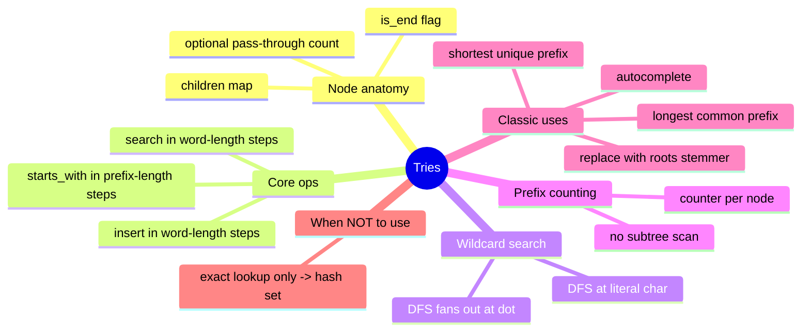

# 13 — Tries · Cheat-sheet

## Concept map



*What to notice: every branch is one of the five exercises in this
module — the trie itself never changes shape, only what you read off
it (a flag, a counter, a DFS) changes per problem.*

## Node anatomy

```python
class TrieNode:
    def __init__(self):
        self.children: dict[str, "TrieNode"] = {}
        self.is_end = False          # a word ends exactly here
        self.count = 0                # optional: words passing through here
```

## Op costs — L (word/prefix length) vs n (words stored)

| Operation | Cost | Depends on n? |
| --- | --- | --- |
| `insert(word)` | O(L) | no |
| `search(word)` (exact) | O(L) | no |
| `starts_with(prefix)` | O(L) | no |
| `count_starting_with(prefix)` (with counters) | O(P) | no |
| `autocomplete(prefix, k)` | O(P + M), M = chars in results | no (only in the results returned) |
| `search(pattern)` wildcard | O(L) best, O(alphabet^dots · L) worst | no, but dots hurt |

The whole pitch of a trie is that row after row says "no" — prefix
questions never need to touch all `n` stored words.

## Trie vs hash map vs sorted array

| | exact lookup | prefix query ("starts with") | memory |
| --- | --- | --- | --- |
| **Trie** | O(L) | O(L) (or O(P) for counts) | can exceed hash map's — one node per distinct prefix character, more overhead per character stored |
| **Hash map / set** | O(L) average | O(n · L) — no way to avoid scanning every key | compact: one entry per whole word |
| **Sorted array** | O(L log n) (binary search) | O(L log n) to find the range + O(matches) to read it | most compact — no per-character structure |

*Read this table as: hash map wins when you only ever ask "is X
here?"; a trie wins the moment prefixes matter; a sorted array is the
low-memory middle ground when you can afford O(log n) and don't need
wildcard/DFS-style matching.*

## Wildcard-DFS template

```python
def search(pattern: str) -> bool:
    def dfs(node, i):
        if i == len(pattern):
            return node.is_end
        ch = pattern[i]
        if ch == ".":
            return any(dfs(child, i + 1) for child in node.children.values())
        child = node.children.get(ch)
        return child is not None and dfs(child, i + 1)
    return dfs(root, 0)
```

A literal character narrows to one child (a normal trie walk); `.`
is the only thing that turns it into a branching search.

## Gotchas (recap)

- `is_end` and "has children" are independent — check `is_end`
  explicitly for exact matches, never infer it from child count.
- Nodes are shared across words; `len(nodes) != len(words)`. Count
  words with an explicit counter, not tree shape.
- A trie can use MORE memory than a hash set for a large alphabet
  with little prefix sharing — it's a deliberate trade, not a given.

## Self-quiz

1. Why is `starts_with` O(L) on a trie but O(n · L) on a hash set?
2. A node has `is_end = True` and two children. What word(s) does
   that describe, concretely?
3. What does the pass-through counter on a node actually count, and
   why does that make `count_starting_with` avoid a subtree scan?
4. In wildcard search, why does a literal character stay O(1) per
   step while `.` doesn't?
5. Why does visiting `is_end` BEFORE recursing into sorted children
   (during autocomplete's DFS) guarantee alphabetical order for free?
6. Name one situation where a trie is the wrong choice even though
   the data is a bunch of strings.

<details><summary>Answers</summary>

1. A trie's `starts_with` walks exactly `L` characters straight to the
   answer. A hash set has no relationship between similar keys, so
   the only way to find every key with a given prefix is to check
   each of the `n` stored keys, each an O(L) comparison.
2. A word ending exactly at this node, AND at least one longer word
   that shares this node as a prefix (e.g. `"car"` with children
   continuing toward `"card"`/`"care"`).
3. It counts how many inserted words pass through that node (have it
   somewhere on their path, including at their own ending). Reading
   the counter is O(1) once you've walked to the node — no need to
   descend into the subtree and tally matches one by one.
4. A literal character only ever has one place to go — one dict
   lookup, O(1). `.` doesn't know which child is right, so it must
   try all of them, each spawning its own recursive search.
5. Lexicographic order puts any string before any longer string that
   extends it (`"car"` < `"card"`). Checking `is_end` at the current
   node reports that shorter match before the DFS descends into
   longer ones, and recursing into children in sorted order handles
   the rest — the two together produce full alphabetical order with
   no separate sort step.
6. Any time the only question is "is this exact string present?" with
   no prefix/wildcard/autocomplete need — a hash set is simpler, uses
   less memory per word, and is just as fast for that one question.

</details>

## Pattern-recognition drill

For each prompt, name the structure/pattern before checking the
answer.

1. "Autocomplete a search box as the user types, showing up to 5
   matches."
2. "Given a list of words, check if `'w1w2w3'` (three of them
   concatenated) is a palindrome." *(decoy — no prefix/wildcard need)*
3. "How many stored usernames start with `'admin'`?"
4. "Check whether a 9x9 Sudoku board has any duplicate digit in a
   row." *(decoy — plain hash set membership per row)*
5. "Support a dictionary lookup where the user can type `.` for a
   letter they don't remember."
6. "Given a huge, static list of exact IDs, answer `id in ids` as
   fast as possible — no prefix questions ever." *(decoy)*

<details><summary>Answers</summary>

1. Trie + prefix walk + bounded DFS (autocomplete) — this module,
   ex03.
2. Hash set — pure exact-membership/equality check, no prefix or
   character-by-character matching involved.
3. Trie with a pass-through counter — this module, ex03.
4. Hash set — "any duplicate in this row" is exact-value membership,
   not a prefix question.
5. Trie + wildcard DFS — this module, ex02.
6. Hash set — exact lookup only, no prefix/wildcard need, so the
   simpler O(1)-average structure wins.

</details>
