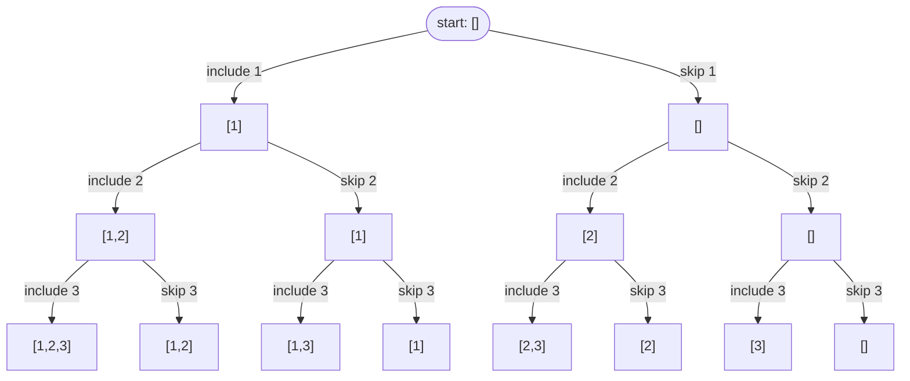
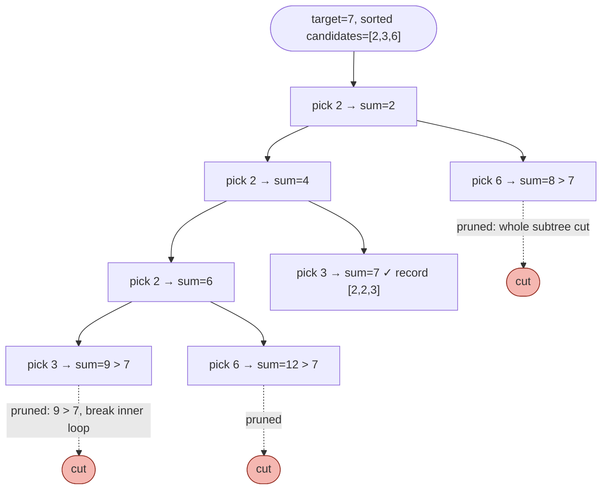

# 14 — Backtracking

## Why this exists

Some problems don't want "the" answer — they want *every* valid
answer: every subset, every combination, every way to place N queens
on a board so none attack each other. You can't loop your way through
"every subset of a 10-element list" — that's 1024 of them, shaped like
a tree of choices, not a line. The naive alternative — writing nested
loops for each possible length — doesn't scale past a handful of
elements and can't express "every combination" for a general `n`.

Backtracking is DFS over a **decision tree**: at each node you make a
choice, recurse into the consequences, then undo the choice before
trying the next one. Module 08 gave you the call-tree mental model for
recursion; here the call tree *is* the decision tree, and the new move
is the "undo" — recursion that cleans up after itself so the next
branch starts from a clean slate.



*What to notice: every root-to-leaf path is one subset of `[1,2,3]` —
8 leaves = 2³. "Include" and "skip" at each of the 3 elements gives
every combination of choices automatically; nobody wrote a loop for
"subsets of size 2".*

## THE template

Every backtracking function is the same three moves, wrapped in a
loop over the choices available at this node:

```python
def backtrack(path, remaining_choices):
    if is_a_complete_answer(path):
        results.append(path.copy())   # COPY — path keeps mutating after this
        return                         # (or `if` without return, if partial
                                        #  answers can also continue deeper)

    for choice in remaining_choices:
        if not is_valid(choice, path):     # pruning lives here
            continue

        path.append(choice)                # 1. CHOOSE
        backtrack(path, next_choices)       # 2. EXPLORE
        path.pop()                          # 3. UNCHOOSE
```

**The copy-on-record trap:** `path` is one list, mutated in place for
the entire traversal — that's the point, it's cheap. But if you do
`results.append(path)` you've stored a *reference* to that one
ever-changing list. By the time you inspect `results`, every entry
points at the same final (probably empty) list. Always
`results.append(path.copy())` — or `path[:]`, or build a `tuple(path)`.
Copy exactly once, at the moment you record.

## The three classic shapes

| Shape | Choice at each step | Loop pattern | Used for |
| --- | --- | --- | --- |
| **Subsets** | include or skip *this* element | recurse twice (include/skip), or a for-loop with a `start` index | subsets, subsequence problems |
| **Combinations** | pick the next element, order doesn't matter | `for i in range(start, n): ... backtrack(i + 1)` | combination sum, "n choose k" |
| **Permutations** | pick any element not yet used | `for i in range(n): if not used[i]: ...` (or swap-in-place) | orderings, arrangements |

The tell is in the problem statement: "subset"/"subsequence" → the
subsets shape; "combination" or "how many ways to pick k of n" (order
doesn't matter, `[1,2] == [2,1]`) → combinations, and the `start`
index stops you from re-picking earlier elements or generating the
same set twice; "arrangement"/"ordering"/"permutation" (order
matters, `[1,2] != [2,1]`) → permutations, and you need a `used`
tracker (a boolean array/set, or swap elements into place and swap
back) because every element is a candidate at every position.

## Handling duplicates: sort + skip-same-choice-at-same-level

Input `[1, 2, 2]` has a repeated value. Without care, "include the
first 2" and "include the second 2" produce two identical subsets
`[1, 2]` — same value, different index, wasted work and duplicate
output. Fix: **sort first**, then at each level of the tree, skip a
choice equal to the previous choice **already tried at this same
level** (not skip it everywhere — you still need `[2, 2]` further
down the tree, one level deeper).

Worked example — `subsets_with_dup([1, 2, 2])`, sorted to `[1, 2, 2]`,
using the for-loop-with-start-index shape:

| Level (start index) | Loop index `i` | Value | Action |
| --- | --- | --- | --- |
| 0 | 0 | 1 | take → path `[1]`, recurse from 1 |
| 1 (inside `[1]`) | 1 | 2 | take → path `[1,2]`, recurse from 2 |
| 2 (inside `[1,2]`) | 2 | 2 | take → path `[1,2,2]`, record, backtrack |
| 1 (inside `[1]`) | 2 | 2 | `nums[2] == nums[1]` **and `i > start`** → skip |
| 0 (back at root) | 1 | 2 | take → path `[2]`, recurse from 2 |
| 1 (inside `[2]`) | 2 | 2 | take → path `[2,2]`, record, backtrack |
| 0 (back at root) | 2 | 2 | `nums[2] == nums[1]` **and `i > start`** → skip |

*What to notice: the skip condition is `i > start and nums[i] ==
nums[i - 1]` — "start" means this is the first choice being tried at
this level, so it's always allowed; only a *later* index at the *same*
level repeating the *previous sibling's* value gets skipped.*

## Pruning: cut branches you already know fail

Exploring a branch that cannot possibly lead to a valid answer wastes
time proportional to the whole subtree beneath it. Two pruning moves
you'll use constantly:

- **Sort + break on sum overshoot** — in combination-sum-style
  problems, sort candidates ascending. The moment `path_sum +
  candidate > target`, every later (larger, since sorted) candidate at
  this level will overshoot too — `break` the loop instead of
  `continue`.
- **Constraint sets** — in N-queens, instead of rescanning the whole
  board for "is this square attacked?" (O(n) per check), keep three
  sets: columns used, and two diagonals (`row - col` for one
  direction, `row + col` for the other, both constant per diagonal).
  Checking membership is O(1); rescanning would make the whole search
  O(n) times slower.



*What to notice: `pick 6` after `[2]` overshoots (8 > 7) and gets cut
immediately — without the sorted-ascending order, a bad candidate
could sit in the middle of the loop and you couldn't `break`, only
`continue`, checking every remaining candidate anyway.*

## How to recognize it

- The problem asks for **all** combinations/permutations/subsets/ways
  to place/partition/arrange something — not just one answer or a
  count via formula.
- Words like "generate", "enumerate", "every way", "all valid".
- The input size is small (roughly n ≤ 20, board ≤ 9×9) — a strong
  signal the intended complexity is exponential and that's expected.
- You're building a partial answer step by step and need to try one
  choice, see what happens, then try a different choice from the same
  state — that "try, undo, try something else" rhythm is backtracking.

## Complexity honesty

Backtracking is exponential by nature: subsets are O(2ⁿ), permutations
are O(n!), N-queens is bounded by roughly O(n!) with pruning. **That's
not a bug** — the problem asked for every answer, and there genuinely
are that many. The skill isn't avoiding the exponential blowup (you
can't, the output size forces it); it's (a) recognizing when a problem
is actually polynomial in disguise (see the SUMMARY drill — some
"sounds exponential" problems are DP, coming in module 18) and (b)
pruning aggressively so the constant factor and unreachable subtrees
don't make an already-exponential search unusably slow.

## Gotchas

- **Forgetting to copy the path when recording.** `results.append(path)`
  stores a reference; every entry ends up pointing at the same
  (eventually empty) list. `results.append(path.copy())`.
- **Unchoose asymmetry.** Whatever `choose` mutates, `unchoose` must
  undo, in the reverse order if there's more than one mutation (e.g.
  grid-search: mark visited *then* recurse *then* restore — restore
  the same cell you marked, always, even on early return).
- **Duplicate handling: level vs. branch confusion.** The dedup skip
  (`i > start and nums[i] == nums[i-1]`) only skips *siblings at the
  same level* — it must NOT stop you from using an equal value one
  level deeper (`[2, 2]` is still valid; two *sibling* 2's at the same
  level producing the same subset is what's being cut).
- **Off-by-one on `start`** — combinations recurse with `start = i + 1`
  (never reuse an earlier index); combination-sum-with-reuse recurses
  with `start = i` (the same element can be picked again).

## Try it now

→ `exercises/ex01_subsets_drill.py` through `exercises/ex07_n_queens.py`,
then `checkpoint_14.py`.
Check with `uv run pytest 14-backtracking`.
