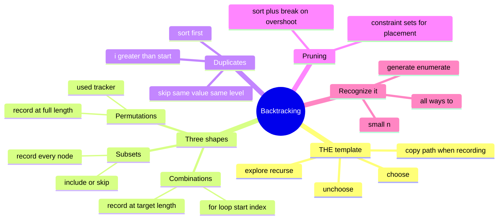

# 14 — Backtracking · Cheat-sheet

## Concept map



*What to notice: every branch is one decision you make before writing
the for-loop — which shape, whether duplicates need the same-level
skip, and what to prune on. Pick all three, and the code almost writes
itself.*

## THE template

```python
def backtrack(path, choices_left):
    if is_complete(path):
        results.append(path.copy())   # COPY, never the live list
        return

    for choice in choices_left:
        if not is_valid(choice, path):
            continue
        path.append(choice)     # 1. choose
        backtrack(path, next_choices)  # 2. explore
        path.pop()               # 3. unchoose
```

## The three shapes

| Shape | Recurse call | Records at | Cue |
| --- | --- | --- | --- |
| Subsets | `backtrack(i + 1)` from a for-loop, called at every node | every node visited | "subset", "subsequence" |
| Combinations | `backtrack(i + 1)` (no reuse) or `backtrack(i)` (reuse) | when path reaches target length/sum | "combination", "n choose k", order doesn't matter |
| Permutations | loop over ALL indices, skip `used[i]` | when path reaches full length | "arrangement", "ordering", order matters |

## Duplicate-skip rule

Sort input first. Inside the for-loop over choices at one level:

```python
if i > start and choices[i] == choices[i - 1]:
    continue   # already tried this value as a sibling at this level
```

`i > start` is the key guard — the FIRST choice tried at a level is
always allowed; only a repeat of the immediately preceding sibling's
value gets skipped.

## Pruning menu

| Prune | How | Use it when |
| --- | --- | --- |
| Sort + break on overshoot | sort ascending; `if running + candidate > limit: break` | combination-sum, budget-limited subsets |
| Constraint sets | O(1) membership check instead of an O(n) rescan | N-queens (columns, `row-col`, `row+col` diagonals) |
| Early exact-match return | stop recursing once the target is hit exactly | any "reaches exactly X" search |

## Copy-the-path rule

`path` is mutated in place for the whole traversal — cheap, and the
whole point. Copy it exactly once, at the moment you record a result:
`results.append(path.copy())` (or `path[:]`). `results.append(path)`
stores a live reference — every entry ends up identical (and usually
empty) once the traversal finishes.

## Self-quiz

1. What are the three moves in every backtracking call, in order?
2. Why does `results.append(path.copy())` matter — what goes wrong
   with `results.append(path)`?
3. A problem says "how many ways can you pick 3 of these 8 items,
   order doesn't matter" — which of the three shapes, and why?
4. A problem says "every possible ordering of these 5 tasks" — which
   shape, and what extra bookkeeping does it need that subsets/
   combinations don't?
5. You're generating subsets of `[2, 2, 3]` and getting `[2, 3]` twice
   in the output. What's missing?
6. In `combination_sum`, why do we sort the candidates before
   searching, and what does that sorting let us do in the loop?
7. In N-queens, why are `row - col` and `row + col` the right keys for
   the two diagonal sets (rather than, say, just `row` and `col`)?
8. A problem restricts `n` to at most ~15. What does that constraint
   usually signal about the intended solution's complexity?

<details><summary>Answers</summary>

1. Choose (make a move / append to path), explore (recurse), unchoose
   (undo the move / pop from path) — always in that order, and always
   paired so the state is clean for the next iteration of the loop.
2. `path` is one object mutated throughout the whole traversal.
   `results.append(path)` stores a *reference* to that object, not a
   snapshot — by the time the traversal ends, every stored "result"
   points at the same final list. `.copy()` (or `path[:]`) takes a
   snapshot at that moment instead.
3. Combinations — order doesn't matter and it's a fixed count (`k`),
   so a for-loop with a `start` index, recursing to `i + 1`, and
   recording once the path reaches length 3.
4. Permutations — order matters, so every not-yet-used element is a
   candidate at every position. It needs a `used` tracker (or
   swapping elements in place) because, unlike combinations, you
   can't just advance a `start` index — any remaining element could
   come next.
5. The duplicate-skip guard: sort the input, then in the for-loop at
   each level, skip index `i` when `i > start and nums[i] ==
   nums[i - 1]` — otherwise the two `2`s at different indices both
   produce the subset `[2, 3]`.
6. Sorting makes "the running sum plus the next candidate overshoots
   the target" monotonic across the remaining loop — once one
   candidate overshoots, every later (larger) one will too, so you
   can `break` instead of checking each one individually.
7. Every square on the same "\\" diagonal shares the same `row - col`
   value, and every square on the same "/" diagonal shares the same
   `row + col` value — two O(1)-checkable sets replace an O(n) rescan
   of every previously placed queen.
8. That the intended solution is exponential (2ⁿ, n!, or similar) —
   the problem wants every valid answer, not the fastest way to count
   or find one, and the small bound on `n` is the author's way of
   saying "yes, this is meant to be exponential."

</details>

## Pattern-recognition drill

For each one-liner, name the pattern/structure before checking the
answer.

1. "Given a set of unique numbers, return every possible subset."
2. "Given `n` and `k`, return every way to choose `k` numbers from
   1 to `n`."
3. "Given a list of unique numbers, return every possible ordering."
4. "Given coins of unlimited supply, return every combination that
   adds up to a target amount."
5. "Given a phone number's digits, return every string of letters it
   could spell on an old keypad."
6. "Given a grid of letters, decide if a word can be traced through
   adjacent cells without reusing a cell."
7. "Given a board size `n`, place `n` queens so none attack each
   other, and return every arrangement."
8. "Given a list of numbers, find the length of the longest strictly
   increasing subsequence."

<details><summary>Answers</summary>

1. Backtracking — subsets shape (include/skip each element, or a
   for-loop with a start index, recording every node).
2. Backtracking — combinations shape (for-loop with a start index,
   record once the path reaches length `k`).
3. Backtracking — permutations shape (used-tracker, record once the
   path reaches full length).
4. Backtracking — combination-sum shape (combinations with reuse:
   recurse to `i`, not `i + 1`; sort + break-on-overshoot to prune).
5. Backtracking — combinations-by-position (one choice per digit,
   chosen from that digit's letter set).
6. Backtracking — DFS on a grid with in-place visited marking and
   restore (choose/explore/unchoose applied to cells instead of list
   elements).
7. Backtracking — one choice (column) per row, pruned with column +
   two diagonal constraint sets.
8. **Decoy — this is NOT backtracking.** It sounds like "try every
   subsequence" (which would be 2ⁿ), but it has overlapping
   subproblems and optimal substructure: the longest increasing
   subsequence ending at index `i` only depends on the best answer at
   earlier indices. That's dynamic programming — coming in module 18.

</details>
