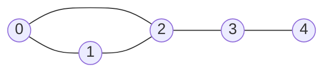
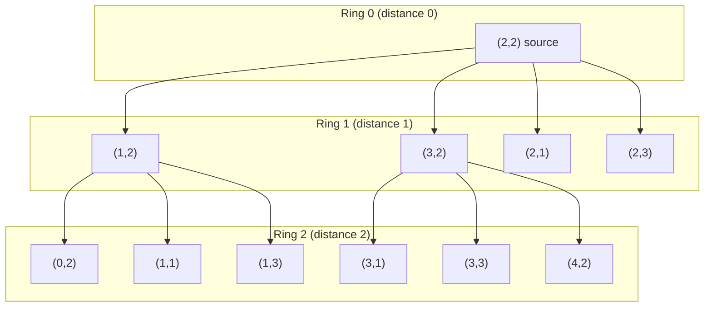

# 15 — Graphs I: Traversal

## Why this exists

Trees were graphs with training wheels: one parent, no cycles, a
single obvious root. Real relationships aren't that tidy — roads loop
back on themselves, web pages link to each other, dependencies form
cycles you have to detect, friendships go both ways. Anything built
from "things" and "connections between things" is a **graph**: road
networks, social networks, hyperlinks, build dependencies, game maps.

The naive alternative to a graph is pretending the relationships don't
exist and checking every pair of things directly — "is A connected to
B?" by brute force means trying every possible chain of intermediate
things, which blows up combinatorially. A graph's edges tell you
directly what's connected to what, and **traversal** — DFS and BFS —
answers the two questions that come up constantly: *what can I reach
from here*, and *how fast can I reach it*.

## Representations

A graph is nodes (also called vertices) plus edges (connections
between them). Edges can be **directed** (A → B only) or
**undirected** (A — B, meaning A → B and B → A both exist).



*What to notice: this is one picture, but it can be stored two very
different ways in code — same information, different trade-offs.*

**Adjacency list** — a dict from node to the list of its neighbors.
This course's convention for the rest of the graph modules:

```python
adj = {
    0: [1, 2],
    1: [0, 2],
    2: [0, 1, 3],
    3: [2, 4],
    4: [3],
}
```

**Adjacency matrix** — an n×n grid where `matrix[i][j] == 1` means
there's an edge from `i` to `j`:

```text
     0  1  2  3  4
  0 [0, 1, 1, 0, 0]
  1 [1, 0, 1, 0, 0]
  2 [1, 1, 0, 1, 0]
  3 [0, 0, 1, 0, 1]
  4 [0, 0, 0, 1, 0]
```

| | Space | "Is (i, j) an edge?" | Iterate neighbors of i |
| --- | --- | --- | --- |
| Adjacency list | O(V + E) | O(degree(i)) — scan the list | O(degree(i)) — exactly the list |
| Adjacency matrix | O(V²) | O(1) — direct lookup | O(V) — scan the whole row |

Most interview graphs are **sparse** (E is much smaller than V²) — a
social network doesn't have every user following every other user.
Adjacency list wins on space and is what you'll build almost
everywhere; reach for a matrix only when edge lookups dominate and the
graph is small or dense.

## A grid IS a graph

You don't need to build an adjacency list to treat a 2D grid as a
graph. Each cell `(r, c)` is a node; its up-to-4 neighbors
(up/down/left/right) are the edges — implicit, computed on the fly
instead of stored:

```python
DIRS = [(-1, 0), (1, 0), (0, -1), (0, 1)]  # up, down, left, right

def neighbors(r: int, c: int, rows: int, cols: int):
    for dr, dc in DIRS:
        nr, nc = r + dr, c + dc
        if 0 <= nr < rows and 0 <= nc < cols:
            yield nr, nc
```

This one mental move — "a grid is a graph, cells are nodes, adjacency
is computed not stored" — unlocks a huge fraction of grid problems:
islands, flood fill, mazes, and every "spreads across a grid" problem
in this module.

## DFS and BFS

You already know these from trees (module 11) — same two moves, one
new rule. **DFS** dives as deep as possible before backtracking
(stack-based, recursion or an explicit stack). **BFS** explores
everything one step away before anything two steps away (queue-based)
— this is what makes BFS the right tool for "shortest path" questions
on unweighted graphs.

The ONE rule that's new: a **visited set**. Trees have no cycles, so a
tree traversal can never revisit a node by accident. Graphs can — walk
edge 0→1, then 1→0, forever. Every graph traversal tracks visited
nodes and refuses to enqueue/recurse into one twice.

```python
# DFS — recursive
def dfs_recursive(adj, start):
    visited = {start}
    order = []

    def visit(node):
        order.append(node)
        for neighbor in adj[node]:
            if neighbor not in visited:
                visited.add(neighbor)
                visit(neighbor)

    visit(start)
    return order


# DFS — iterative (explicit stack)
def dfs_iterative(adj, start):
    visited = {start}
    order = []
    stack = [start]
    while stack:
        node = stack.pop()
        order.append(node)
        for neighbor in adj[node]:
            if neighbor not in visited:
                visited.add(neighbor)
                stack.append(neighbor)
    return order


# BFS — queue
from collections import deque

def bfs(adj, start):
    visited = {start}
    order = []
    queue = deque([start])
    while queue:
        node = queue.popleft()
        order.append(node)
        for neighbor in adj[node]:
            if neighbor not in visited:
                visited.add(neighbor)
                queue.append(neighbor)
    return order
```

Notice both DFS and BFS mark a node visited the moment they discover
it (append to stack / enqueue), not when they finally process it (pop
/ dequeue). More on why that matters in Gotchas below.

## BFS wavefront on a grid

BFS from a single source visits nodes in strict distance order: every
node at distance 1, then every node at distance 2, then distance 3 —
like a ripple expanding outward. On a grid, that ripple is visible:



*What to notice: BFS finishes ring 1 completely before touching ring
2 — the queue is FIFO, so nodes discovered earlier (closer) are always
processed before nodes discovered later (farther). That's the entire
reason BFS distance equals shortest-path distance on an unweighted
graph.*

## How to recognize it

- "Shortest path" / "fewest steps" / "minimum moves" on an
  **unweighted** graph or grid → **BFS, and only BFS**. DFS can find *a*
  path but has no reason to find the *shortest* one.
- "Any path exists" / "can you reach X from Y" / "all reachable nodes"
  / "count regions/components" → DFS or BFS, either works — pick
  whichever is more convenient (DFS is often less code via recursion).
- "Spreads simultaneously from several places at once" (fire, rot,
  infection, multiple starting rooms) → **multi-source BFS**: seed the
  queue with ALL starting nodes at distance 0 before the first pop,
  and the wavefronts merge automatically.
- Grid of 0s/1s or similar with "connected region" language ("island",
  "same color area", "surrounded") → grid-as-graph, DFS or BFS flood
  fill.

## Worked example: counting islands

Grid (`1` = land, `0` = water), scanning row by row, left to right,
starting a new DFS flood-fill every time an unvisited `1` is found:

```text
1 1 0 0
1 0 0 1
0 0 1 1
```

| Step | Cell scanned | Action |
| --- | --- | --- |
| 1 | (0,0) = 1, unvisited | New island #1. DFS floods (0,0)→(0,1)→(1,0); all marked visited. |
| 2 | (0,1) | Already visited (part of island #1) — skip. |
| 3 | (0,2), (0,3) | Water — skip. |
| 4 | (1,0) | Already visited — skip. |
| 5 | (1,1), (1,2) | Water — skip. |
| 6 | (1,3) = 1, unvisited | New island #2. DFS floods just (1,3) (its neighbors (0,3) and (2,3) are water/land — (2,3) is land!). |
| 7 | (2,0), (2,1) | Water — skip. |
| 8 | (2,2) = 1, unvisited | Wait — (2,2) connects to (2,3), which connects to (1,3): already visited by island #2's flood in step 6. Skip. |
| 9 | (2,3) | Already visited — skip. |

Result: **2 islands** — `{(0,0), (0,1), (1,0)}` and
`{(1,3), (2,2), (2,3)}`. The key move: the outer loop only ever
*starts* a new flood-fill; the flood-fill itself is what claims every
cell reachable from that start, so the outer loop never double-counts.

## Complexity

Both DFS and BFS visit every node once and every edge once (or twice
for undirected — once from each endpoint): **O(V + E) time**. Space is
O(V) for the `visited` set plus O(V) worst case for the stack (DFS
recursion or explicit stack) or queue (BFS) — a graph that's one long
chain visits all V nodes before returning. On a `rows × cols` grid,
V = rows · cols and E ≈ 4V, so this is O(rows · cols) time and space.

**Why:** every node is enqueued/pushed at most once (guarded by
`visited`), and every edge is examined at most once per endpoint when
scanning that node's neighbor list — there's no way to do less work
than "look at every node and every edge" if the answer depends on
reachability through all of them.

## Gotchas

- **Forgetting the visited set.** Without it, a cycle (or a grid,
  where you can walk back the way you came) sends the traversal into
  an infinite loop.
- **Marking visited on dequeue instead of enqueue — the classic BFS
  bug.** If you mark a node visited only when you pop it from the
  queue, the SAME node can be pushed onto the queue multiple times by
  different neighbors before any of those pushes gets popped — wasted
  work at best, wrong distances at worst (a node's first dequeue isn't
  guaranteed to be from its true shortest-distance predecessor once
  duplicates are in the queue). Always mark visited the moment you
  enqueue, not when you dequeue. (DFS with an explicit stack has the
  same trap, for the same reason.)
- **Recursion depth on big grids.** Recursive DFS on a 300×300 grid can
  recurse 90,000 frames deep in the worst case (a long snake-shaped
  region) — past Python's default recursion limit. Prefer iterative
  DFS/BFS (explicit stack/queue) for anything grid-sized in this
  module; save recursive DFS for graphs you know are small or shallow.
- **Disconnected graphs.** "Traverse from a start node" only reaches
  that node's component. If the problem wants ALL nodes (all islands,
  all components, is-the-*whole*-graph-bipartite), loop over every
  node and start a fresh traversal from each unvisited one.

## Try it now

→ `exercises/ex01_graph_repr.py` through `exercises/ex07_bipartite_check.py`,
then `checkpoint_15.py`.
Check with `uv run pytest 15-graphs-1`.
