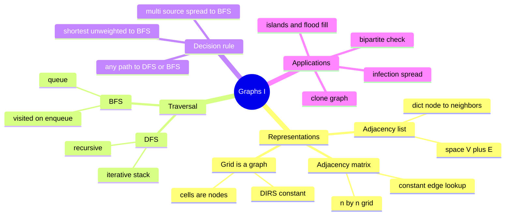

# 15 — Graphs I: Traversal · Cheat-sheet

## Concept map



*What to notice: every branch answers one design question — how is
the graph stored, which traversal, and which of the four
"how to recognize it" cues matched the problem.*

## Representation cheat-sheet

| | Space | Edge lookup `(i, j)`? | Iterate neighbors of `i` | Best for |
| --- | --- | --- | --- | --- |
| Adjacency list (`dict[node, list[neighbor]]`) | O(V + E) | O(degree(i)) | O(degree(i)) | sparse graphs (most interview problems) |
| Adjacency matrix (`list[list[int]]`) | O(V²) | O(1) | O(V) | small/dense graphs, frequent edge checks |
| Grid (`grid[row][col]`) | O(rows × cols) | O(1), implicit | O(1), via `DIRS` | anything laid out on a 2D board |

## DFS vs BFS decision table

| Question | Use | Why |
| --- | --- | --- |
| **"Shortest path" / "fewest steps" on an unweighted graph** | **BFS — and only BFS** | BFS visits nodes in strict distance order; DFS finds *a* path, not necessarily the shortest. |
| "Does any path exist?" / "all reachable nodes?" | DFS or BFS | Either explores every reachable node; pick whichever's less code. |
| "Count regions / connected components" | DFS or BFS | Same reasoning — loop over unvisited starts, one traversal per component. |
| "Spreads simultaneously from several places" | **Multi-source BFS** | Seed the queue with ALL sources at distance 0 before the first pop; wavefronts merge automatically. |

## The visited-on-enqueue rule

Mark a node visited the moment it's **discovered** (pushed to the
stack / enqueued), never when it's finally **processed** (popped /
dequeued). Marking on dequeue lets the same node get queued multiple
times by different neighbors before any copy is processed — wasted
work, and in BFS it can corrupt the very distance guarantee that makes
BFS useful for shortest paths.

```python
if neighbor not in visited:
    visited.add(neighbor)      # mark HERE
    queue.append(neighbor)     # not after queue.popleft()
```

## Grid-as-graph recipe

```python
DIRS = [(-1, 0), (1, 0), (0, -1), (0, 1)]  # up, down, left, right

def neighbors(r, c, rows, cols):
    for dr, dc in DIRS:
        nr, nc = r + dr, c + dc
        if 0 <= nr < rows and 0 <= nc < cols:
            yield nr, nc
```

Cells are nodes; adjacency is computed, never materialized into a
dict. Prefer **iterative** DFS/BFS on grids — a big enough grid can
recurse past Python's recursion limit.

## Multi-source BFS recipe

Seed the queue with every source at distance 0 *before* the loop
starts, instead of running one BFS per source and merging results:

```python
queue = deque((r, c, 0) for r, c in all_sources)
visited = set(all_sources)
while queue:
    r, c, dist = queue.popleft()
    for nr, nc in neighbors(r, c, rows, cols):
        if valid(nr, nc) and (nr, nc) not in visited:
            visited.add((nr, nc))
            queue.append((nr, nc, dist + 1))
```

## Self-quiz

1. Why is adjacency LIST usually preferred over adjacency MATRIX for
   interview-style graphs?
2. What's the one rule that graph traversal needs that tree traversal
   never did, and why?
3. A problem asks for the fewest moves from A to B on an unweighted
   grid. Which traversal, and why not the other one?
4. What breaks if you mark a node visited on DEQUEUE instead of
   ENQUEUE?
5. Why should grid DFS in this module usually be iterative rather than
   recursive?
6. What's the "invert the question" trick used in surrounded-regions,
   and why does it avoid tracing each region's boundary directly?
7. Cloning a graph with a cycle naively (recursive copy, no
   bookkeeping) breaks how? What data structure fixes it?
8. A graph has two disconnected pieces. One is bipartite, the other
   isn't. Is the WHOLE graph bipartite? Why does testing only the
   first component you reach get this wrong?

<details><summary>Answers</summary>

1. Most graphs in practice (and in interviews) are sparse — E is much
   smaller than V². Adjacency list costs O(V + E) space and lets you
   iterate a node's neighbors in O(degree), while a matrix always
   costs O(V²) regardless of how few edges exist.
2. A visited set. Trees have no cycles, so a tree traversal can never
   revisit a node by accident. Graphs can have cycles (and grids let
   you walk back the way you came), so without tracking visited nodes
   a traversal can loop forever.
3. BFS — it visits nodes in strict distance order (ring 1, then ring
   2, then ring 3...), so the first time it reaches B is guaranteed to
   be via a shortest path. DFS dives deep first and has no reason to
   find the shortest path before a longer one.
4. The same node can be pushed onto the queue multiple times (by
   different neighbors) before any of those copies gets processed —
   wasted work at minimum, and it can break the guarantee that a
   node's first dequeue is via its true shortest-distance predecessor.
5. A big grid (e.g. 300×300) can require recursion 90,000 frames deep
   in the worst case (a long snake-shaped region), which exceeds
   Python's default recursion limit. An explicit stack has no such
   ceiling.
6. Instead of checking "is this region fully surrounded" directly
   (which requires tracing each region's whole boundary), flood-fill
   from every BORDER cell first — whatever that flood-fill reaches is
   safe by definition, and everything else is fully enclosed. One
   linear pass instead of per-region boundary tracing.
7. Naive recursive copy recurses forever on a cycle (node A's clone
   needs node B's clone, which needs node A's clone, ...). Fixed with
   a hash map from original node -> cloned node: check the map before
   cloning a neighbor, and reuse the existing clone if it's already
   there.
8. No — the graph is bipartite only if EVERY component is (a single
   odd cycle anywhere makes the whole graph non-bipartite by
   definition, even if other components are fine). Testing only the
   first component reached and returning early the moment it succeeds
   is the classic bug: you must loop over every node and start a fresh
   BFS 2-coloring from each unvisited one, checking all of them.

</details>

## Pattern-recognition drill

For each one-liner, name the pattern/structure before checking the
answer.

1. "Given a grid of land and water, count the number of islands."
2. "Given a maze, find the fewest steps from the entrance to the
   nearest exit on the border."
3. "Several fires start simultaneously on a grid; find how many
   minutes until the whole forest has burned, or -1 if some patch
   never catches."
4. "Given a friendship list, find the fewest introductions needed to
   connect two specific people."
5. "Given a connected graph, produce a completely independent deep
   copy of it."
6. "Given a graph of task dependencies, can the tasks be split into
   two shifts with no two directly-dependent tasks in the same
   shift?"
7. "Given a board of 'X' and 'O', flip every 'O' region that isn't
   touching the edge of the board."
8. "Given a weighted road network, find the cheapest route between two
   cities."

<details><summary>Answers</summary>

1. DFS/BFS flood fill — grid-as-graph, count connected regions of `1`
   cells.
2. BFS — "fewest steps" on an unweighted grid is the strongest BFS
   signal there is; stop at the first border cell dequeued.
3. Multi-source BFS — seed the queue with every fire's starting cell
   at distance 0; the answer is the max distance reached (or -1 if
   some flammable cell is never dequeued).
4. BFS — shortest-path distance on the unweighted friendship graph
   ("degrees of separation").
5. DFS/BFS + a hash map from original node to cloned node (handles
   cycles and keeps shared neighbors shared in the copy).
6. BFS 2-coloring — bipartite check; remember to test every
   disconnected component, not just the first.
7. DFS/BFS flood fill from the border first (invert the question),
   then flip everything the flood fill didn't reach.
8. **Decoy — this is NOT plain BFS.** BFS only guarantees shortest
   path when every edge costs the same (unweighted). A weighted graph
   needs Dijkstra's algorithm — coming in module 16.

</details>
