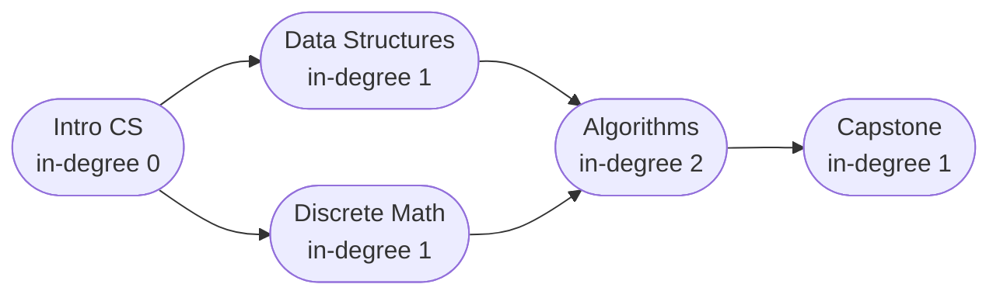
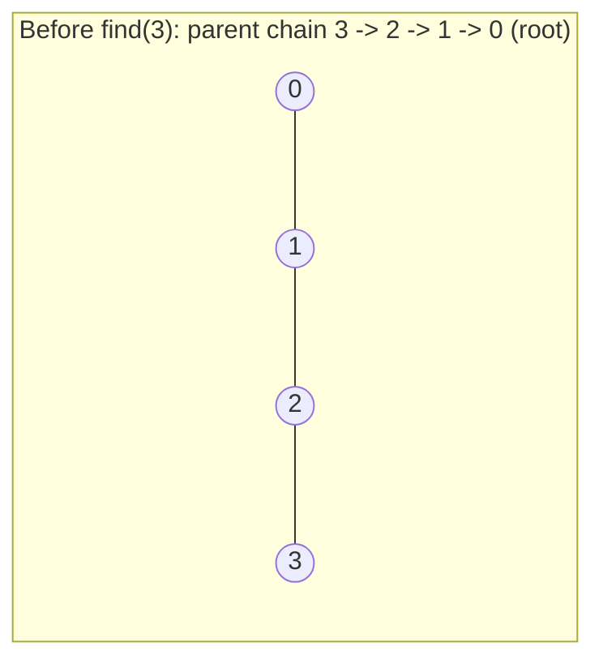
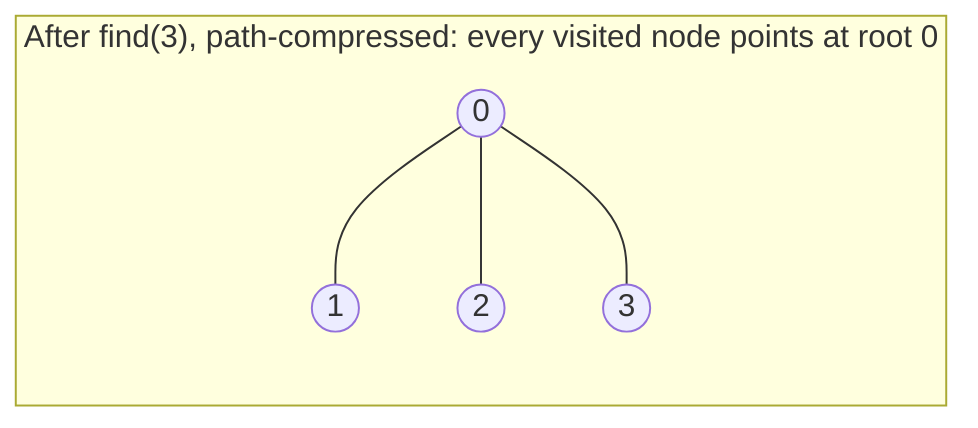

# 16 — Graphs II: Ordering, Union-Find & Weighted Paths

## Why this exists

Module 15 gave you DFS and BFS: walk every node, find components, find
the shortest path when every edge costs the same. Three questions
traversal alone can't answer:

- **What ORDER must dependent tasks run in?** "Compile `a.c` before
  linking, install dependencies before running the app" — DFS/BFS
  visit nodes, they don't produce a valid build sequence.
- **Are these nodes merged into one group as edges arrive, one at a
  time?** Re-running BFS from scratch after every new edge to answer
  "same component now?" is `O(n)` per question. You need an answer
  that updates incrementally.
- **What's the CHEAPEST path, or the cheapest way to connect
  everything, when edges have different weights?** BFS's "shortest =
  fewest edges" guarantee breaks the instant edges aren't all equal —
  a 1-edge path costing 100 is not shorter than a 3-edge path costing 6.

Four tools, one for each question: **topological sort** (order),
**union-find** (incremental grouping), **minimum spanning tree**
(cheapest way to connect everything), and **Dijkstra / Bellman-Ford**
(cheapest path between two specific nodes).

## Topological sort — only on DAGs

A topological order is a linear ordering of a **directed acyclic
graph's (DAG)** nodes such that every edge `u -> v` has `u` appearing
before `v`. It only exists if the graph has no cycle — a cycle would
demand `u` before `v` and, eventually, `v` before `u`.

**Kahn's algorithm**: track each node's **in-degree** (number of
unfinished prerequisites). Seed a queue with every node whose
in-degree is 0 (nothing blocks it). Repeatedly pop a node, append it
to the order, and decrement the in-degree of everything it unlocks —
push any neighbor whose in-degree just hit 0.

*What to notice: "Intro CS" is the only in-degree-0 node, so it must
go first. After it's processed, both "Data Structures" and "Discrete
Math" drop to in-degree 0 — either can go next. Two valid orders:
`[Intro, DataStruct, Discrete, Algo, Capstone]` and
`[Intro, Discrete, DataStruct, Algo, Capstone]` — Kahn's algorithm
doesn't pick a unique order, just A valid one.*

**Cycle detection for free**: if the queue drains before every node
has been output, the leftover nodes' in-degrees never reached 0 — a
cycle is holding them hostage forever. Compare `len(order) < n` and
you know instantly, no separate cycle-detection pass needed.

## Union-find — near-`O(1)` "same group?" under merging

Union-find (disjoint-set-union) answers exactly one pair of questions,
fast, even as merges keep happening: **"are `x` and `y` in the same
group?"** (`find`) and **"merge these two groups"** (`union`). It's the
right tool the moment a problem needs incremental grouping instead of
one static traversal.

The structure is a **forest**: every element points at a `parent`; a
root points at itself. Two elements are in the same set iff walking
`parent` links from each of them reaches the same root.

Two upgrades turn a plain (and potentially very tall) forest into a
near-flat one:

- **Path compression** — every time `find` walks a path to the root,
  re-point every node on that path directly at the root. The next
  `find` through any of them is instant.
- **Union by rank** — when merging two trees, always hang the
  shallower one under the deeper one's root. Attaching the deep tree
  under the shallow one would make the whole thing taller for no
  reason.

*What to notice: before compression, `find(3)` must walk 3 hops
(`3 -> 2 -> 1 -> 0`) to reach the root.*

*What to notice: after path compression, `1`, `2`, AND `3` all point
straight at root `0` — every node that was ON the path got flattened,
not just the one that was searched for. The next `find` on any of them
is one hop.*

Together, path compression and union by rank bound every operation to
`O(alpha(n))` amortized — `alpha` is the inverse Ackermann function,
which grows so slowly it's under 5 for any `n` you could ever construct.
Treat it as a constant.

## Minimum spanning tree — cheapest way to connect everything

Given a weighted, undirected, connected graph, a **minimum spanning
tree (MST)** is the subset of edges that connects every node using the
least total weight, with no cycles (a tree over all `n` nodes has
exactly `n - 1` edges). Two algorithms, two different angles of attack:

- **Kruskal's algorithm** — sort ALL edges by weight ascending. Walk
  them in order; use union-find to add an edge only if its two
  endpoints aren't already connected (adding it otherwise would only
  create a cycle — never helps a *minimum* tree). Stop at `n - 1`
  edges. This is "cheapest edges first, skip anything that closes a
  loop."
- **Prim's algorithm** — grow ONE tree from a start node. Keep a
  min-heap of "cheapest edge reaching from the current tree to a node
  not yet in it." Repeatedly pop the cheapest, add that node to the
  tree (skip it if it's already in — lazy deletion), push its new
  outgoing edges. This is "always extend the tree by its cheapest
  available reach."

| | Kruskal | Prim |
| --- | --- | --- |
| Needs | a flat edge list | an adjacency list (or a way to compute edges on demand) |
| Shines when | edges are sparse or already given as a list | the graph is dense or IMPLICIT (e.g. "every pair of points," computed on the fly) |
| Core engine | sort + union-find | min-heap |
| Complexity | `O(e log e)` (the sort dominates) | `O(e log n)` typically, or `O(n^2)` array-based on dense graphs without a heap |

The tell: if you're handed an explicit, moderate-size edge list,
Kruskal's sort-and-skip is simpler to reason about. If the graph is
dense or the edges aren't a physical list at all (like "every pair of
points, weight = distance"), Prim avoids ever materializing `O(n^2)`
edges up front — it only ever asks "what's cheap from where I already
am?"

## Dijkstra — BFS's weighted upgrade

BFS finds shortest paths by processing nodes in the order they're
first reached, one layer at a time — that only works because every
edge costs exactly 1, so "reached earlier" and "reached more cheaply"
are the same thing. **Dijkstra's algorithm** keeps that same "expand
the cheapest known frontier" idea, but replaces the FIFO queue with a
**min-heap** keyed by distance-so-far, so the next node processed is
always the globally cheapest one seen so far — regardless of edge
weight.

**Lazy-deletion pattern**: a node can be pushed onto the heap multiple
times (once per improvement found to it). Rather than removing the
stale, worse copies from the middle of the heap (expensive), just pop
normally and, if the popped distance is worse than the best already
recorded for that node, skip it — it's an obsolete entry.

Worked example — 5-node graph, edges `A->B(4)`, `A->C(1)`, `C->B(1)`,
`B->D(1)`, `C->D(5)`, `D->E(3)`, source `A`:

| Step | Popped (dist, node) | Action | `dist` after |
| --- | --- | --- | --- |
| 0 | — | seed heap with `(0, A)` | `{A: 0}` |
| 1 | `(0, A)` | relax `A->B` (4), `A->C` (1) | `{A:0, B:4, C:1}` |
| 2 | `(1, C)` | relax `C->B`: `1+1=2 < 4` improve; `C->D`: `1+5=6` | `{A:0, B:2, C:1, D:6}` |
| 3 | `(2, B)` | relax `B->D`: `2+1=3 < 6` improve | `{A:0, B:2, C:1, D:3}` |
| 4 | `(3, D)` | relax `D->E`: `3+3=6` | `{A:0, B:2, C:1, D:3, E:6}` |
| 5 | `(4, B)` | STALE — popped dist 4 > recorded 2 — skip | (unchanged) |
| 6 | `(6, D)` | STALE (dist 6 > recorded 3) — skip | (unchanged) |
| 7 | `(6, E)` | no outgoing edges | done |

*What to notice: `B` and `D` each get pushed twice — once at their
first (expensive) discovery, once when a cheaper route through `C`
is found. Both stale copies eventually surface at the heap's root and
get skipped in one comparison, never causing a wrong answer.*

**Why negative edges break it**: Dijkstra finalizes a node's distance
the moment it's popped, betting that nothing popped LATER (which, by
heap order, is always more expensive so far) could ever improve it. A
negative edge violates that bet — a path that looks expensive now
could plunge below an already-finalized distance one edge later.
Dijkstra has no mechanism to revisit a node it already "closed."

**The fallback — Bellman-Ford-style relaxation**: instead of greedily
finalizing the cheapest node first, relax **every edge, every round**,
for enough rounds that any possible shortest path (up to a bound on
its edge count) has had the chance to fully propagate. This tolerates
negative edges (though not negative CYCLES, which make "shortest"
undefined) and has a natural variant: capping the rounds at `k + 1`
answers "cheapest path using at most `k` intermediate hops" — something
plain Dijkstra, which optimizes for cost alone, cannot express.

## How to recognize it

- **"Prerequisites" / "build order" / "course schedule" / "task
  dependencies"** → topological sort. If it also asks "is this even
  possible?" → the free cycle-detection.
- **"Groups" / "merging" / "friend circles" / "is there a redundant
  connection" / repeated "are these connected?" as edges keep
  arriving** → union-find.
- **"Connect everything as cheaply as possible" / "minimum cost to
  link all nodes"** → minimum spanning tree (Kruskal for a given edge
  list, Prim for a dense/implicit graph).
- **"Shortest path" / "cheapest route" / "fastest way" with WEIGHTED
  edges** → Dijkstra. (If edges are unweighted, that's plain BFS from
  module 15 — don't reach for a heap you don't need.)
- **"At most `k` stops / hops / layovers"** → Dijkstra's greedy
  finalization can't respect a hop budget; use the `k`-round
  relaxation variant instead.

## Gotchas

- **Running topo sort on a graph that might have a cycle without
  checking.** Always compare `len(order) == n` before trusting the
  result — a shorter list means some nodes were never unblocked.
- **Forgetting path compression (or union by rank).** Skip either one
  and union-find degrades toward `O(n)` per operation on adversarial
  input (a long chain) — the whole point of the structure evaporates.
- **Dijkstra with stale heap entries.** Forgetting the lazy-skip check
  (`if popped_dist > dist[node]: continue`) doesn't usually produce a
  WRONG answer (the cheaper entry still gets processed first), but it
  wastes work re-relaxing from an already-finalized, worse copy — and
  in from-scratch heap builds, can double-process neighbors.
- **Directed vs. undirected mixups.** Topological sort and Bellman-Ford
  k-stops problems are naturally directed (a prerequisite doesn't run
  backward). MST and "connect all nodes" problems are naturally
  undirected (a cable works both ways). Pushing an edge onto only one
  node's adjacency list when the graph should be undirected silently
  makes half your shortest paths unreachable.

## Try it now

→ `exercises/ex01_topo_sort.py` through `exercises/ex07_k_stops_cheapest.py`,
then `checkpoint_16.py`.
Check with `uv run pytest 16-graphs-2`.
