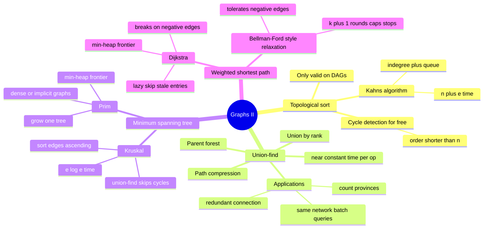

# 16 — Graphs II: Ordering, Union-Find & Weighted Paths · Cheat-sheet

## Algorithm picker

| Question | Algorithm | Complexity |
| --- | --- | --- |
| What ORDER must dependent tasks run in? | Topological sort (Kahn's) | `O(n + e)` |
| Is this even possible (no cycle)? | Topo sort — compare order length to `n` | `O(n + e)` |
| Are these two nodes in the same group, as merges keep arriving? | Union-find | `O(alpha(n))` amortized/op |
| Cheapest way to connect ALL nodes — given an explicit edge list? | Kruskal's MST | `O(e log e)` |
| Cheapest way to connect ALL nodes — dense or implicit graph? | Prim's MST | `O(e log n)` |
| Cheapest path between two specific nodes, weighted, no negative edges? | Dijkstra | `O(e log e)` |
| Cheapest path using AT MOST `k` stops? | `k`-round edge relaxation | `O(k * e)` |
| Cheapest/shortest path with NEGATIVE edges present? | Bellman-Ford-style relaxation | `O(n * e)` |
| Fewest EDGES, all weights equal? | Plain BFS — module 15, not this module | `O(n + e)` |

## Kahn's algorithm template

```python
from collections import deque

def topo_order(n, edges):
    graph = {i: [] for i in range(n)}
    indegree = [0] * n
    for u, v in edges:              # u -> v: v depends on u
        graph[u].append(v)
        indegree[v] += 1

    queue = deque(i for i in range(n) if indegree[i] == 0)
    order = []
    while queue:
        node = queue.popleft()
        order.append(node)
        for neighbor in graph[node]:
            indegree[neighbor] -= 1
            if indegree[neighbor] == 0:
                queue.append(neighbor)

    return order if len(order) == n else None      # short order -> cycle
```

## Union-find template

```python
class UnionFind:
    def __init__(self, n):
        self.parent = list(range(n))
        self.rank = [0] * n

    def find(self, x):
        if self.parent[x] != x:
            self.parent[x] = self.find(self.parent[x])   # path compression
        return self.parent[x]

    def union(self, x, y):
        rx, ry = self.find(x), self.find(y)
        if rx == ry:
            return False                            # already connected
        if self.rank[rx] < self.rank[ry]:
            rx, ry = ry, rx
        self.parent[ry] = rx                         # union by rank
        if self.rank[rx] == self.rank[ry]:
            self.rank[rx] += 1
        return True
```

## Dijkstra template

```python
import heapq

def dijkstra(n, graph, source):
    dist = [float("inf")] * n
    dist[source] = 0
    heap = [(0, source)]
    while heap:
        d, node = heapq.heappop(heap)
        if d > dist[node]:
            continue        # <<< LAZY-SKIP: stale heap entry, discard it
        for neighbor, weight in graph[node]:
            new_dist = d + weight
            if new_dist < dist[neighbor]:
                dist[neighbor] = new_dist
                heapq.heappush(heap, (new_dist, neighbor))
    return dist
```

> **Negative edges break Dijkstra.** It finalizes a node's distance the
> instant it's popped, betting that nothing popped LATER (always more
> expensive so far, by heap order) could ever improve it. A negative
> edge can violate that bet. Negative edges, no negative CYCLES ->
> Bellman-Ford-style relaxation instead. `k`-stops problems use the
> same relaxation idea, capped at `k + 1` rounds.

## Kruskal vs Prim, at a glance

| | Kruskal | Prim |
| --- | --- | --- |
| Needs | a flat edge list | an adjacency list, or edges computed on demand |
| Shines when | edges are sparse / already listed | dense or IMPLICIT graphs (e.g. every pair of points) |
| Core engine | sort + union-find | min-heap |



*What to notice: every branch is a different answer to "what can't
plain traversal do" — order, incremental grouping, cheapest
connect-everything, and cheapest specific path. Weighted shortest
path further splits by whether negative edges (or a stop budget) are
in play.*

## Self-quiz

1. Why does Kahn's algorithm require a DAG, and what actually happens
   if you run it on a graph that has a cycle?
2. Union-find stays near `O(1)` per operation because of two specific
   techniques. Name them and say, in one sentence each, what they do.
3. When would you reach for Prim's algorithm instead of Kruskal's, and
   why does that situation favor a heap over a sort?
4. Dijkstra can push the same node onto the heap more than once. Walk
   through why that happens, and how the lazy-skip check
   (`if d > dist[node]: continue`) handles it safely.
5. Why does a single negative edge break Dijkstra's core assumption —
   what exactly is the "bet" it makes when it pops a node?
6. What's the difference between "cheapest path" and "cheapest path
   using at most `k` stops," and why can't plain Dijkstra answer the
   second one directly?
7. In `redundant_connection`, processing edges left to right with
   union-find, why is the FIRST edge that closes a cycle also the
   correct edge to report as redundant?
8. A topological sort's output has fewer than `n` nodes in it. What
   does that tell you, and how do you check for it without running a
   separate cycle-detection pass?

<details><summary>Answers</summary>

1. A topological order requires `u` before `v` for every edge `u -> v`.
   A cycle would demand `u` before `v` AND, eventually, `v` before `u`
   — impossible to satisfy simultaneously. Run Kahn's on a cyclic
   graph and the nodes inside (and only reachable through) the cycle
   never reach in-degree 0, so they never enter the queue — the
   algorithm just terminates early with a short `order`.
2. **Path compression** — every node visited while walking `find` to
   the root gets re-pointed straight at the root, so future `find`
   calls on any of them are one hop. **Union by rank** — when merging
   two trees, the shallower one is always attached under the deeper
   one's root, so merges never make the structure taller than
   necessary.
3. When the graph is dense or the edges aren't a physical list at all
   (e.g. "every pair of points, weight = distance"). Kruskal would
   need all `O(n^2)` edges materialized and sorted before it can even
   start; Prim only ever asks "what's the cheapest reach from the tree
   I've already built?", discovering edges on demand via the heap
   instead of all at once.
4. Every time a cheaper route to a node is found, that node gets
   pushed again with the improved distance — the old, worse entry is
   still sitting in the heap. When that stale entry eventually
   surfaces (gets popped), its distance no longer matches the best
   recorded distance for that node, so `d > dist[node]` is true and
   it's skipped — one wasted pop, no wrong answer.
5. Dijkstra finalizes a node's distance the moment it's popped, on the
   assumption that nothing popped later (which, by heap order, is
   always at least as expensive so far) could ever undercut it. A
   negative edge breaks that: a path that looks expensive right now
   could drop below an already-finalized distance one edge later, and
   Dijkstra has no mechanism to revisit a node it already closed.
6. "Cheapest path" optimizes for cost alone, with no limit on how many
   edges it uses. "Cheapest path within `k` stops" adds a second
   constraint — edge COUNT — that Dijkstra's greedy finalization
   can't express: it might finalize a cheaper-but-longer route first
   and never reconsider a pricier route that actually fits the stop
   budget.
7. The input describes a graph that started as a valid tree (`n` nodes,
   `n - 1` edges) with exactly one extra edge appended somewhere.
   Every edge processed before the first one that closes a cycle is,
   by definition, still building a valid tree (no cycle yet) — so the
   very first edge that connects two ALREADY-connected nodes must be
   that one extra edge.
8. It tells you a cycle exists — some nodes' in-degrees never reached
   0 because they were waiting on a prerequisite that was, in turn,
   waiting on them. Check with `len(order) == n` right after Kahn's
   algorithm finishes; no separate traversal needed, because Kahn's
   already *is* a cycle detector — a cycle is just the reason nodes
   get left behind.

</details>

## Pattern-recognition drill

For each one-liner, name the tool (topological sort; union-find;
minimum spanning tree — Kruskal or Prim; Dijkstra; `k`-round
relaxation; or "BFS, not this module") before checking the answer.

1. "Given a list of course prerequisites, find a valid order to take
   every course, or report that it's impossible."
2. "As friendship requests arrive one at a time, answer 'are these two
   people in the same friend group yet?' after each one."
3. "Given a list of cities and candidate road-building costs between
   pairs of them, find the cheapest way to connect every city."
4. "Given `n` rooftop sensors and the distance between every pair of
   them, find the cheapest wiring that connects them all."
5. "Given a weighted road network, find the shortest travel time from
   one city to every other city."
6. "Same road network, but you're only willing to make at most two
   transfers — find the cheapest route under that limit."
7. "Given an unweighted grid maze, find the fewest steps from the
   entrance to the exit."
8. "Given a list of cables that was supposed to form a tree, find the
   one extra cable that creates a cycle."

<details><summary>Answers</summary>

1. Topological sort (Kahn's algorithm) — "prerequisites" / "valid
   order" is the textbook cue; "or report it's impossible" is the
   free cycle-detection check.
2. Union-find — incremental grouping as merges arrive one at a time,
   with repeated "same group?" queries in between.
3. Minimum spanning tree, Kruskal — an explicit, moderate-size edge
   list of candidate connections; sort + union-find skip-cycles.
4. Minimum spanning tree, Prim — the graph is dense/implicit (every
   pair of points has an edge); Prim discovers edges on demand instead
   of materializing `O(n^2)` of them up front.
5. Dijkstra — "shortest travel time" with WEIGHTED edges, to every
   node from one source.
6. `k`-round edge relaxation (Bellman-Ford style) — a hop/stop budget
   is exactly what plain Dijkstra's greedy finalization can't respect.
7. **Decoy — BFS, not this module.** Unweighted grid + "fewest steps"
   is module 15's plain BFS; reaching for a heap here does needless
   extra work for the same answer.
8. Union-find — this is `redundant_connection`: process edges in
   order, and the first one that connects two already-connected nodes
   is the extra cable.

</details>
