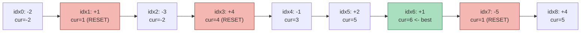
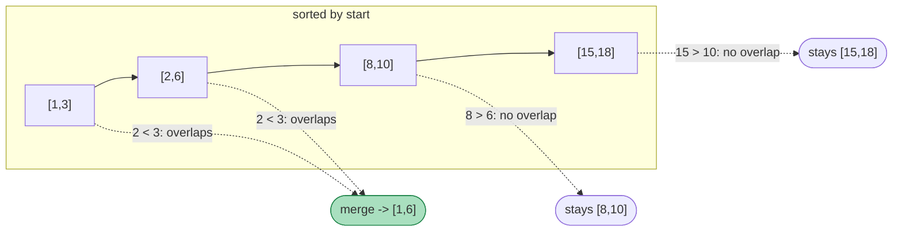

# 17 — Greedy & Intervals

## Why this exists

Most of this course has been "try every option" (backtracking) or "try
every option, but remember the answer" (coming in module 18: dynamic
programming). Greedy is the opposite promise: at every step, make the
choice that looks best *right now*, never reconsider it, and the final
answer is still globally optimal. When it works, an exponential or
O(n²) search collapses into a single O(n) or O(n log n) pass — no
tree of choices, no memo table, just a running decision.

The catch: greedy doesn't always work, and a wrong greedy rule fails
silently — it returns *an* answer, just not the best one. The skill
this module builds isn't "spot the greedy problem" (you'll get a feel
for that), it's **justifying** a greedy rule before you trust it.

## The exchange argument, informal

The exchange argument is the thinking tool of this module. It answers
"why does picking the locally-best option never cost me anything
globally?" The shape is always the same:

> Take any optimal solution. If, at the first point it differs from
> what greedy would pick, we swap in greedy's choice instead — show
> the result is still valid and no worse. Since this swap can be
> repeated until the optimal solution *is* greedy's solution, greedy
> must be at least as good as optimal — and optimal is, by
> definition, at least as good as greedy. They tie.

**Worked example — picking the most non-overlapping meetings.** You
have several meetings (intervals) and want to attend as many as
possible, none overlapping. Greedy's rule: always pick the meeting
that **ends earliest** among the ones still available.

Suppose an optimal schedule doesn't start with the earliest-ending
meeting `M` — it starts with some other meeting `M'` instead (`M'`
ends later than `M`, since `M` ends earliest of all). Swap `M` in for
`M'`:

- `M` doesn't overlap anything `M'` didn't already need to avoid,
  because `M` ends **no later** than `M'` — anything compatible with
  `M'`'s end time is compatible with `M`'s (earlier or equal) end
  time.
- The count of meetings attended is unchanged — we swapped one for
  one.

So swapping never hurts. Repeat the swap at the next disagreement, and
eventually the optimal schedule *is* greedy's schedule — proving
greedy is optimal. This is exactly `max_non_overlapping` in
`ex06_interval_scheduling.py`.

## Kadane's algorithm: running best, reset on negative prefixes

**The problem:** find the contiguous subarray with the largest sum.
**The naive alternative:** check every subarray — O(n²) (or O(n³)
without prefix sums). **The greedy insight:** a running sum that has
gone negative can only drag down everything added after it — so the
instant the running sum dips below zero, throw it away and restart
from the next element. You never need to "remember" a negative prefix.

Array `[-2, 1, -3, 4, -1, 2, 1, -5, 4]`:

*What to notice: a RESET fires whenever `cur + nums[i]` would be worse
than starting fresh at `nums[i]` — i.e. the running sum went negative.
The best window `[4, -1, 2, 1]` (idx3..idx6) starts right after the
idx3 reset, because everything before idx3 (`-2, 1, -3`) sums to −4 —
strictly a drag.*

| i | nums[i] | cur before | cur + nums[i] | cur after = max(nums[i], cur+nums[i]) | reset? | best so far |
| - | - | - | - | - | - | - |
| 0 | −2 | — | — | −2 | start | −2 |
| 1 | 1 | −2 | −1 | **1** | yes | 1 |
| 2 | −3 | 1 | −2 | −2 | no | 1 |
| 3 | 4 | −2 | 2 | **4** | yes | 4 |
| 4 | −1 | 4 | 3 | 3 | no | 4 |
| 5 | 2 | 3 | 5 | 5 | no | 5 |
| 6 | 1 | 5 | 6 | 6 | no | 6 |
| 7 | −5 | 6 | 1 | **1** | yes | 6 |
| 8 | 4 | 1 | 5 | 5 | no | 6 |

The recurrence is one line: `cur = max(nums[i], cur + nums[i])`,
`best = max(best, cur)`. That "one line, O(1) extra state, one pass"
shape is the running-best family.

## Greedy sweep patterns

Three shapes cover almost every greedy sweep you'll meet:

| Shape | State you carry forward | Update rule | Examples |
| --- | --- | --- | --- |
| **Running best** (Kadane) | best value seen, current running value | reset the running value when it stops helping | max subarray, best time to trade |
| **Furthest reach** | the furthest index reachable so far | `furthest = max(furthest, i + nums[i])` while sweeping `i` | jump game, video-stitching-style coverage |
| **Net balance** | a running total that must never (globally) go negative | track the running total AND the point where it last dropped below the best-so-far minimum | gas station circuit |

Furthest-reach worked example — `can_reach_end([2, 3, 1, 1, 4])`:
sweep `i = 0..len-1`, track `furthest`. At `i=0`, `furthest = max(0, 0+2) = 2`.
At `i=1`, `furthest = max(2, 1+3) = 4`. At `i=2`, `furthest = max(4, 2+1)
= 4`. The moment `furthest >= len(nums) - 1` you can stop early — reachable.
If you ever reach an `i > furthest` before that, you're stuck — not
reachable.

Net-balance worked example — the gas station problem: if
`sum(gas) - sum(cost) < 0` overall, no start works (you'd run the
tank dry no matter where you begin — the total deficit is
unavoidable). If the total is `>= 0`, a valid start is guaranteed to
exist, and it's the index right after the running tank last went
negative — everywhere before that point could only ever be reached
with an even bigger deficit already carried in, so it can never be
the start of a working circuit.

## Intervals: always sort first — but by which endpoint?

Nearly every interval problem starts with a sort. The one decision
that determines correctness: **sort by start, or by end?**

| Goal | Sort by | Why |
| --- | --- | --- |
| Merge overlapping / detect overlap | **start** | you need to walk intervals in the order they begin, extending or closing the "current" merged interval as you go |
| Pick the maximum count of non-overlapping intervals | **end** | the interval that frees up the timeline soonest leaves the most room for everything after it — the exchange argument from earlier |

**Timeline of merging** — intervals `[1,3], [2,6], [8,10], [15,18]`,
sorted by start:

*What to notice: `[1,3]` and `[2,6]` overlap (`2 < 3`, the next start
is strictly before the current end) so they fuse into `[1,6]`. `[8,10]`
starts at 8, strictly after `[1,6]` ends at 6 — no overlap, stays
separate. Each interval is visited once; the "current merged interval"
is the only state you carry.*

## How to recognize it

- **"Maximum subarray" / "best contiguous run" / "largest sum
  window"** → running-best (Kadane).
- **"Can you reach the end" / "minimum jumps/steps to reach"** →
  furthest-reach sweep.
- **"Minimum number of X to cover/schedule/attend everything"**, or
  **"maximum number of non-overlapping Y"** → sort-by-end interval
  scheduling.
- **Any problem centered on intervals** (`[start, end]` pairs) —
  merging, overlap detection, room/resource counting — sort first,
  by start or end per the table above.
- **A circular resource that must never go negative** (fuel, balance,
  inventory) → net-balance sweep.

**Honesty box.** Greedy is easy to *guess* wrong — a rule can sound
reasonable and still be non-optimal on some input. Before trusting a
greedy rule: either sketch the exchange argument (does swapping in the
locally-best choice ever make things worse?), or test it against a
brute-force reference on random small inputs. If neither argument
holds up, the problem probably needs dynamic programming instead
(module 18) — DP is what you reach for when the "locally best" choice
depends on more than what greedy can see in one pass.

## Gotchas

- **Sorting by the wrong endpoint.** Sort by start for
  merging/overlap; sort by end for max-count selection. Mixing them
  up gives a *plausible-looking* wrong answer, not a crash — that's
  what makes it dangerous. Always ask "what does this greedy rule
  need to be true about the next interval?" before picking the sort
  key.
- **Touching vs. overlapping.** `[1, 2]` and `[2, 3]` touch at the
  point `2` — they do **NOT** overlap (pinned course-wide). This means
  `merge_intervals` keeps them as two separate intervals in the
  output, and `can_attend_all`/scheduling treats back-to-back
  intervals as fully compatible (no conflict). The one deliberate
  exception is arrow-shooting (`ex07`): an arrow fired at a shared
  boundary point hits *both* touching balloons, because the arrow is
  a **point**, not an interval — point-containment is inclusive at
  both ends even though interval-overlap is not. Same course, two
  different questions ("do these ranges overlap?" vs. "does this
  point lie in this range?") — read the problem statement carefully.
- **Empty and single-interval inputs.** An empty interval list should
  return an empty result, not crash. A single interval never overlaps
  anything and is trivially "mergeable"/"attendable" as-is.
- **All-negative arrays in Kadane.** `max_subarray_sum` must return
  the *least negative* single element, never silently clamp to `0` —
  `0` is only a valid answer if the empty subarray is allowed, and
  the classic version doesn't allow it.

## Try it now

→ `exercises/ex01_kadane_max_run.py` through
`exercises/ex07_min_arrows.py`, then `checkpoint_17.py`.
Check with `uv run pytest 17-greedy-intervals`.
