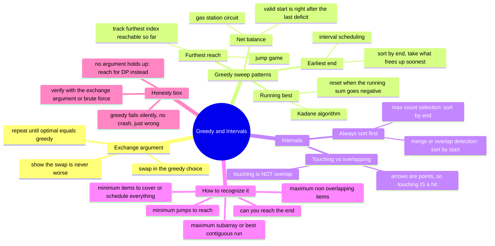

# 17 — Greedy & Intervals · Cheat-sheet

## Concept map

*What to notice: every branch maps to a decision you make before
writing a line of code — which sweep shape, which sort key, and
whether the greedy rule actually survives the exchange argument.*

Note: the mindmap writes "Kadane algorithm" without an apostrophe —
elsewhere in this file it's spelled the normal way, "Kadane's
algorithm."

## Greedy pattern menu

| Shape | State carried forward | Update rule | Examples in this module |
| --- | --- | --- | --- |
| **Running best** | best value seen, current running value | reset the running value the moment it stops helping (`cur = max(nums[i], cur + nums[i])`) | `max_subarray_sum`, `max_subarray_bounds`, `best_trades_unlimited`, `coffee_run` |
| **Furthest reach** | furthest index reachable so far | `furthest = max(furthest, i + nums[i])` while sweeping `i`; stuck if `i` ever exceeds `furthest` | `can_reach_end`, `min_jumps` |
| **Net balance** | running total that must never go negative overall | if total gas − total cost ≥ 0 a start exists; it's the index right after the running tank last went negative | `start_station` |
| **Earliest end** | the end time of the last interval taken | sort by end, greedily take any interval whose start is ≥ the last taken interval's end | `max_non_overlapping`, `plan_day` |

`min_boats` and `assign_kits` (ex04) are a fifth everyday shape worth
naming separately: **sort + two pointers from both ends** — pair the
smallest unresolved item with the largest it can still satisfy,
closing in from opposite ends of a sorted array.

## The sort-by-start-or-end rule

Nearly every interval problem opens with a sort. Get the endpoint
wrong and you get a plausible-looking wrong answer, not a crash.

| Goal | Sort by | Why |
| --- | --- | --- |
| Merge overlapping intervals, detect any overlap, sweep busy/free time | **start** | you need to walk intervals in the order they begin, extending or closing the "current" merged interval as you go |
| Pick the maximum count of non-overlapping intervals, minimum arrows/rooms/removals derived from that count | **end** | the interval (or shot) that frees up the timeline soonest leaves the most room for everything after it |

Ask yourself: "does this greedy rule need to know when things *start*,
or when they stop being in the way (*end*)?" That answer picks the
sort key.

## The exchange-argument checklist

Before trusting a greedy rule on a new problem, walk this checklist:

1. **State the rule** in one sentence ("always pick the interval that
   ends earliest").
2. **Assume an optimal solution disagrees** with greedy at some point.
3. **Swap** greedy's choice in for the optimal solution's choice at
   that point.
4. **Would swapping ever hurt?** Check validity (does the swap still
   respect every constraint?) and check the score (does the swap ever
   make the count/sum/total worse?). If the answer to both is "no, it
   never hurts," greedy is safe.
5. **If you can't argue step 4**, don't trust the rule — verify it
   against a brute-force reference on small random inputs, or assume
   it's wrong and reach for DP (module 18) instead.

## Touching-vs-overlap pin

`[1, 2]` and `[2, 3]` **touch** at the point `2` — this course-wide
rule says they do **NOT overlap**.

| Function | Touching intervals are... |
| --- | --- |
| `merge_intervals`, `insert_interval`, `merge_busy` | kept separate in the output (not merged) |
| `can_attend_all`, `max_non_overlapping`, `min_rooms`, `plan_day` | fully compatible — back-to-back is not a conflict |
| `min_arrows` (the one deliberate exception) | **counted as a hit** — an arrow is a point, not an interval, so it hits every balloon range containing that point, including both endpoints |

The reason for the exception: "do these two ranges overlap?" and
"does this point lie inside this range?" are different questions.
Interval-overlap is exclusive at a shared boundary; point-containment
is inclusive at both ends. Read which question a problem is actually
asking.

## Self-quiz

1. State the exchange argument in your own words — what does "swap
   never hurts" actually mean, and why does it prove optimality?
2. `max_subarray_sum` on an all-negative array must NOT return `0`.
   Why not, and what should it return instead?
3. Kadane's reset rule is "start fresh when the running sum goes
   negative." Why does throwing away a negative-going prefix never
   lose the true best answer?
4. You're merging intervals and your code sorts by END instead of
   START. Will it crash? What actually goes wrong?
5. In the gas station problem, why does `sum(gas) - sum(cost) >= 0`
   guarantee a valid starting station exists, rather than just making
   one more likely?
6. `[5, 6]` and `[6, 7]` are two balloon ranges in the arrows problem.
   Do they need one arrow or two? Contrast with the same two ranges
   as meeting-room intervals — do they need one room or two?
7. Furthest-reach (`can_reach_end`) and running-best (Kadane) are both
   one-pass, O(1)-extra-space sweeps. What's the key difference in
   what each one tracks?
8. A problem says "find the minimum number of non-overlapping
   intervals to remove so the rest don't overlap." How does this
   reduce to `max_non_overlapping`, a problem you already know how to
   solve?

Answers

1. Take any optimal solution; at the first point it differs from
   greedy, swap in greedy's choice instead. If that swap is always
   valid and never makes the result worse, you can repeat it until the
   optimal solution literally IS greedy's solution — so greedy ties
   optimal, meaning greedy is optimal too.
2. Because `0` is only a valid answer if the empty subarray is
   allowed — the classic version requires a non-empty subarray. On an
   all-negative array it must return the largest (least negative)
   single element, e.g. `[-3, -1, -2] -> -1`.
3. A running sum that has gone negative can only drag down any value
   added after it — extending through it is strictly worse than
   restarting at the next element. So the negative prefix contributes
   nothing to any subarray sum that could be the true best; dropping
   it costs nothing.
4. It won't crash, but it will silently produce a wrong merge: sorting
   by end doesn't guarantee intervals are visited in the order they
   *begin*, so an interval that starts early but ends late can appear
   after (and fail to absorb) an interval that should have merged into
   it. You get a plausible-looking but incorrect merged list.
5. Because the total is exactly the sum of every station's local
   surplus/deficit around the circuit. If the total is negative, no
   starting point can possibly work — the shortfall is unavoidable no
   matter where you begin. If the total is `>= 0`, the station right
   after the point where the running tank last hit its lowest point is
   provably reachable from every other station without going negative
   in between (everything before that point only ever carries a worse
   deficit forward).
6. One arrow: `[5,6]` and `[6,7]` touch at the point `6`, and an arrow
   fired at `x=6` is a point that lies inside both ranges — touching
   IS a hit for arrows. As meeting rooms, the same two intervals touch
   but do NOT overlap, so they need only ONE room (back-to-back
   meetings are compatible) — same numbers, two different rules,
   because "does a point hit this range" and "do these ranges overlap"
   are different questions.
7. Kadane tracks a VALUE (the best running sum) and resets it based on
   whether it's still helping. Furthest-reach tracks an INDEX (the
   furthest position reachable) and never resets it — it only ever
   grows (or the sweep gets stuck if the current index outruns it).
8. If you can keep `k` intervals non-overlapping at most (that's
   `max_non_overlapping`), then every other interval — `n - k` of them
   — must be removed to eliminate all remaining overlaps. So
   `min_removals(intervals) = len(intervals) - max_non_overlapping(intervals)`;
   no separate algorithm needed.

## Pattern-recognition drill

For each one-liner, name the pattern before checking the answer. Two
of these are traps where greedy does NOT work.

1. "Given daily temperature changes (can be negative), find the best
   contiguous run of days for total temperature gain."
2. "Given how far you can jump from each position, can you reach the
   last position?"
3. "Given a circular route of fuel stations with fuel gained and fuel
   spent per station, find a valid starting station, or report none
   exists."
4. "Given a list of overlapping meeting-room bookings, merge them into
   the fewest number of continuous busy blocks."
5. "Given a list of proposed talks, find the maximum number you could
   attend if you can only be in one at a time."
6. "Given a list of items with weights, minimize the number of boats
   needed if each boat carries at most 2 items and has a weight
   limit."
7. "Given a set of items each worth some value and weighing some
   amount, and a knapsack with a maximum weight capacity, maximize
   total value — you may take each item at most once."
8. "Given a row of houses with paint costs per color, minimize total
   cost so that no two adjacent houses share a color."

Answers

1. Running-best (Kadane) — "best contiguous run" of a value that can
   go negative is the classic maximum-subarray shape.
2. Furthest-reach sweep — "can you reach the end" from per-position
   jump distances.
3. Net-balance sweep — a circular resource (fuel) that must never go
   negative; check the total first, then find the reset point.
4. Sort-by-start interval merge — walk intervals in start order,
   extend or close the "current" merged interval.
5. Sort-by-end interval scheduling — the exchange-argument showcase:
   always take the talk that frees you up soonest.
6. Sort + two pointers from both ends — pair the lightest unresolved
   item with the heaviest it can still ride with, closing inward.
7. **Trap — greedy fails here.** 0/1 knapsack looks like it might
   yield to "always take the best value-per-weight item first," but
   that ratio-greedy provably fails on some inputs (a slightly
   heavier, slightly lower-ratio item can free up room for two other
   items that beat it combined). There's no valid exchange argument —
   the best choice at each step depends on what's still available
   afterward, not just what's best right now. This needs DP (module
   19's 0/1 knapsack).
8. **Trap — greedy fails here.** "Always paint the cheapest available
   color at each house" looks locally reasonable, but a cheap choice
   at house `i` can force an expensive choice at house `i+1` in a way
   that a globally different choice at `i` would have avoided — the
   optimal color at each house depends on what was chosen for its
   neighbor, which greedy can't see past one step. Needs DP: track the
   best total cost ending in each color at each house (module 18/19
   territory).

