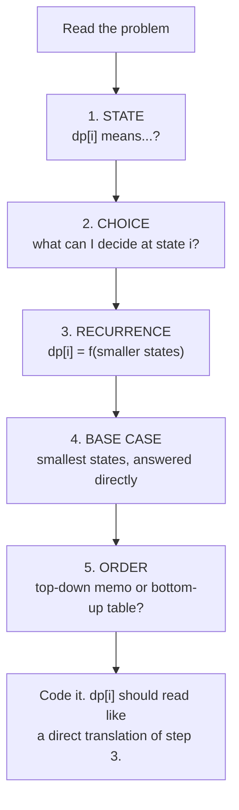
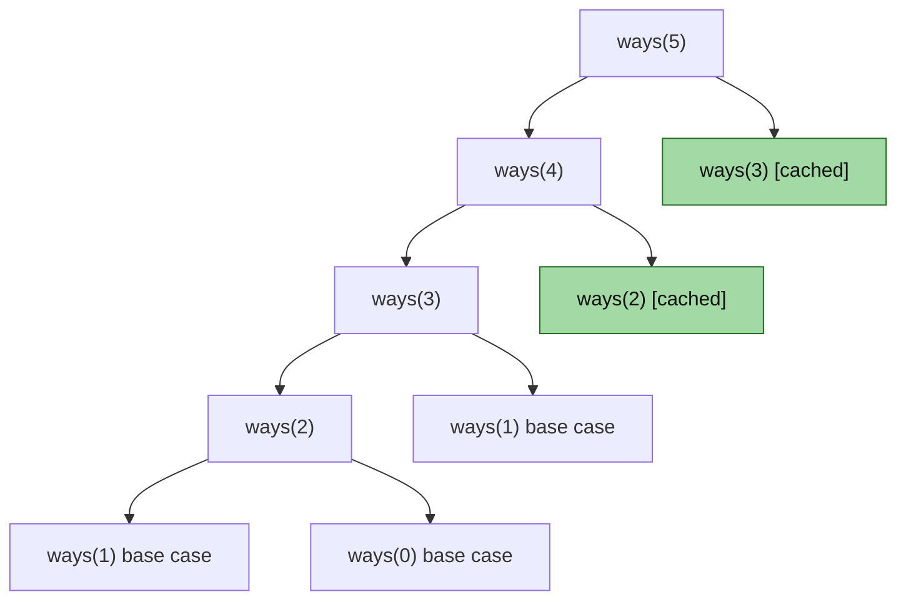

# 18 — Dynamic Programming I (1-D)

## Why this exists

Module 14's backtracking explores the *whole* decision tree — every
subset, every combination — because the problem genuinely asked for
every answer. But plenty of problems only ask "how many ways" or
"what's the best/cheapest," and their decision tree keeps asking the
exact same question over and over from different branches. Module 08
already showed you this shape: `fib_naive(5)` computes `fib(3)` twice
and `fib(2)` three times, from scratch, every single time.

Dynamic programming is the discipline of noticing that repetition and
answering each distinct question exactly once. Nothing about the
*search* changes — it's still "try each choice, recurse on what's
left" — only the bookkeeping does. That one change turns an
exponential call tree into a polynomial one:

| | Exponential (no cache) | Polynomial (DP) |
| --- | --- | --- |
| `fib_naive(30)` / `fib_memo(30)` (module 08) | 2,692,537 calls | 31 computed values |
| Generalizes to | any problem with overlapping subproblems | the same problem, memoized or tabulated |

If module 08's fib-with-counters convinced you a cache matters, this
module turns that trick into a repeatable 5-step framework and applies
it to six classic "count the ways" / "min or max cost" / "can it be
done" problems.

## THE framework

Every DP problem in this course (and most you'll meet outside it)
answers these five questions, in this order:

1. **STATE** — define, in words, what `dp[i]` (or `dp[i][j]` in module
   19) means. Not "the best so far" — the best *what*, ending *where*?
   Vague states are where every DP bug starts.
2. **CHOICE** — at state `i`, what are the finitely many decisions
   available? ("take this step or that step," "rob this house or
   don't," "use this coin or not.")
3. **RECURRENCE** — how does `dp[i]` depend on smaller states, given
   the choices? This is the mathematical heart: `dp[i] = f(dp[i-1],
   dp[i-2], ...)`.
4. **BASE CASE** — the smallest state(s) you can answer directly, with
   no recurrence needed. Get these wrong and every state above them is
   wrong too.
5. **ORDER** — top-down (memoized recursion, computed on demand,
   recursion handles the order for you) or bottom-up (a table filled
   in an order that guarantees every `dp[j]` a recurrence needs is
   already computed before you need it).



*What to notice: steps 1–4 are pure thinking, done before any code.
Step 5 is the only implementation decision, and — as the next section
shows — it barely changes the code at all once 1–4 are nailed down.*

## Memoization vs. tabulation, on climbing stairs

**Climbing stairs**: how many distinct ways to climb `n` stairs, taking
1 or 2 steps at a time? Walk the framework:

1. STATE: `ways(i)` = number of distinct ways to reach stair `i`.
2. CHOICE: the *last* step taken to land on `i` was either a 1-step
   (from `i-1`) or a 2-step (from `i-2`).
3. RECURRENCE: `ways(i) = ways(i-1) + ways(i-2)`.
4. BASE CASE: `ways(0) = 1` (one way to "climb" 0 stairs: do nothing),
   `ways(1) = 1`.
5. ORDER: either direction works here — nothing later depends on
   something not yet computed either way.

**Top-down (memoization)** — write the recursion the problem
statement suggests, add a cache:

```python
def ways_memo(n: int) -> int:
    cache: dict[int, int] = {}

    def helper(i: int) -> int:
        if i <= 1:
            return 1
        if i in cache:
            return cache[i]
        cache[i] = helper(i - 1) + helper(i - 2)
        return cache[i]

    return helper(n)
```

**Bottom-up (tabulation)** — build the table in an order that
guarantees dependencies exist first:

```python
def ways_table(n: int) -> int:
    dp = [0] * (n + 1)
    dp[0] = dp[1] = 1
    for i in range(2, n + 1):
        dp[i] = dp[i - 1] + dp[i - 2]
    return dp[n] if n >= 1 else dp[0]
```

| | Memoization (top-down) | Tabulation (bottom-up) |
| --- | --- | --- |
| Shape | Recursion + cache | Loop + array |
| Reads like | The recurrence, almost verbatim | The recurrence, run forward |
| Stack depth | O(n) — real risk for large n (`RecursionError`) | O(1) — no recursion at all |
| Computes | Only the states actually needed | Every state up to n, always |
| Space optimization | Awkward (cache holds everything) | Natural (see below) |

**Space optimization:** `dp[i]` only ever looks at `dp[i-1]` and
`dp[i-2]` — nothing further back is ever touched again once `dp[i]` is
computed. So the whole array is unnecessary; keep two rolling
variables instead:

```python
def ways_optimized(n: int) -> int:
    if n <= 1:
        return 1
    prev2, prev1 = 1, 1          # ways(0), ways(1)
    for _ in range(2, n + 1):
        prev2, prev1 = prev1, prev2 + prev1
    return prev1
```

This drops space from O(n) to O(1). The rule of thumb: **if the
recurrence only reaches back a fixed number of states (1, 2, a small
constant window), you never need the full table** — only the tabulated
(bottom-up) form makes this optimization obvious, which is the biggest
practical reason to reach for tabulation once you're past the
"getting it right" stage.

## The call tree, revisited

Module 08 showed `fib_naive(5)`'s call tree with `fib(3)` computed
twice and `fib(2)` three times, in orange. `ways(n)` above has the
*identical* recurrence shape (`ways(i) = ways(i-1) + ways(i-2)`, same
base-case count) — memoizing collapses the exact same repeated
branches:



*What to notice: the green nodes (`ways(3)`, `ways(2)`) are the exact
same subtrees module 08 drew in orange as wasted, repeated work — here
they're cut off after their FIRST computation because the cache
already holds the answer. This is the whole trick, every time: no new
idea, just "have I answered this exact question before?"*

## Worked example: house robber

You're robbing houses on a street, values `[2, 7, 9, 3, 1]`. Adjacent
houses share a wall with a shared alarm — rob two neighbors and you
get caught. Maximize total value.

1. **STATE**: `dp[i]` = the max loot achievable using only houses
   `0..i` (not "the best so far" — that's too vague to code; "using
   houses 0 through i, deciding freely whether to include house i" is
   precise).
2. **CHOICE**: at house `i`, either **skip** it (best is whatever
   `dp[i-1]` already achieved) or **rob** it (its value plus the best
   achievable *not counting house `i-1`*, i.e. `dp[i-2]`).
3. **RECURRENCE**: `dp[i] = max(dp[i-1], values[i] + dp[i-2])`.
4. **BASE CASE**: `dp[-1] = 0` (no houses, conceptually — handled as
   `prev2 = 0`), `dp[0] = values[0]`.
5. **ORDER**: bottom-up, left to right — `dp[i]` needs `dp[i-1]` and
   `dp[i-2]`, both already behind us.

| i | values[i] | skip: dp[i-1] | rob: values[i] + dp[i-2] | dp[i] |
| --- | --- | --- | --- | --- |
| 0 | 2 | — | — | 2 |
| 1 | 7 | 2 | 7 + 0 = 7 | 7 |
| 2 | 9 | 7 | 9 + 2 = 11 | 11 |
| 3 | 3 | 11 | 3 + 7 = 10 | 11 |
| 4 | 1 | 11 | 1 + 11 = 12 | 12 |

Answer: `dp[4] = 12` (rob houses at index 1 and 4: `7 + ... ` — trace
back the choice at each step: `dp[4]` came from the "rob" branch
(`1 + dp[2] = 12`), `dp[2]` came from the "rob" branch (`9 + dp[0] =
11`), `dp[0] = 2` — so houses 0, 2, 4 → `2 + 9 + 1 = 12`. Either
reconstruction is valid; the DP only promised the *value*, 12, unless
you also track the choices.)

## How to recognize it

- The problem says **"count the number of ways"** to reach some end
  state (climbing stairs, decode ways, fill n days with given block
  sizes).
- The problem says **"minimum/maximum cost/value"** to reach some end
  state or satisfy some condition (min cost climbing, coin change,
  house robber).
- The problem asks **"can it be done at all"** (word break) — a
  yes/no reachability question, not "show me one way."
- Choices **overlap**: the same sub-state (same remaining amount, same
  prefix index, same "house i and whether i-1 was taken") is reachable
  through more than one path of earlier choices.
- You do **NOT** need to enumerate or return the actual combinations —
  only a count, a min/max, or a boolean. The moment a problem also
  wants "and show me every way," you're back to backtracking (module
  14) — possibly backtracking *informed* by a DP table, but DP alone
  computes an aggregate, not a list of paths.

## Gotchas

| Gotcha | What happens | Fix |
| --- | --- | --- |
| State too vague ("best so far") | You can't write the recurrence because you don't know what "so far" excludes/includes | State must say precisely what's fixed (an index, a boundary) and what's still free |
| Iteration order violates dependencies | `dp[i]` computed before `dp[i-1]` exists → reads a stale/zero value | Bottom-up: iterate in the direction the recurrence looks backward; top-down avoids this by construction (recursion computes dependencies first) |
| Initializing with 0 instead of infinity (or vice versa) | A "minimum" DP that starts at 0 looks artificially cheap; a "maximum" DP that starts at infinity never updates | Counting/summing states start at 0; **min** states start at `+infinity` (nothing found yet); **max** states that must be achievable start at `-infinity` or are seeded from a real base case |
| Off-by-one between "first `i` items" and "index `i`" | `dp[i]` meaning "using the first `i` items" is offset by one from `values[i]` (the `i`-th item, 0-indexed) | Pin the state definition in words FIRST (framework step 1) — it tells you whether `dp[i]` should read `values[i]` or `values[i-1]` |
| Forgetting unbounded vs. bounded choice | Coin change: coins can repeat (unbounded) — using `dp[amount - coin]` (not `dp[amount - coin]` from a *previous row*) is what allows reuse | Know per-problem whether each "item" can be chosen once or unlimited times — it changes which earlier state the recurrence reads from |

## Try it now

→ `exercises/ex01_stairs_framework.py` through
`exercises/ex07_longest_rising.py`, then `checkpoint_18.py`.
Check with `uv run pytest 18-dp-1d`.
