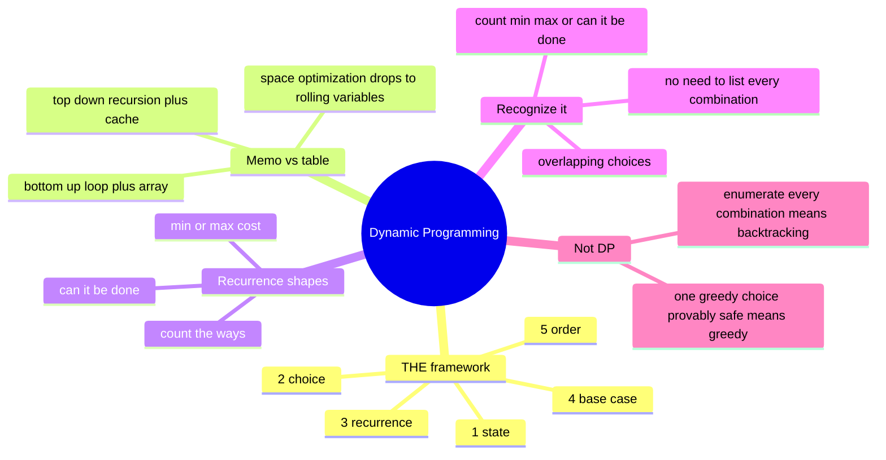

# 18 — Dynamic Programming I (1-D) · Cheat-sheet

## Concept map

*What to notice: the framework's five steps are the same five questions
every time, in the same order — only the RECURRENCE and the combiner
(sum, min, max, or) change between problems.*

## THE framework — numbered 1–5

1. **STATE** — say, in words, what `dp[i]` means. Not "the best so
   far" — the best *what*, using/ending *where*?
2. **CHOICE** — the finitely many decisions available at state `i`.
3. **RECURRENCE** — `dp[i] = f(dp[i-1], dp[i-2], ...)`, built directly
   from the choices in step 2.
4. **BASE CASE** — the smallest state(s) answered directly, no
   recurrence needed.
5. **ORDER** — top-down (memoized recursion) or bottom-up (a table
   filled so every dependency exists before it's read).

Steps 1–4 are pure thinking, done before any code. Step 5 is the only
implementation decision.

## Memoization vs. tabulation

| | Memoization (top-down) | Tabulation (bottom-up) |
| --- | --- | --- |
| Shape | Recursion + cache | Loop + array |
| Reads like | The recurrence, almost verbatim | The recurrence, run forward |
| Stack depth | O(n) — real `RecursionError` risk for large n | O(1) — no recursion |
| Computes | Only the states actually needed | Every state up to n, always |
| Space optimization | Awkward (cache holds everything) | Natural (see below) |
| Reach for it when | The recursive shape is obvious and n is small/moderate | n is large, or you want the space optimization |

**Space-optimization rule:** if `dp[i]` only ever reads back a fixed,
small number of earlier states (`dp[i-1]`, `dp[i-2]`, or a small
constant window), the full table is unnecessary — keep only that many
rolling variables. Drops space from O(n) to O(1). This optimization is
only obvious in the tabulated form; a memoized cache holds every state
by construction.

## Recurrence templates — count vs. min vs. can

| Question | Combiner | Base case | Example |
| --- | --- | --- | --- |
| **Count** the ways | `dp[i] = sum(dp[i - choice] for choice in choices)` | `dp[0] = 1` (one way: do nothing) | climbing stairs, decode ways, ways to fill |
| **Min/max** cost or value | `dp[i] = min(...)` or `max(...)` over choices | seed with the smallest real state; init unreached states to `+infinity` (min) — never 0 | min-cost stairs, house robber, coin change |
| **Can** it be done | `dp[i] = any(dp[j] and condition(j, i) for j in ...)` | `dp[0] = True` (empty/nothing is trivially done) | word break |

**Initialization trap:** counting states start at 0 (nothing found
yet, will accumulate). **Min** states start at `+infinity` (nothing
reachable yet — 0 would look impossibly cheap). **Max** states are
seeded from a real, achievable base case (never `+infinity`, and
`-infinity` only for states not guaranteed reachable at all).

## Greedy vs. DP

Both walk left to right making one decision per step — the difference
is whether that decision is provably safe in isolation.

- **Greedy** (module 17) commits to the locally-best choice at each
  step and never revisits it — valid only when you can *prove* no
  other choice ever does better (an exchange argument).
- **DP** keeps every choice's *consequence* alive as a state, and lets
  the recurrence pick the best downstream outcome — used when the
  locally-best choice is NOT always globally optimal.
- **The tell:** coin change with denominations `[1, 3, 4]` and amount
  `6`. Greedy (always take the biggest coin that fits) takes `4, 1, 1`
  — 3 coins. The true optimum is `3, 3` — 2 coins. Greedy fails
  because a coin system needs a *proof* to be greedy-safe (US coins
  happen to have one); DP never needs that proof — it just tries every
  choice's consequence via the recurrence.

## Self-quiz

1. Why is "dp[i] = the best so far" not a valid STATE definition?
2. What's the one thing that changes between memoization and
   tabulation, once the framework's steps 1–4 are nailed down?
3. `dp[i]` only ever reads `dp[i-1]` and `dp[i-2]`. What does that tell
   you about how much space the tabulated version actually needs?
4. Coin change (module 18): why does the recurrence read `dp[amount -
   coin]` from the SAME pass, rather than a previous "row"?
5. A "minimum cost" DP is initialized with every state at 0 instead of
   infinity. What breaks, concretely?
6. House robber's recurrence is `dp[i] = max(dp[i-1], values[i] +
   dp[i-2])`. Name the CHOICE this recurrence encodes, in one sentence.
7. A problem says "return every way to split this string into
   dictionary words." Is that a DP problem? Why or why not?
8. Coins `[1, 3, 4]`, amount `6`. What does greedy return, what's
   actually optimal, and which single word from this module's
   framework explains why greedy is wrong here?

Answers

1. "So far" doesn't say *what* is being tracked — the best sum? the
   best sum ending exactly at `i`? including or excluding `i`? Without
   pinning that down you can't write a RECURRENCE, because you don't
   know what smaller states to read or what they promise.
2. ORDER (framework step 5) — top-down lets recursion discover the
   right evaluation order for you (with a cache to avoid recomputing);
   bottom-up commits to an explicit loop order that must respect every
   dependency. The STATE, CHOICE, RECURRENCE, and BASE CASE stay
   identical either way.
3. Only the tabulated table needs the full array; the last two values
   are always sufficient, so it can be collapsed to two rolling
   variables — O(n) space drops to O(1).
4. Coins are reusable an unlimited number of times (unbounded choice).
   Reading `dp[amount - coin]` from the state currently being built
   (not a separate "previous row") is exactly what allows the SAME
   coin to be picked again for a smaller remaining amount.
5. Every state looks artificially free from the start (cost 0 with no
   coins/steps spent), so `min(...)` never distinguishes "reachable
   cheaply" from "not yet reached at all" — the DP silently reports 0
   for states that should be impossible or expensive.
6. At house `i`, either skip it (best loot is whatever `dp[i-1]`
   already achieved) or rob it (its value plus the best loot achievable
   while excluding its immediate neighbor, `dp[i-2]`).
7. No — "return every way" means you must enumerate and return actual
   splits, not just a count or a yes/no. That's backtracking (module
   14), possibly guided by a DP reachability table (`can_segment`) to
   prune dead branches, but the enumeration itself isn't DP.
8. Greedy takes the biggest coin repeatedly: `4 + 1 + 1` = 3 coins.
   Optimal is `3 + 3` = 2 coins. Greedy is wrong because this coin
   system has no proof that the locally-biggest coin is always part of
   *some* optimal solution — DP's RECURRENCE tries every coin's
   consequence instead of committing early.

## Pattern-recognition drill

For each one-liner, name the pattern/structure before checking the
answer — some are decoys.

1. "Count the number of distinct ways to tile a 2×n board with 1×2
   dominoes."
2. "Given a set of unique numbers, return every possible subset."
3. "What's the minimum number of jumps to reach the end of an array,
   where `nums[i]` is the farthest you can jump from index `i`?"
4. "Given a rod of length n and prices per cut length, find the
   maximum revenue from cutting it into pieces."
5. "Given a list of meeting intervals, find the minimum number of
   rooms needed to hold them all simultaneously."
6. "Can a digit string be decoded into a valid sequence of letters
   under a fixed mapping, and if so, in how many ways?"
7. "Given an array, find the length of the longest strictly increasing
   run of values, in original order but not necessarily contiguous."
8. "Given a target sum and a set of numbers usable once each, return
   every distinct subset that adds up to the target."

Answers

1. Dynamic programming — count-the-ways shape. `dp[i] = dp[i-1] +
   dp[i-2]` (place a vertical domino using 1 column, or two horizontal
   dominoes using 2 columns) — the climbing-stairs recurrence in
   disguise.
2. **Decoy — not DP.** "Return every possible subset" demands the
   actual subsets, not a count — that's backtracking (module 14),
   subsets shape.
3. Dynamic programming (or a greedy variant with its own proof) —
   min-cost-to-reach shape: `dp[i]` = min jumps to reach index `i`,
   built from every `j < i` that can reach it.
4. Dynamic programming — max-value shape, structurally identical to
   unbounded coin change: `dp[len] = max(price[cut] + dp[len - cut])`
   over every possible first-cut length.
5. **Decoy — not DP.** No overlapping-choice recurrence here; this is
   the start/end event-sweep pattern from module 17 (greedy/interval),
   not dynamic programming.
6. Dynamic programming — this module's `decode_ways` exactly (count
   the ways, two-choice recurrence, "if so" is answered implicitly by
   the count being nonzero).
7. Dynamic programming — this module's `lis_length` / `lis_length_fast`
   (LIS): O(n²) DP first, then the O(n log n) patience-sorting
   speed-up.
8. **Decoy — not DP.** "Return every distinct subset" demands the
   actual subsets — backtracking (module 14), combination-sum shape.
   A DP table could answer "how many" or "is it possible" in this
   problem's shape, but not "list them all."

