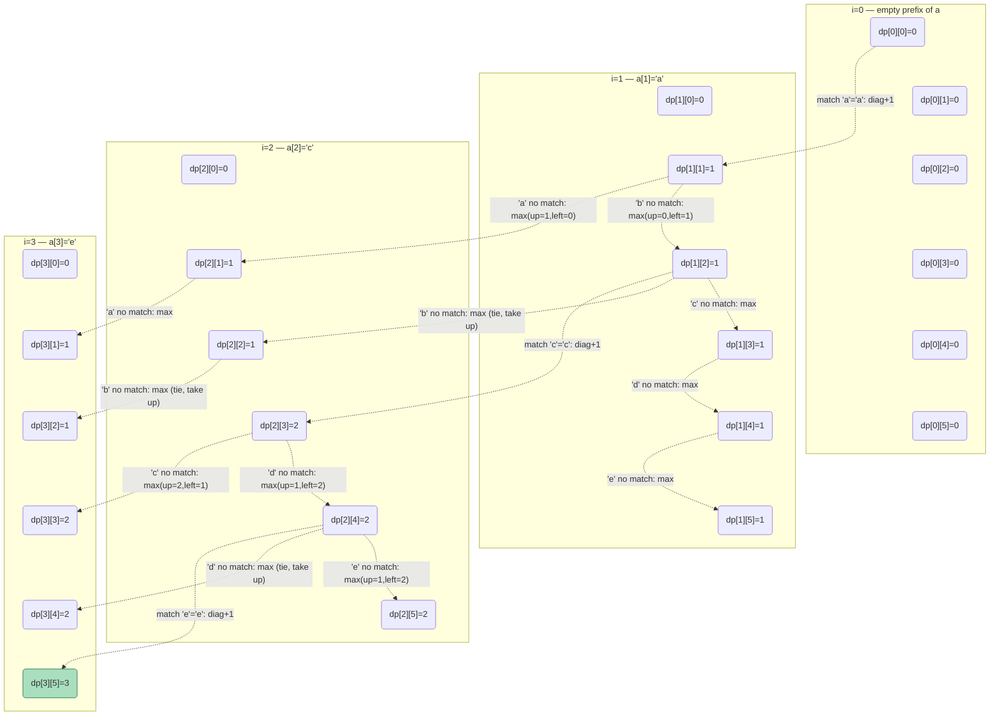
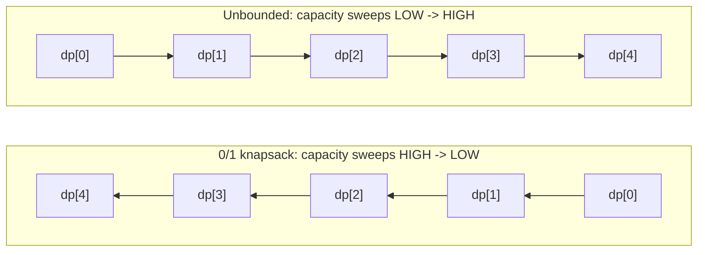

# 19 — Dynamic Programming II (2-D)

## Why this exists

Module 18 solved problems where one index told you everything about
"where you are": `dp[i]` = best answer using the first `i` steps/coins/
houses. That works as long as the problem has exactly one moving part.

Plenty of problems have two. "How much of string A have I matched
against how much of string B?" needs a position in *each* string.
"What's the best value using some of these items, without blowing a
budget?" needs an item index *and* how much budget is left. One number
can't describe either state — you need a pair, so the table grows a
dimension: `dp[i][j]` instead of `dp[i]`.

The naive alternative is the same one module 18 warned about, just
worse: try every subsequence of A against every subsequence of B
(exponential in both lengths), or try every subset of items
(`O(2ⁿ)`). Dynamic programming still rescues you the same way —
overlapping subproblems, computed once, looked up after that — the
table just has rows *and* columns now.

**Nothing about the framework changes.** State, choice, recurrence,
base case, order — the same five steps from module 18. You're just
answering "what's the state?" with two numbers instead of one.

## The LCS grid, fully filled

`lcs_length("ace", "abcde")`: `dp[i][j]` = length of the longest common
subsequence between the first `i` characters of `"ace"` and the first
`j` characters of `"abcde"`. Row 0 and column 0 are the base case (an
empty prefix shares nothing with anything, so they're all 0).



*What to notice: every cell has exactly one arrow feeding it — either a
diagonal "match" jump (+1 over the diagonal neighbor) or a "max" pull
from directly above or directly to the left. The bottom-right corner,
`dp[3][5]=3`, is the answer: the LCS of "ace" and "abcde" is "ace"
itself, length 3.*

## The two big 2-D families

Almost every 2-D DP problem is one of these two shapes. Spot which one
first — it tells you what the rows and columns mean before you write a
line of code.

| Family | `dp[i][j]` means | Recurrence shape | Classic problems |
| --- | --- | --- | --- |
| **Two-sequences** | best answer comparing the first `i` chars of A against the first `j` chars of B | compare `A[i]` vs `B[j]`: match → step diagonally (+1 or free), mismatch → take the best of dropping from A or from B | LCS, edit distance, palindrome check via LCS-with-reverse |
| **Item-and-budget** | best value using (some of) the first `i` items within a budget/capacity of `j` | for item `i`: skip it, or take it if it fits — `dp[i][j] = max(dp[i-1][j], dp[i-1][j-cost]+value)` | 0/1 knapsack, subset sum, coin change, target sum |

## Worked example — 0/1 knapsack, the five steps

Items (weight, value): `(2, 3)`, `(3, 4)`, `(4, 5)`. Capacity `5`. Each
item is take-it-or-leave-it — at most once.

1. **State** — `dp[i][c]` = the best total value achievable using only
   the first `i` items, with total weight ≤ `c`.
2. **Choice** — for item `i`: skip it (`dp[i-1][c]`), or take it if it
   fits (`dp[i-1][c - weight_i] + value_i`).
3. **Recurrence** —
   `dp[i][c] = dp[i-1][c]` if `weight_i > c`, otherwise
   `dp[i][c] = max(dp[i-1][c], dp[i-1][c - weight_i] + value_i)`.
4. **Base case** — `dp[0][c] = 0` for every `c` (no items, no value);
   `dp[i][0] = 0` for every `i` (no room, nothing fits).
5. **Order** — fill `i` from 1 up to `n`, and for each `i`, `c` from 0
   up to `capacity`. Row `i` only ever reads row `i - 1`.

| item \ capacity | 0 | 1 | 2 | 3 | 4 | 5 |
| --- | --- | --- | --- | --- | --- | --- |
| none | 0 | 0 | 0 | 0 | 0 | 0 |
| +(w2,v3) | 0 | 0 | 3 | 3 | 3 | 3 |
| +(w3,v4) | 0 | 0 | 3 | 4 | 4 | 7 |
| +(w4,v5) | 0 | 0 | 3 | 4 | 5 | 7 |

`dp[3][5] = 7` — take the weight-2 and weight-3 items (`3 + 4 = 7`,
using all 5 of the capacity). The weight-4 item never earns its keep
here: taking it alone caps out at 5.

## 0/1 vs unbounded: one line of code

Unbounded knapsack (an item can be reused any number of times — think
"coins" or "rod pieces") changes exactly **which row** the "take it"
branch reads from:

```python
# 0/1: item i used at most once — "take" reads the PREVIOUS row
dp[i][c] = max(dp[i - 1][c], dp[i - 1][c - w] + v)

# unbounded: item i can repeat — "take" reads THIS SAME row
dp[i][c] = max(dp[i - 1][c], dp[i][c - w] + v)
#                              ^ i, not i - 1 — you can pick item i again
```

Reading from row `i` (not `i - 1`) means "after taking one copy of
item `i`, I'm still allowed to take another" — the row hasn't moved on
to the next item yet. That one changed index is the entire difference
between "each item once" and "each item unlimited times."

## Space optimization: the direction rule

Every row only reads the row directly above it (0/1) or itself (un­
bounded) — never anything further back. That means you don't need the
full 2-D table: **one row, updated in place**, is enough. The only
catch is the order you sweep the capacity in.



*What to notice: the arrows show which cell gets read/written first.
0/1 must finish the high end before touching `dp[c - w]`, so that read
still holds "before this item" data. Unbounded wants the opposite —
`dp[c - w]` should already include this item, so a later, larger `c`
in the same pass can reuse it.*

```python
# 0/1 — 1 row, capacity DESCENDING
for c in range(capacity, weight - 1, -1):
    dp[c] = max(dp[c], dp[c - weight] + value)

# unbounded — 1 row, capacity ASCENDING
for c in range(weight, capacity + 1):
    dp[c] = max(dp[c], dp[c - weight] + value)
```

**Why descending for 0/1:** if you swept ascending, by the time you
reach `dp[c]` you might already have overwritten `dp[c - weight]` with
a value that includes item `i` — accidentally reusing it, turning 0/1
into unbounded by mistake. Sweeping from the top down guarantees
`dp[c - weight]` is still last item's value when you read it.

**Why ascending for unbounded:** that's exactly the reuse you *want* —
`dp[c - weight]` already reflecting item `i` lets you stack another
copy of it into `dp[c]` in the same pass.

The ladder, in order of what you'd actually write:
1. Full 2-D table (`O(n × capacity)` space) — write this first, it's
   the easiest to get right.
2. Two 1-D rows (`prev`, `curr`), swapped each iteration — halves the
   space, same logic.
3. One 1-D row, updated in place, with the direction rule above —
   `O(capacity)` space, same answers, because each row never needed
   anything beyond the row directly before it.

## How to recognize it

- Two strings/sequences being compared, aligned, or transformed into
  each other → **two-sequence DP** (`dp[i][j]` over both prefixes).
- "Pick items without exceeding a limit," each item usable once →
  **0/1 knapsack** — a budget dimension joins the item dimension.
- "Count the ways to make X out of parts you can reuse" → **unbounded
  knapsack** (coin change, rod cutting) — same shape, reused rows.
- Grid movement with a cost/count at each cell, only right/down moves
  → **grid DP** — the grid itself *is* the table.
- "Longest/shortest palindromic substring" → still 2-D, but compare a
  string against *its own reverse*, or expand outward from centers.

## Gotchas

- **The `+1` border.** `dp` is usually sized `(n+1) × (m+1)` so row/col
  0 can hold the "empty prefix" base case without special-casing index
  `-1`. Forgetting the border is the #1 off-by-one in this module —
  `dp[i][j]` corresponds to `a[i-1]` and `b[j-1]`, not `a[i]`/`b[j]`.
- **Capacity direction.** Space-optimizing to 1-D and sweeping the
  wrong way silently turns 0/1 into unbounded (or vice versa) — the
  code still runs, it just gives a *plausible, wrong* answer. Always
  double check which row the "take" branch is supposed to read.
- **Subsequence vs. substring.** LCS/edit-distance work on
  *subsequences* — characters can skip around, order preserved,
  contiguity not required. Longest palindromic *substring* must be
  contiguous. Mixing these up gives you a different, wrong problem.
- **Reconstructing the answer, not just its length.** `lcs_length`
  only needs the numbers. `lcs_string` needs you to walk the filled
  table *backwards* from `dp[n][m]`, re-deriving which move (diagonal
  match, up, or left) produced each cell — the table has to be kept
  around for this, not discarded after computing the final number.

## Try it now

→ `exercises/ex01_grid_paths.py` through `exercises/ex07_palindrome_dp.py`,
then `checkpoint_19.py`.
Check with `uv run pytest 19-dp-2d`.
