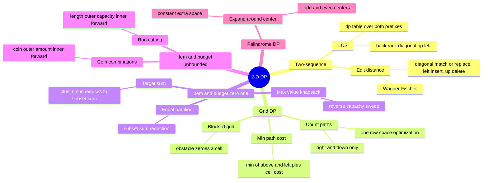

# 19 — Dynamic Programming II (2-D) · Cheat-sheet

## Concept map



*What to notice: every leaf is a shape decision, made BEFORE code —
which family, whether the budget dimension reuses items, and which
direction the capacity sweep runs.*

## The two big families, at a glance

| Family | `dp[i][j]` means | Recurrence shape | Classic problems |
| --- | --- | --- | --- |
| **Two-sequence** | best answer for prefixes `i` of A, `j` of B | compare `A[i]` vs `B[j]`: match -> diagonal step; mismatch -> best of dropping from A or B | LCS, edit distance |
| **Item-and-budget** | best value/count using first `i` items within budget `j` | for item `i`: skip, or take if it fits | 0/1 knapsack, partition, coin change, target sum |
| **Grid** (a special case) | best answer arriving AT cell `(r, c)` | from above or from the left | count paths, min path cost |

## Knapsack 0/1 vs unbounded — one line of code

```python
# 0/1: item used at most once — "take" reads the PREVIOUS row/pass
dp[c] = max(dp[c], dp_prev[c - w] + v)

# unbounded: item reusable — "take" reads THIS SAME row/pass
dp[c] = max(dp[c], dp[c - w] + v)
#                   ^ dp, not dp_prev — item i can be picked again
```

Space-optimized to 1-D, that same difference becomes the sweep
**direction**:

| Variant | Capacity sweep | Why |
| --- | --- | --- |
| 0/1 (each item once) | HIGH to LOW | `dp[c - w]` must still be "before this item" when read |
| Unbounded (reusable) | LOW to HIGH | `dp[c - w]` should already include this item, so it stacks |

## Space-optimization ladder

1. Full 2-D table (`dp[i][j]` or `dp[i][w]`) — `O(n * m)` space, write
   this first, easiest to get right, and the ONLY option if you need to
   reconstruct the answer afterward (e.g. `lcs_string`,
   `best_feature_set`).
2. Two rolling 1-D rows (`prev`, `curr`), swapped each iteration —
   halves the space, same logic.
3. One 1-D row updated in place, with the direction rule above —
   `O(m)` or `O(capacity)` space, because every row only ever reads the
   row directly before it (0/1) or itself (unbounded).
4. Grid DP's special case: a single row updated LEFT TO RIGHT,
   `dp[c] += dp[c - 1]` — "from above" is `dp[c]` before the update,
   "from the left" is `dp[c - 1]` just after it.

## Reduction gallery

**Equal partition** (`can_partition_equal` / `is_fair_split`): can
`nums` split into two subsets of equal sum?
```
total = sum(nums)
total is odd  ->  impossible, return False
target = total // 2
Reduce to: does some subset of nums sum to exactly target?
Solve with a 0/1 boolean subset-sum dp, O(n * total) time.
```

**Target sum with signs** (`ways_to_target`): assign +/- to every
number in `nums` to reach `target`.
```
Let P = the "+"-assigned subset sum, N = the "-"-assigned subset sum.
P + N = sum(nums)      (every number picked exactly once)
P - N = target          (the signed sum wanted)
-----------------------------------------------------
2P = sum(nums) + target
P  = (sum(nums) + target) / 2

Preconditions, checked FIRST:
  (sum(nums) + target) must be even  -- else return 0
  abs(target) must be <= sum(nums)   -- else return 0
Then count 0/1 subsets that sum to exactly P.
Each zero in nums DOUBLES the count (it's still a real sign choice).
```

## Self-quiz

1. Why does the 0/1 knapsack's 1-D capacity sweep have to run high to
   low, not low to high?
2. In `count_coin_ways`, why is the coin the OUTER loop and the amount
   the inner loop? What would swap that produce instead?
3. What two preconditions make the target-sum reduction impossible, and
   why does each one break the math?
4. Why can't `lcs_string` use the same 1-D space optimization as
   `lcs_length`?
5. In edit distance, what edit operation does each of the three
   incoming table directions (diagonal, left, up) represent?
6. Why does a zero in `ways_to_target`'s input double the answer instead
   of leaving it unchanged?
7. What's the difference between counting palindromic *substrings* and
   the longest common *subsequence* — which one requires contiguity?
8. In `best_feature_set`, what condition during backtracking tells you
   an item WAS included in the optimal set?

<details><summary>Answers</summary>

1. The 1-D array is reused across items. Reading `dp[c - w]` while
   sweeping high to low guarantees that cell still holds the value from
   BEFORE the current item was considered — sweeping low to high would
   let the same item's contribution get added again in the same pass,
   silently turning 0/1 into unbounded.
2. Fixing each coin's "era" before moving to the next coin means a
   combination like {1, 2} only ever gets built one way (1 then 2), not
   also as {2, 1}. Swapping the loops (amount outer, coin inner) counts
   every ORDER separately, producing a permutation count instead — the
   module 18 checkpoint's `ways_to_fill` shape.
3. `(sum + target)` odd means `P` isn't an integer, so no subset sum
   can equal it. `abs(target) > sum` means even assigning every number
   the sign that helps most can't reach that far.
4. Reconstructing the string requires walking the table BACKWARDS from
   `dp[n][m]`, re-deriving which move produced each cell — the 1-D
   optimization overwrites earlier rows, so that history is gone by the
   time you'd need to look back through it.
5. Diagonal = replace (or match for free when characters are equal);
   left = insert (bring in a character from the target string); up =
   delete (drop a character from the source string).
6. A zero can be assigned '+' or '-' with no effect on the sum — both
   are still distinct, valid sign assignments, so every existing way to
   reach the target splits into two ways once a zero is added.
7. Palindromic *substrings* must be contiguous (no skipped characters);
   LCS *subsequences* may skip characters but must preserve order.
   Mixing them up solves a different problem than the one asked.
8. `dp[i][w] != dp[i - 1][w]` — if including item `i - 1` changed the
   best value at that (item, budget) cell, it must have been taken;
   if the value is identical to the row above, it was skipped.

</details>

## Pattern-recognition drill

Name the pattern before peeking: two-sequence DP, grid DP, 0/1
knapsack, unbounded knapsack, palindrome DP, or "not 2-D DP at all."

1. "Given two edited drafts of an essay, find the longest passage that
   appears in both, in order, allowing gaps."
2. "A courier can carry at most W kilograms; pick packages, each usable
   once, to maximize delivered value."
3. "Count the number of ways to make exact change for $1 using an
   unlimited supply of pennies, nickels, dimes, and quarters."
4. "A robot on a factory floor can only step right or down; count its
   distinct routes to the exit."
5. "Find the longest run of characters in a string that reads the same
   forwards and backwards."
6. "Minimum number of single-character edits to turn a typed word into
   the correct spelling."
7. "Given a set of numbers, decide whether two coworkers can split them
   into equal-total piles."
8. "Given a sorted array, find two numbers that add up to a target."

<details><summary>Answers</summary>

1. Two-sequence DP (LCS) — "appears in both, in order, allowing gaps"
   is the subsequence cue.
2. 0/1 knapsack — each package used at most once, under a weight
   budget.
3. Unbounded knapsack, combination count — coins reusable, order
   doesn't matter.
4. Grid DP — only right/down moves, count the routes.
5. Palindrome DP (expand-around-center) — "longest ... reads the same
   forwards and backwards," contiguous (substring, not subsequence).
6. Two-sequence DP (edit distance) — insert/delete/replace between two
   strings.
7. 0/1 knapsack reduction (equal partition) — "split into equal-total
   piles" is the subset-sum cue.
8. NOT 2-D DP — two pointers, opposite ends (module 04); sorted input
   is the cue.

</details>
