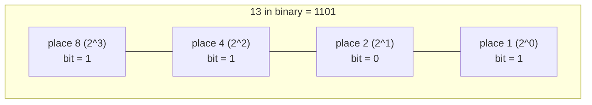
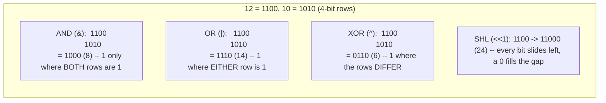
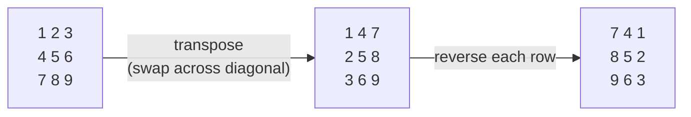

# 20 — Bit Manipulation & Math

## Why this exists

Every integer your program touches is already an array of bits — you
just haven't been treating it that way. Some problems that look like
they need O(n) extra space (a seen-set, a frequency table) collapse to
O(1) space the instant you notice the "set" you're tracking fits in
the bits of a single number. And bit tricks are a favorite interview
warm-up precisely because they're small enough to fully verify in a
whiteboard's worth of space — they probe whether you understand what
`&`, `|`, `^` actually *do*, not whether you memorized a library call.

The second half of this module is a grab-bag of math every interview
track expects: greatest common divisor, primality, and treating a 2D
grid as coordinates to transform in place. None of it is hard once you
see the trick; all of it recurs constantly once you know it.

The naive alternative these tricks beat: a hash set to track "have I
seen this before" (O(n) space, where a handful of `^` operations do
the same job in O(1)); checking primality of every number up to `n`
one at a time with trial division (O(n·√n), where a sieve does it in
O(n log log n)); allocating a second grid to hold a rotated/zeroed
copy (O(n·m) extra space, where in-place index math needs none).

## The number 13, bit by bit

*What to notice: each position is worth a power of two, and the number
is just the sum of the positions where the bit is `1` — `8 + 4 + 1 =
13`. Every trick below is just arithmetic on which positions are lit.*

## AND / OR / XOR / shift, as row operations

Line two numbers up as bit rows and each operator becomes a simple
per-column rule — no carrying, no borrowing, one column at a time.

*What to notice: AND is a filter (keeps only agreement), OR is a
union (keeps any presence), XOR is a difference (keeps disagreement),
and a left shift by `k` is exactly "multiply by `2**k`" — a right
shift is "divide by `2**k`, rounding toward negative infinity."*

## The toolkit

Each recipe below treats bit `i` as the one worth `2**i` (bit 0 is the
least significant, rightmost bit).

| Operation | Recipe | What it does |
| --- | --- | --- |
| Get bit `i` | `(n >> i) & 1` | shift the target bit to position 0, mask off everything else |
| Set bit `i` | `n \| (1 << i)` | OR in a `1` at position `i`; other bits pass through untouched |
| Clear bit `i` | `n & ~(1 << i)` | AND with a mask that's `0` only at position `i` |
| Toggle bit `i` | `n ^ (1 << i)` | XOR with a single `1` — flips exactly that position |
| Lowest set bit | `n & -n` | two's-complement identity: isolates the rightmost `1`, zeroes the rest |
| Drop lowest set bit | `n & (n - 1)` | `n - 1` flips the rightmost `1` and every `0` below it; ANDing clears that run |
| Is power of two | `n > 0 and n & (n - 1) == 0` | a power of two has exactly one set bit, so dropping it leaves `0` |

`n & -n` and `n & (n - 1)` are the two moves worth memorizing cold —
almost every "count/find a specific bit" problem is built from one of
them, repeated in a loop.

## XOR's three superpowers

XOR has three laws that combine into a disproportionately useful
tool:

1. **`a ^ a = 0`** — a value XORed with itself cancels out.
2. **`a ^ 0 = a`** — XOR with zero is a no-op (an identity element).
3. **Commutative and associative** — order and grouping don't matter:
   `a ^ b ^ c == c ^ a ^ b`.

Put together: XOR-fold a list where every value appears an even
number of times except one, and every pair cancels to `0`, leaving
only the odd one out — no hash set, O(1) space. The same laws give you
a **swap-free difference**: `a ^ b` has a `1` in exactly the positions
where `a` and `b` disagree, so `count_set_bits(a ^ b)` is the Hamming
distance between them without ever comparing bit by bit by hand.

## Worked example: find the single number

`nums = [4, 1, 2, 1, 2]` — every value appears twice except `4`. Fold
XOR across the array, left to right, tracking the running result:

| step | value | running XOR | why |
| --- | --- | --- | --- |
| start | — | `0` | identity: `a ^ 0 = a` |
| 1 | `4` | `4` | `0 ^ 4 = 4` |
| 2 | `1` | `5` | `4 ^ 1 = 0100 ^ 0001 = 0101` |
| 3 | `2` | `7` | `5 ^ 2 = 0101 ^ 0010 = 0111` |
| 4 | `1` | `6` | `7 ^ 1 = 0111 ^ 0001 = 0110` — the two `1`s just cancelled |
| 5 | `2` | `4` | `6 ^ 2 = 0110 ^ 0010 = 0100` — the two `2`s just cancelled |

Final result: `4` — the single number, in one O(n) pass, O(1) extra
space. Order never mattered; only *how many times* each value showed
up did.

## Math essentials

**Euclid's GCD.** `gcd(a, b) == gcd(b, a % b)`, down to `gcd(x, 0) ==
x`. Why: any common divisor of `a` and `b` also divides `a % b`
(`a = q*b + (a % b)`, so a divisor of both `a` and `b` divides the
remainder too) — and the reverse holds just as well, so the *set* of
common divisors never changes as you swap in the remainder. Shrinking
`b` to `a % b` each round gets to `0` fast (at least halving every two
steps), giving O(log(min(a, b))) — nowhere near the O(min(a, b)) of
counting down from the smaller number and checking each candidate.

**LCM via GCD.** `lcm(a, b) == a * b // gcd(a, b)` — dividing by the
shared factor before multiplying (not after) avoids needlessly large
intermediates.

**Fast power** (full treatment in module 08, `ex03_fast_pow.py`):
square-and-halve turns `x ** n` from `n` multiplications into
`log n` — `x**n = (x**(n//2))**2`, times one more `x` if `n` is odd.
Same idea reappears here whenever a math exercise needs a power
without importing `**`'s cost.

**Primality — two speeds.**

- *One number:* trial division only needs to check divisors up to
  `sqrt(n)` — any factor pair `(d, n/d)` has one member `<= sqrt(n)`,
  so if nothing up to there divides `n`, nothing bigger will either.
  O(√n) per number.
- *Every number up to `n`:* the **Sieve of Eratosthenes** — start
  assuming everything is prime, then for each prime `p` starting at
  `p*p`, cross out every multiple of `p`. Anything never crossed out is
  prime. O(n log log n) total, far below the O(n√n) of trial-dividing
  every number one at a time.

```mermaid
flowchart LR
    subgraph row1["2 - 10"]
    n2(("2")):::prime --- n3(("3")):::prime --- n4(("4")):::cross --- n5(("5")):::prime --- n6(("6")):::cross --- n7(("7")):::prime --- n8(("8")):::cross --- n9(("9")):::cross --- n10(("10")):::cross
    end
    subgraph row2["11 - 20"]
    n11(("11")):::prime --- n12(("12")):::cross --- n13(("13")):::prime --- n14(("14")):::cross --- n15(("15")):::cross --- n16(("16")):::cross --- n17(("17")):::prime --- n18(("18")):::cross --- n19(("19")):::prime --- n20(("20")):::cross
    end
    subgraph row3["21 - 30"]
    n21(("21")):::cross --- n22(("22")):::cross --- n23(("23")):::prime --- n24(("24")):::cross --- n25(("25")):::cross --- n26(("26")):::cross --- n27(("27")):::cross --- n28(("28")):::cross --- n29(("29")):::prime --- n30(("30")):::cross
    end
    classDef prime fill:#a9dfbf,stroke:#1e8449
    classDef cross fill:#f5b7b1,stroke:#943126
```

*What to notice: `4, 6, 8, 10...` get crossed out by `p=2`; `9, 15,
21, 27` by `p=3` (`3, 6, 12, 18, 24` were already gone); `25` is the
first NEW number `p=5` crosses out, because crossing starts at `p*p`
— everything below `p*p` was already handled by a smaller prime. Once
`p*p > 30`, every remaining un-crossed number is prime — that's why
the outer loop only needs to run `p` up to `sqrt(n)`.*

## Matrix as math

**Rotate a square grid 90° clockwise, in place, no second grid:**
transpose (flip across the main diagonal, swapping `grid[r][c]` with
`grid[c][r]`), then reverse each row. Two O(n²) passes, O(1) extra
space — cheaper than allocating a rotated copy.

*What to notice: `C` is exactly the original grid rotated 90°
clockwise — the top row `1 2 3` became the rightmost column, read
top-to-bottom.*

**Spiral order** — walk the grid using four shrinking bounds
(`top`, `bottom`, `left`, `right`): go right along `top`, then down
along `right`, then left along `bottom`, then up along `left`,
tightening each bound by one after its leg, and stopping once
`top > bottom` or `left > right`. No visited-set needed — the bounds
alone prevent revisiting a cell.

## Complexity

| Operation | Time | Space | Why |
| --- | --- | --- | --- |
| Single bit op (`&`, `\|`, `^`, shift) | O(1)* | O(1) | one machine instruction per word |
| `count_set_bits` (Kernighan) | O(set bits) | O(1) | each `n & (n - 1)` clears exactly one 1 |
| XOR fold over an array | O(n) | O(1) | one pass, one accumulator — the whole point |
| `gcd` (Euclid) | O(log min(a, b)) | O(1) | each `%` at least halves the smaller number |
| Sieve of Eratosthenes | O(n log log n) | O(n) | each prime crosses out its multiples |
| Trial-division `is_prime` | O(√n) | O(1) | a factor pair always has one side ≤ √n |
| Matrix rotate / spiral / zero | O(rows × cols) | O(1) extra | touch each cell a constant number of times |

*One caveat for Python: ints are arbitrary-precision, so a "single" bit
op is really O(word count of n) — constant for the 32/64-bit values
these exercises use, but worth remembering for huge ints.

## How to recognize it

- **"Without using extra memory / in O(1) space"** where the state
  you'd naturally track is a small fixed set of flags or a "have I
  seen this" set over a bounded range → bitmask or XOR fold.
- **"Every element appears twice except one" / "appears three times
  except one"** → XOR fold (twice) or bit-counting per position
  (three or more).
- **"Count set bits" / "Hamming weight" / "Hamming distance"** →
  Kernighan's `n & (n - 1)` loop, or the `dp[i] = dp[i>>1] + (i&1)`
  table when you need it for a whole range at once.
- **"Power of two"**, **"only divisor is..."**, **"how many primes up
  to n"** → the bit-trick / sieve / gcd toolkit above.
- **"Rotate the image / matrix in place"**, **"set entire row/column
  to zero without extra memory"**, **"return elements in spiral
  order"** → in-place matrix index math (transpose+reverse, marker
  row/col, shrinking bounds).
- **A problem framed as raw digits or a binary string** ("add these
  two binary strings", "add one to this digit array") → carry-loop
  arithmetic, not a parse into one giant integer.

## Gotchas

- **Operator precedence.** `&` and `|` bind LOOSER than comparisons in
  Python — `if n & 1 == 1` parses as `n & (1 == 1)`, not `(n & 1) ==
  1`. Always parenthesize: `if (n & 1) == 1`.
- **Python ints don't overflow — but "32-bit" problems still mean
  32-bit.** Python integers are arbitrary precision, so `~n` and
  left shifts never wrap the way they do in a fixed-width language.
  Problems that ask for 32-bit behavior (reversing bits, wraparound)
  need an explicit mask (`& 0xFFFFFFFF`) to emulate it — the mask is
  the whole trick, not an afterthought.
- **Negative numbers and shifts.** Python's `>>` on a negative int
  sign-extends (fills with `1`s, matching Python's infinite two's
  complement), so it never behaves like an unsigned shift. If a
  problem needs an unsigned right shift, mask first.
- **Integer division vs. float division.** `//` truncates toward
  negative infinity in Python (not toward zero) — `-7 // 2 == -4`,
  not `-3`. Matters for anything mixing negative numbers with bit or
  math tricks that assume truncation toward zero.
- **The sieve's inner loop starts at `p*p`, not `2*p`.** Starting at
  `2*p` still gives a correct answer but redoes work every smaller
  prime already did — starting at `p*p` is what gets the O(n log log
  n) bound.

## Try it now

→ `exercises/ex01_bit_basics.py` through
`exercises/ex06_digit_strings.py`, then `checkpoint_20.py`.
Check with `uv run pytest 20-bit-manipulation-math`.
