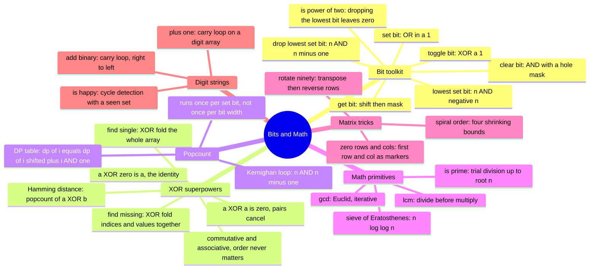

# 20 — Bit Manipulation & Math · Cheat-sheet

## Concept map



*What to notice: two toolkits, one principle — lean on the structure
already inside the data (bit patterns, number theory, grid geometry)
instead of paying for extra memory.*

## The bit-recipe table

| Op | One-liner | What it does |
| --- | --- | --- |
| Get bit `i` | `(n >> i) & 1` | shift the target bit to position 0, mask off the rest |
| Set bit `i` | `n \| (1 << i)` | OR in a `1` at position `i` |
| Clear bit `i` | `n & ~(1 << i)` | AND with a mask that's `0` only at position `i` |
| Toggle bit `i` | `n ^ (1 << i)` | XOR flips exactly that position |
| Lowest set bit | `n & -n` | two's-complement identity isolates the rightmost `1` |
| Drop lowest set bit | `n & (n - 1)` | `n - 1` flips the lowest `1` and every `0` below it |
| Is power of two | `n > 0 and n & (n - 1) == 0` | a power of two has exactly one set bit |

## XOR laws — memorize these three

```
a ^ a = 0                  # any value XORed with itself cancels
a ^ 0 = a                  # XOR with 0 is the identity
a ^ b ^ c == c ^ a ^ b      # commutative and associative
```

**Consequences:** XOR-fold an array where every value appears twice
except one → pairs cancel → the lone survivor is the answer. XOR-fold
`0..n` together with every element of the array → every present value
cancels its own index; the missing value survives.

## Popcount — Kernighan vs. the DP table

**One value:** the `n & (n - 1)` loop — O(popcount), never O(bit
width).

**A table for `0..n` at once:**

```python
result = [0] * (n + 1)
for i in range(1, n + 1):
    result[i] = result[i >> 1] + (i & 1)
```

This is DP: `i >> 1` is a strictly smaller, already-computed index;
`i & 1` restores the bit that shift dropped.

## Sieve template

```python
is_composite = [False] * (n + 1)
primes = []
for p in range(2, n + 1):
    if not is_composite[p]:
        primes.append(p)
        for multiple in range(p * p, n + 1, p):
            is_composite[multiple] = True
# start at p*p: every smaller multiple was already marked
# by a smaller prime factor.
```

## Fast-pow reminder (module 08)

```python
def fast_pow(base: float, exp: int) -> float:
    if exp == 0:
        return 1
    half = fast_pow(base, exp // 2)
    if exp % 2 == 0:
        return half * half
    return half * half * base
```

O(log exp) multiplications instead of O(exp).

## Language-reality box — Python vs. fixed-width languages

| Aspect | Python | Fixed-width (e.g. JS/TS, 32-bit signed) |
| --- | --- | --- |
| Integer width for bitwise ops | Arbitrary precision — never overflows | Fixed at 32 bits; wraps/truncates |
| Right shift `>>` | Arithmetic shift, sign-extends toward `-inf`; never needs an "unsigned" variant | Two variants: `>>` sign-extends, `>>>` zero-fills |
| `~n` | `-(n + 1)` exactly, no wraparound | `-(n + 1)` but truncated to 32 bits |
| Simulating a fixed width | Mask explicitly with `& 0xFFFFFFFF` whenever a problem says "32-bit" | Automatic — every bitwise op already truncates to 32 bits |
| The catch | Forgetting the mask means a "32-bit reverse/overflow" exercise silently behaves like it has infinite bits | Forgetting `>>>` means a shift can silently produce a negative result |

The mask is not an afterthought — for `reverse_bits32` and any
problem that says "32-bit," `& 0xFFFFFFFF` is the whole trick.

## Self-quiz

1. What is `n & (n - 1)` doing, and why does it run the popcount loop
   in O(popcount) iterations rather than O(bit width)?
2. Name XOR's three algebraic properties. How do they let you find
   "the value that appears exactly once" in one pass with O(1) space?
3. Why does Euclid's gcd replace `(a, b)` with `(b, a % b)` rather
   than `(a - b, b)`, and why does that make it O(log(min(a, b)))?
4. The sieve's inner loop starts at `p * p`, not `2 * p`. Why is
   `2 * p` wasteful?
5. Why does rotating 90 degrees clockwise equal "transpose, then
   reverse each row"? What would you do for 90 degrees
   counter-clockwise instead?
6. In spiral order, why do the "sweep bottom" and "sweep left" legs
   each need an `if` guard that the other two legs don't?
7. In `zero_rows_cols`, why must you save two booleans for the first
   row/column BEFORE using them as markers for the interior?
8. Python ints never overflow — so why does `reverse_bits32` still
   need `n & 0xFFFFFFFF` at the start?

<details><summary>Answers</summary>

1. `n & (n - 1)` drops the lowest set bit: `n - 1` flips that bit from
   `1` to `0` and every bit below it from `0` to `1`; ANDing with `n`
   (whose lower bits stay `0` in that mask) clears just that one bit.
   The loop runs once per `1`-bit in `n`, never once per bit position.
2. `a ^ a = 0` (cancel), `a ^ 0 = a` (identity), commutative and
   associative (order never matters). XOR-fold every element: each
   pair contributes `x ^ x = 0`, XOR with `0` is a no-op, so only the
   unpaired element survives.
3. Subtraction shrinks the pair linearly; `a % b` jumps straight to a
   remainder that's at most `b - 1`, roughly halving the smaller
   number every two steps — O(log(min(a, b))) total steps, versus
   O(min(a, b)) for repeated subtraction.
4. For any prime `p`, every multiple `k * p` with `k < p` already has
   a smaller prime factor `k` (or a factor of `k`) and was crossed out
   when that smaller prime was processed. Starting at `p * p` skips
   all of that redundant work.
5. Transpose reflects the grid across the main diagonal; reversing
   each row then turns that reflection into a true 90-degree clockwise
   rotation. For counter-clockwise: reverse each row first, then
   transpose (or transpose, then reverse each column).
6. After sweeping right along `top` and incrementing `top`, or
   sweeping down along `right` and decrementing `right`, the bounds
   may have already crossed (`top > bottom` or `left > right`).
   Without the guard, the "sweep bottom" or "sweep left" leg would
   revisit a row or column already covered by an earlier leg,
   duplicating elements in the output.
7. The first row and column double as marker storage during the
   interior scan. If they originally held a `0`, overwriting them with
   markers would erase that fact. Saving it in two booleans first lets
   the final step correctly zero the first row/column too, without
   losing the original information.
8. Python integers are unbounded, so a value like `-5` or one wider
   than 32 bits carries extra high-order bits (conceptually infinite
   ones, or a huge magnitude) that have no place in a 32-bit answer.
   Masking with `0xFFFFFFFF` first clips the input down to exactly the
   32 bits the problem is actually asking about.

</details>

## Pattern-recognition drill

For each, name the pattern/structure before peeking at the answer.

1. "Given an array where every value appears exactly twice except
   one, find the odd one out — in O(n) time, O(1) space."
2. "Count the number of 1-bits in a very large integer whose bit
   representation is extremely sparse (mostly zeros)."
3. "Given a list of integers 0..n with one missing, find the gap — no
   extra array allowed." *(bonus: name a second approach too)*
4. "How many prime numbers are there up to one million?" *(which
   algorithm, and what's its complexity?)*
5. "Rotate a 100x100 image 90 degrees clockwise without allocating a
   second matrix."
6. "Find the shortest repeating cycle that covers two event periods of
   length A and B — the answer is a single number derived from A and
   B." *(decoy: not bits — name the two primitives it actually needs)*

<details><summary>Answers</summary>

1. XOR fold — XOR every element; pairs cancel (`a^a=0`), the lone
   value survives (`a^0=a`). O(n) time, O(1) space.
2. Kernighan's `n & (n - 1)` popcount loop — runs O(popcount)
   iterations, not O(bit width), so a sparse 64-bit number with only
   3 set bits needs just 3 iterations.
3. XOR version: XOR together all of `0..n` AND every element of the
   array; present values cancel in pairs, the missing one survives.
   Sum version: `n * (n + 1) // 2 - sum(nums)`. Both are O(n) time,
   O(1) space; the XOR version sidesteps any overflow risk in
   fixed-width-integer languages.
4. Sieve of Eratosthenes — O(n log log n) time, O(n) space. For
   n = 1,000,000 that yields 78,498 primes. Trial-dividing each number
   independently would be O(n·sqrt(n)) and far too slow.
5. In-place matrix rotation: transpose (swap `grid[r][c]` with
   `grid[c][r]` for `c > r`) then reverse each row. O(n²) time, O(1)
   extra space.
6. NOT bit manipulation — this is `lcm` (least common multiple).
   `lcm(a, b) = a // gcd(a, b) * b`. The two primitives are Euclid's
   gcd and the divide-before-multiply trick that keeps the
   intermediate value small. Bit tricks are the wrong tool here.

</details>
