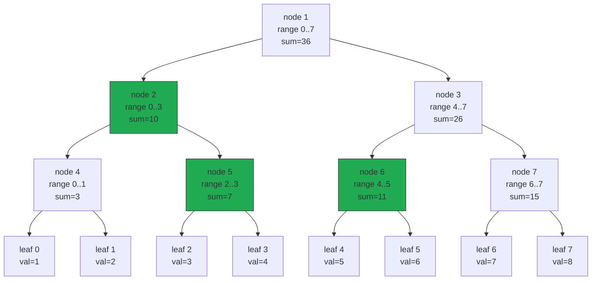
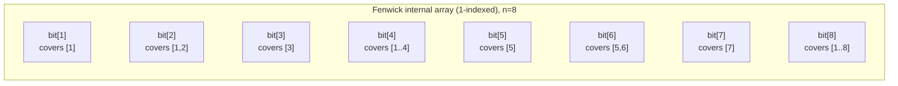
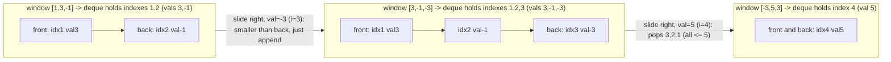
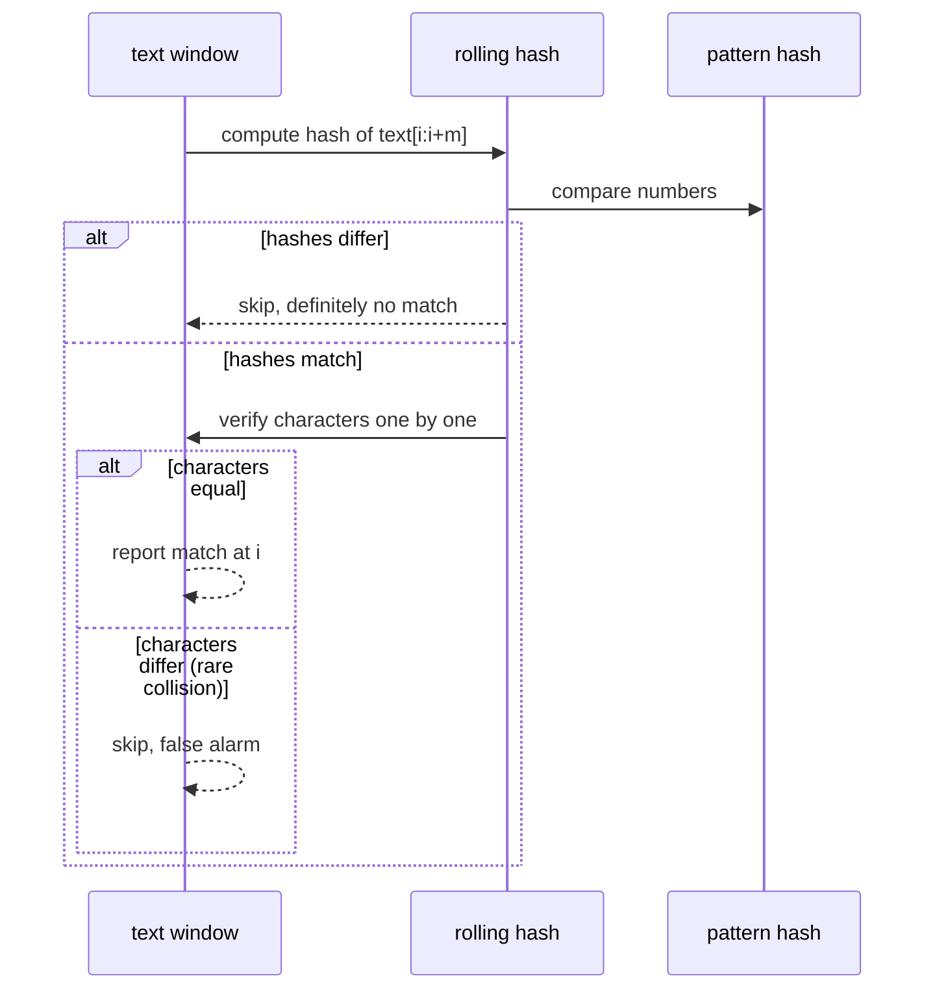
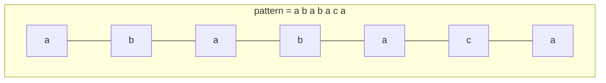

# 21 — Advanced Structures & String Algorithms

## Why this exists

This is the "senior-level differentiators" module. Everything here is
asked LESS often than Parts I–II — most interview loops never touch a
segment tree — but the candidates who separate themselves in
range-query problems, competitive-style hards, and "design a metrics
service" system questions are the ones who reach for these
comfortably. Two gaps this module closes:

1. **Prefix sums (module 04) die the moment data updates.** A prefix
   array answers a range-sum query in `O(1)`, but if a single element
   changes, rebuilding the whole array costs `O(n)` — do that once per
   update and you're back to `O(n)` per operation. **Segment trees**
   and **Fenwick trees** give you `O(log n)` for BOTH update and range
   query, at once. That combination — mutate AND query fast — is the
   entire reason they exist.
2. **Naive substring search is `O(n·m)`** (try every start position,
   compare up to `m` characters each time). **Rolling hashes**
   (Rabin-Karp) and the **failure function** (KMP) bring that down to
   `O(n+m)` by never re-reading a character they don't have to.

Plus a smaller, very practical tool: the **monotonic deque**, which
answers "what's the max of every sliding window?" in `O(n)` total —
the two-ended sibling of module 06's monotonic stack.

## Segment tree: range query + point update, both `O(log n)`

A segment tree is a binary tree built OVER an array, where every node
stores a summary (here, the sum) of a contiguous range. The root
covers the whole array; each node splits its range in half between its
two children; leaves cover a single element.



*What to notice: querying `range_sum(1, 5)` only visits the
highlighted nodes — it decomposes `[1,5]` into a handful of node
ranges that exactly cover it (part of node 2's range, all of node 5,
all of node 6) instead of walking all 8 leaves. That decomposition
into `O(log n)` pieces is why range queries are fast.*

**Build:** recursively split `[lo, hi]` in half until `lo == hi`
(a leaf), then combine children bottom-up. `O(n)` total — same
telescoping argument as heapify (module 12): most nodes are near the
leaves and do `O(1)` work merging two children.

**Query(i, j):** if the node's range is entirely inside `[i, j]`,
return its stored value — no need to look further down. If it's
entirely outside, return the identity (0 for sum) and stop. Otherwise
it partially overlaps: recurse into both children and combine.

**Update(i, value):** walk down to the leaf for index `i` (one path,
`O(log n)` nodes), set it, then recompute every ancestor on the way
back up as `merge(left_child, right_child)`.

**The merge-function generalization:** nothing above mentions "sum"
specifically except the merge step and the identity element. Swap
`merge = lambda a, b: a + b` and `identity = 0` for
`merge = min` and `identity = +infinity`, and you have a **range-min
tree** instead — same tree, same `O(log n)` build/query/update, a
totally different question answered. This is why segment trees show
up under so many names: range-max, range-GCD, range-AND — all the
same skeleton.

## Fenwick tree (Binary Indexed Tree): smaller, faster, prefix-only

A Fenwick tree answers the SAME "update + range sum" question as a
sum-segment-tree, in less code and roughly half the constant factor —
at the cost of being locked to prefix-style aggregation (sums, xors,
counts — not min/max, which have no inverse to "subtract").

The trick is `lowbit(i) = i & (-i)` — the value of the lowest set bit
of `i`. Each index `i` in the internal array is responsible for a
range of `lowbit(i)` elements ending at `i`.

- **`add(i, delta)`**: walk UP, `i += lowbit(i)`, updating every
  ancestor range that includes `i`. Stops in `O(log n)` steps.
- **`prefix_sum(i)`**: walk DOWN, `i -= lowbit(i)`, accumulating.
  Also `O(log n)` steps.
- **`range_sum(i, j)`** = `prefix_sum(j) - prefix_sum(i - 1)` — same
  subtraction trick as module 04's prefix arrays, just on top of a
  structure that supports fast updates.



*What to notice: `bit[6]` covers `[5,6]` (2 elements, `lowbit(6)=2`)
while `bit[8]` covers all 8 elements (`lowbit(8)=8`) — the ranges
nest by powers of two, which is exactly what makes `add` and
`prefix_sum` each touch only `O(log n)` of them.*

### Comparison: prefix array vs Fenwick vs segment tree

| | Prefix array | Fenwick tree | Segment tree |
| --- | --- | --- | --- |
| Build | `O(n)` | `O(n)` | `O(n)` |
| Point update | `O(n)` (rebuild suffix) | `O(log n)` | `O(log n)` |
| Range query | `O(1)` | `O(log n)` | `O(log n)` |
| Code size | tiny | small | medium |
| Handles min/max? | no (not invertible) | no | **yes** (any merge fn) |
| Handles range UPDATE (add to a whole range)? | no | with a trick | with lazy propagation (not covered here) |

*Read it as a decision ladder: data never changes → prefix array. Data
changes and you only need sums/counts → Fenwick (smallest, fastest).
Data changes and you need min/max/gcd/anything-non-invertible →
segment tree.*

## Monotonic deque: sliding-window maximum in `O(n)`

Module 06 built a **monotonic stack** for "next greater element,"
popping one end as new elements arrive. A **monotonic deque** is its
two-ended sibling: elements can leave from EITHER end, which is
exactly what a sliding window needs — old elements fall off the left,
new elements get compared in on the right.

**Template**, `window_maxes(nums, k)` — max of every size-`k` window:

```python
from collections import deque

def window_maxes(nums: list[int], k: int) -> list[int]:
    dq: deque[int] = deque()          # indexes, values strictly decreasing
    result = []
    for i, val in enumerate(nums):
        while dq and nums[dq[-1]] <= val:   # back: no longer useful
            dq.pop()
        dq.append(i)
        if dq[0] <= i - k:                  # front: fell out of the window
            dq.popleft()
        if i >= k - 1:
            result.append(nums[dq[0]])
    return result
```

The deque always holds candidate indexes in DECREASING value order,
front to back — so the front is always the current window's max.



*What to notice: sliding from S1 to S2 only APPENDS (the new value
`-3` is smaller than the back, so nothing gets evicted); sliding from
S2 to S3 POPS three stale entries off the back in one step because
`5` beats all of them — the deque shrinks and grows, but every index
is still pushed and popped at most once across the whole run.*

### Worked example: `window_maxes([1, 3, -1, -3, 5, 3, 6, 7], k=3)`

| i | val | pop back (smaller) | deque after push | pop front (stale) | window max |
| --- | --- | --- | --- | --- | --- |
| 0 | 1 | — | `[0]` | — | (window incomplete) |
| 1 | 3 | pop 0 (1≤3) | `[1]` | — | (window incomplete) |
| 2 | -1 | — | `[1,2]` | — | `nums[1]=3` |
| 3 | -3 | — | `[1,2,3]` | — | `nums[1]=3` |
| 4 | 5 | pop 3,2,1 (all ≤5) | `[4]` | — | `nums[4]=5` |
| 5 | 3 | — | `[4,5]` | — | `nums[4]=5` |
| 6 | 6 | pop 5,4 (both ≤6) | `[6]` | — | `nums[6]=6` |
| 7 | 7 | pop 6 (6≤7) | `[7]` | — | `nums[7]=7` |

Result: `[3, 3, 5, 5, 6, 7]`.

*What to notice: index 1 (value 3) sits at the front of the deque for
THREE windows in a row without ever being re-compared — that's the
`O(n)` total: every index is pushed once and popped at most once,
across the whole run, no matter how large `k` is.*

## Rabin-Karp: rolling hash for substring search

Comparing `pattern` against every window of `text` character-by-character
costs `O(m)` per window, `O(n·m)` total. A **rolling hash** computes a
number that summarizes a window's characters, and — critically — lets
you slide the window by ONE position in `O(1)`: drop the leaving
character's contribution, shift, add the entering character.

Treat the window as a base-`B` number: `hash = c0*B^(m-1) + c1*B^(m-2)
+ ... + c(m-1)`. Sliding right by one:

```
new_hash = (old_hash - c0 * B^(m-1)) * B + c_new   (all mod some large prime)
```

`B^(m-1) mod p` is exactly the kind of thing module 08's `power_mod`
computes — precompute it once, reuse it for every slide.

**Collision honesty:** two different substrings can hash to the same
number (a collision). Rabin-Karp is only correct if you **verify the
actual characters** whenever the hash matches, before reporting a hit.
Skipping verification isn't a shortcut — it's a bug that happens to
pass small tests.



*What to notice: the hash comparison is a fast FILTER, not the final
answer — every "match" it reports still gets checked for real before
you trust it.*

## KMP: never re-read a character you've already matched

Rabin-Karp can still degrade to `O(n·m)` if hashes collide often (or
an adversary constructs input to force it). **KMP (Knuth-Morris-Pratt)**
guarantees `O(n+m)` always, by precomputing how much of the PATTERN can
reuse a partial match instead of restarting from scratch.

This is the hardest 30 lines in the course — go slow, and lean on the
diagram and the table below rather than the code first.

### The failure function: "longest proper border"

For each prefix of `pattern`, `failure[i]` = the length of the longest
string that is BOTH a proper prefix AND a proper suffix of
`pattern[0..i]` (a "border"). It answers: "if I'm about to fail
matching at position `i+1`, how much of what I already matched can I
keep, by falling back to a shorter, already-verified prefix?"



*What to notice: the failure table is computed once, over the PATTERN
only, before any comparison against `text` happens — that's what lets
the search loop below reuse it as a lookup table instead of
re-deriving anything mid-search.*

Walked on `"ababaca"`:

| i | `pattern[0..i]` | longest proper prefix == suffix | `failure[i]` |
| --- | --- | --- | --- |
| 0 | `a` | none possible (single char has no PROPER border) | 0 |
| 1 | `ab` | none | 0 |
| 2 | `aba` | `a` | 1 |
| 3 | `abab` | `ab` | 2 |
| 4 | `ababa` | `aba` | 3 |
| 5 | `ababac` | none (`c` breaks it) | 0 |
| 6 | `ababaca` | `a` | 1 |

*What to notice: `failure[4] = 3` because `"aba"` is both a prefix
(`aba`baca) and a suffix (ababa) of `"ababa"` — the longest one. That
"3" is exactly how many characters KMP gets to skip re-checking if a
mismatch happens right after matching all of `"ababa"`.*

### The search loop

Walk `text` once with pointer `i`, and `pattern` with pointer `j`.
Match → advance both. Mismatch with `j > 0` → **don't move `i`**, just
fall back `j = failure[j-1]` (reuse the border, retry without
re-reading `text[i]`). Mismatch with `j == 0` → nothing to fall back
to, advance `i`. `j` reaching `len(pattern)` → record a match at
`i - j`, then fall back `j = failure[j-1]` to keep scanning for
overlapping matches.

```python
def kmp_find_all(text: str, pattern: str) -> list[int]:
    fail = failure_table(pattern)
    matches = []
    j = 0
    for i, ch in enumerate(text):
        while j > 0 and text[i] != pattern[j]:
            j = fail[j - 1]
        if text[i] == pattern[j]:
            j += 1
        if j == len(pattern):
            matches.append(i - j + 1)
            j = fail[j - 1]
    return matches
```

`i` only ever moves forward, once per character — `text` is read
`O(n)` times total across the WHOLE search, never re-scanned. That's
the guarantee Rabin-Karp can't make.

## How to recognize it

- **"Updates AND range queries" mixed together** → segment tree
  (min/max/gcd) or Fenwick (sum/count/xor only).
- **"Max (or min) of every window of size k"** → monotonic deque.
  (Contrast: "sum of every window" is a plain running total — no
  deque needed, see the checkpoint's gotcha.)
- **"Find/count pattern occurrences in a huge text"** → Rabin-Karp
  (simpler to write, good average case) or KMP (guaranteed linear,
  no collision risk).
- **"Repeated substrings" / "duplicate k-length windows"** → rolling
  hash into a hash set, verify on collision.
- **Decoy:** data that never changes + only range queries → you don't
  need any of this, a module-04 prefix array is enough and simpler.

## Common gotchas

- **Segment-tree index arithmetic.** Off-by-one between the node
  index (`2*node`, `2*node+1`) and the RANGE it covers (`lo`, `hi`,
  `mid`) is the #1 bug source. Keep them as separate, explicit
  parameters — never try to derive a range from a node index by math
  alone.
- **Forgetting to verify on a hash match.** A rolling hash match is a
  candidate, not a confirmed answer — always compare the real
  characters (or the real substrings) before trusting it.
- **Failure-table off-by-one.** `failure[i]` describes
  `pattern[0..i]` INCLUSIVE — a common bug is computing it for
  `pattern[0..i)` and shifting every lookup by one. When falling back
  after a mismatch at pattern index `j`, the correct fallback is
  `failure[j - 1]`, not `failure[j]`.
- **Fenwick is 1-indexed internally.** `lowbit(0) = 0` would loop
  forever — the public API can be 0-indexed, but the internal array
  must start real work at index 1.
- **Window-sum vs window-max.** A monotonic deque solves "max/min of
  every window." If you actually need "SUM of every window," that's
  a plain sliding running total (add the new element, subtract the
  one that left) — reaching for a deque there is solving a harder
  problem than you have.

## Try it now

Six exercises: build a segment tree, generalize it to range-min,
build a Fenwick tree (plus a classic hard problem on top of it), then
use a monotonic deque, Rabin-Karp, and KMP on classic string
problems. Then a checkpoint that combines all of it into one small
"metrics service."
