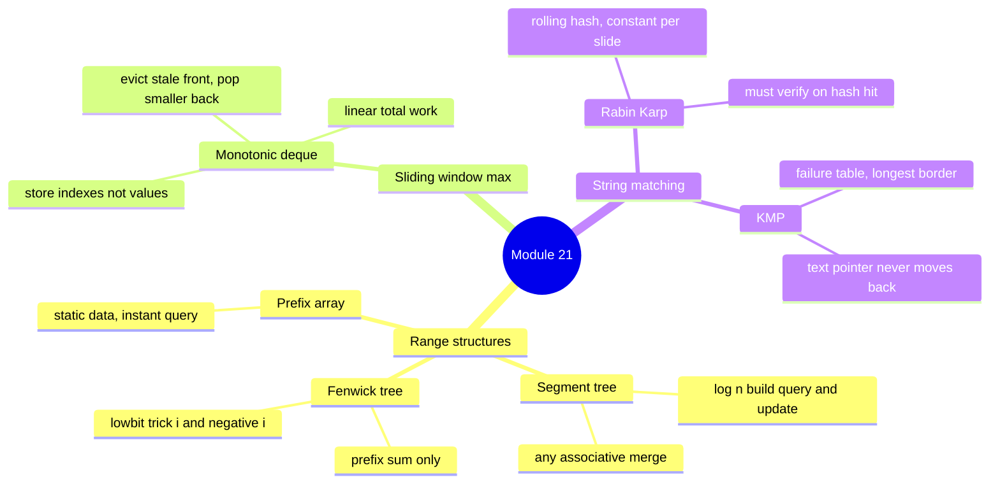

# 21 — Advanced Structures & String Algorithms: Cheat-sheet

## Three range tools compared

| | Prefix array (module 04) | Fenwick tree | Segment tree |
| --- | --- | --- | --- |
| Build | `O(n)` | `O(n)` | `O(n)` |
| Point update | `O(n)` (rebuild suffix) | `O(log n)` | `O(log n)` |
| Range query | `O(1)` | `O(log n)` | `O(log n)` |
| Handles min/max? | no | no (not invertible) | **yes** (any merge fn) |
| Code size | tiny | small | medium |
| Reach for when | data never changes | sum/count/xor + updates | min/max/gcd + updates |

*Fenwick needs an invertible merge (`range = prefix(j) - prefix(i-1)`
only works if subtraction can undo the merge — true for `+`, false
for `min`/`max`). Segment tree has no such restriction, at the cost of
roughly triple the code.*

## Monotonic deque template

```python
from collections import deque

def window_maxes(nums: list[int], k: int) -> list[int]:
    dq: deque[int] = deque()          # indexes, values strictly decreasing
    result = []
    for i, val in enumerate(nums):
        while dq and nums[dq[-1]] <= val:   # back: no longer useful
            dq.pop()
        dq.append(i)
        if dq[0] <= i - k:                  # front: fell out of the window
            dq.popleft()
        if i >= k - 1:
            result.append(nums[dq[0]])
    return result
```

**Invariant:** deque values are strictly decreasing front-to-back; the
front index is always the current window's max. Every index is pushed
once and popped at most once across the whole run — `O(n)` total.

## Rolling-hash recipe (Rabin-Karp)

Constants: `BASE = 31`, `MOD = 1_000_000_007`.

**Drop-char formula** (slide the window right by one):

```
new_hash = ((old_hash - code(outgoing) * BASE**(m-1)) * BASE + code(incoming)) mod MOD
```

Precompute `BASE**(m-1) mod MOD` ONCE with a plain loop (`pow = pow *
BASE % MOD`, repeated `m-1` times) — not per slide. **Always verify**
the actual substring on a hash match; a collision is a false positive,
not a bug in the algorithm, but skipping the check is a bug in your
code.

## Failure-table mini walkthrough (KMP)

Pattern `"abab"` → `table = [0, 0, 1, 2]`:

| i | `pattern[0..i]` | longest proper border | `table[i]` |
| --- | --- | --- | --- |
| 0 | `a` | none | 0 |
| 1 | `ab` | none | 0 |
| 2 | `aba` | `a` | 1 |
| 3 | `abab` | `ab` | 2 |

On a mismatch at pattern index `j`, jump to `table[j - 1]` — never
`table[j]`, never straight back to `0`.

## Where these appear in interviews — honest take

| Tool | How often | Where it actually shows up |
| --- | --- | --- |
| Segment tree / Fenwick | rare | range-query-with-updates problems, "design a metrics/analytics service" system questions, count-inversions-style hards |
| Monotonic deque | occasional | "max/min of every window" — a clean, self-contained medium |
| Rabin-Karp / KMP | rare | "find all pattern occurrences" hards, "repeated substrings" (DNA-style) problems |

Everything in this module is a **senior-level differentiator**, not a
Blind-75 staple: most interview loops never touch a segment tree. But
candidates who reach for these comfortably when a problem calls for
them stand out — and range-query-with-updates and huge-text search are
exactly the shapes that separate "solved it" from "solved it and it
actually scales."

## Concept map



*What to notice: the left branch (range structures) mutates and
queries an array; the right branch (string matching) searches a fixed
text for a pattern. The monotonic deque sits between them — it is a
range-max tool, but for a moving window instead of an arbitrary range.*

## Self-quiz

1. A segment tree and a Fenwick tree both give `O(log n)` updates and
   range queries. What can a segment tree do that a Fenwick tree
   cannot, and why?
2. Fenwick's `add(i, delta)` loop does `pos += pos & (-pos)`. What
   does `pos & (-pos)` compute, and why does climbing by it visit
   exactly the right ancestors?
3. "Point updates, then answer range-PRODUCT queries." Segment tree
   or Fenwick — and why?
4. In the monotonic deque, why store indexes instead of values?
5. Rabin-Karp reports a hash match but the substrings differ. What is
   this called, and what's the fix?
6. In the KMP failure table, `table[i] = 3` means what, exactly?
7. On a KMP mismatch at pattern index `j`, why fall back to
   `table[j - 1]` instead of restarting at `0`?
8. "Find every 10-character DNA sequence that appears more than once
   in a 1,000,000-character genome." Which tool, and why not the
   other string-matching one?

<details><summary>Answers</summary>

1. A segment tree supports any **associative** merge (min, max, gcd).
   Fenwick needs an **invertible** merge so a range can be computed as
   `prefix(j) - prefix(i-1)`; min and max have no inverse (you can't
   "subtract out" the smallest value once it's merged in).
2. `pos & (-pos)` isolates the lowest set bit of `pos` — the size of
   the range that array slot `pos` is responsible for. Adding it
   jumps to the next ancestor whose range includes `pos`.
3. **Segment tree.** Division isn't a safe inverse for multiplication
   (a zero in the range breaks it), so Fenwick's
   `prefix(j) / prefix(i-1)` trick doesn't hold up. A segment tree's
   merge function (`a * b`) needs no inverse at all.
4. Indexes carry position. When the front index falls at or before
   `i - k`, that tells you it's aged out of the window — a value
   alone carries no information about where it came from.
5. A **hash collision** — a false positive. Fix: compare the real
   characters (or substrings) whenever hashes match, before trusting
   it as a real match.
6. The longest **proper** border (a string that's both a prefix and a
   suffix, but not the whole thing) of `pattern[0..i]` has length 3.
7. `table[j - 1]` is the next-longest border of the characters already
   matched — it keeps everything you've already verified. Restarting
   at `0` throws that work away and is what makes naive search
   `O(n*m)`.
8. **Rabin-Karp.** One `O(n)` pass hashes every 10-character window in
   `O(1)` each and collects them in a set. KMP answers "does this ONE
   pattern occur," not "which windows repeat" — running it once per
   candidate window would be quadratic.

</details>

## Pattern-recognition drill

Name the pattern or structure for each one-liner before peeking.

1. "An array of sensor readings gets frequent point updates; answer
   range-max queries between updates."
2. "Find every occurrence of the word `CRITICAL` in a 50 MB server
   log."
3. "Return the maximum price seen in every consecutive 7-day window
   as a price stream slides forward."
4. "An array of daily totals never changes after it's built; answer
   the sum over any date range as fast as possible."
5. "For every element, count how many elements to its right are
   strictly smaller than it."
6. "Find every 12-character substring that appears at least twice in
   a 1,000,000-character genome."

<details><summary>Answers</summary>

1. **Segment tree** — range max with point updates; max isn't
   invertible, so Fenwick doesn't apply here.
2. **KMP** (or Rabin-Karp) — linear-time pattern search in a large,
   fixed text.
3. **Monotonic deque** — sliding-window maximum in `O(n)` total.
4. **Decoy — plain prefix array (module 04).** Data never changes, so
   `O(1)` range-sum queries need nothing fancier; a segment tree or
   Fenwick would be solving a problem you don't have.
5. **Fenwick tree + coordinate compression** — "count smaller after"
   (ex03's hard part).
6. **Rabin-Karp** — one `O(n)` pass, rolling-hash every 12-character
   window, collect the ones seen more than once (verifying on hash
   hits).

</details>
