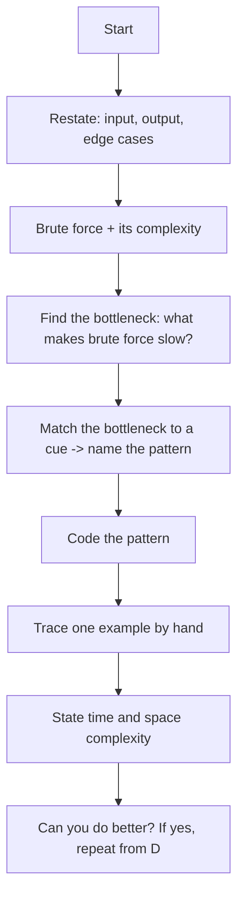

# 22 — Capstone: Interview Sets

## Why this exists

You have drilled 20+ named patterns across 21 modules. Every one of
those lessons told you the pattern up front, in the title. Real
interviews never do that — you get a paragraph of story and a clock.
The skill this module builds is not a new pattern; it is **recognition
under pressure**: reading a fresh scenario and, within about 90
seconds, naming the pattern and the exact phrase that tipped you off.

The naive alternative — trying every pattern you know until one
sticks — costs you the interview on time alone. A 25-minute medium
problem does not survive five minutes of "let me try sliding window...
no... maybe DP...". The fix is a **fixed ritual** you run before
writing any code, every time, so recognition becomes a habit instead
of a guess.

This module has four rehearsal sets (easy → medium → hard → pattern
quiz) and a final-mock checkpoint. No new theory. Every problem below
maps to one or two patterns from modules 01–21 — but nothing in the
problem text says which.

## How to run a set

**Timebox per problem:** easy 15 min, medium 25 min, hard 40 min. When
the clock runs out, stop coding, look up the solution, understand it,
and log the miss in `NOTES.md`. Finishing inside the timebox matters
more than finishing perfectly.

**Before writing a single line of code**, write down (a scratch
comment or `playground/` file is fine):

1. **Restate** — the problem in one sentence: input, output, edge
   cases.
2. **Brute force** — name it and its time/space complexity. Never
   skip this; it anchors the optimization and gives you a fallback
   that works.
3. **Pattern + cue** — the pattern you suspect, and the EXACT phrase
   in the problem statement that made you suspect it.
4. **Code** — only now.

This ritual takes 2–4 minutes and saves you from confidently coding
the wrong approach for twenty.

## Diagram 1: the interview loop

*What to notice: pattern-naming sits in the MIDDLE of the loop, not
the start. You cannot see the right cue until you know what the brute
force wastes time or space on — that's the bottleneck the pattern
fixes.*

## How to recognize it — the CUE MAP

This is the single most valuable page in the course: a lookup table
from problem-statement phrases straight to patterns.

```mermaid
flowchart TD
    C1["counting, frequency, seen-before, group-by"] --> P1["hash-map/set - module 03"]
    C2["sorted input, pair or triplet meets a target"] --> P2["two-pointers - module 04"]
    C3["subarray sum, range total, difference array"] --> P3["prefix-sums - module 04"]
    C4["window of EXACTLY k consecutive items"] --> P4["fixed-window - module 05"]
    C5["longest or shortest window satisfying a condition"] --> P5["variable-window - module 05"]
    C6["nesting, matching, undo, LIFO order"] --> P6["stack/queue - module 06"]
    C7["next greater, next smaller, span until taller"] --> P7["monotonic-stack - module 06"]
    C8["fast and slow pointer, cycle, middle of a list"] --> P8["fast/slow pointers - module 07"]
    C9["find position in sorted data, minimize the maximum, log n hint"] --> P9["binary-search - module 10"]
    C10["all configurations, subsets, permutations, generate every"] --> P10["backtracking - module 14"]
    C11["shortest path, fewest moves, unweighted graph or grid"] --> P11["BFS - module 15"]
    C12["prerequisite order, build order, cycle in a directed graph"] --> P12["topological-sort - module 16"]
    C13["dynamic connectivity, are-they-in-the-same-group over time"] --> P13["union-find - module 16"]
    C14["cheapest path, weighted edges, non-negative costs"] --> P14["Dijkstra - module 16"]
    C15["interval scheduling, minimum rooms, locally-best choice provable"] --> P15["greedy - module 17"]
    C16["top-k, kth largest or smallest, merge k sorted"] --> P16["heap/priority-queue - module 12"]
    C17["running median, live middle value of a stream"] --> P17["two-heaps - module 12"]
    C18["word prefix, autocomplete, dictionary of strings"] --> P18["trie - module 13"]
    C19["count ways or min/max cost, choices build on smaller choices, 1-D state"] --> P19["DP-1D - module 18"]
    C20["two sequences compared, grid path, pick items under a capacity"] --> P20["DP-2D - module 19"]
    C21["range query PLUS updates, both need to be fast"] --> P21["segment-tree or Fenwick - module 21"]
    C22["find every occurrence of a substring in a big text"] --> P22["string-matching KMP/Rabin-Karp - module 21"]
```

*What to notice: the first noun phrase of a problem usually pre-selects
one or two patterns before you've even read the constraints — "sorted"
narrows to two-pointers or binary-search, "stream" narrows to a heap
or two-heaps, "prerequisite" is topological sort almost every time.*

### Condensed cue table (for quick lookup mid-interview)

| Cue phrase | Pattern | Module |
| --- | --- | --- |
| count / frequency / group by | hash-map/set | 03 |
| sorted + pair/triplet target | two-pointers | 04 |
| subarray sum / range total | prefix-sums | 04 |
| exactly k consecutive | fixed-window | 05 |
| longest/shortest satisfying X | variable-window | 05 |
| nesting / matching / undo | stack/queue | 06 |
| next greater/smaller | monotonic-stack | 06 |
| cycle / middle of a list | fast/slow pointers | 07 |
| find position in sorted data | binary-search | 10 |
| generate all configurations | backtracking | 14 |
| shortest path, unweighted | BFS | 15 |
| prerequisite / build order | topological-sort | 16 |
| dynamic connectivity | union-find | 16 |
| cheapest weighted path | Dijkstra | 16 |
| interval scheduling | greedy | 17 |
| top-k / kth / merge-k | heap/priority-queue | 12 |
| running median | two-heaps | 12 |
| word prefix / autocomplete | trie | 13 |
| count ways / 1-D optimum | DP-1D | 18 |
| two sequences / grid / capacity | DP-2D | 19 |
| range query + updates | segment-tree/Fenwick | 21 |
| find substring occurrences | string-matching | 21 |

## Worked example: running the ritual once, start to finish

**Problem:** "A ferry sells tickets in sorted-by-price order for the
day. Two friends want to buy two DIFFERENT tickets whose prices sum to
exactly a shared budget. Find those two prices, or say it's
impossible."

| Step | What you write down |
| --- | --- |
| Restate | Input: prices sorted ascending, a target budget. Output: the two prices that sum to target, or "impossible." |
| Brute force | Check every pair — `O(n^2)` time, `O(1)` space. Works, but slow for large `n`. |
| Bottleneck | The brute force re-scans the whole array for every left value, ignoring that the array is SORTED. |
| Cue | "sorted" + "two prices sum to a target" → **two-pointers** (module 04). |
| Code | One pointer at each end; move the low pointer up if the sum is too small, the high pointer down if too big. |
| Trace | `[2, 4, 7, 11, 15]`, target `18`: `lo=2,hi=15 -> 17 too low, lo++` ; `lo=4,hi=15 -> 19 too high, hi--`; `lo=4,hi=11 -> 15 too low, lo++`; `lo=7,hi=11 -> 18` — found. |
| Complexity | `O(n)` time — each pointer moves at most `n` times total; `O(1)` space. |
| Can you do better? | No — you must look at every price at least once, so `O(n)` is optimal. |

## Complexity reference

| Pattern | Typical time | Typical space |
| --- | --- | --- |
| hash-map/set | O(n) | O(n) |
| two-pointers | O(n) | O(1) |
| prefix-sums (+ hash map) | O(n) | O(n) |
| fixed-window | O(n) | O(1) |
| variable-window | O(n) | O(k) distinct keys |
| stack/queue matching | O(n) | O(n) |
| monotonic-stack | O(n) amortized | O(n) |
| binary-search / search on answer | O(log n) | O(1) |
| backtracking | O(branching^depth) | O(depth) |
| BFS (grid or graph) | O(V + E) | O(V) |
| topological-sort | O(V + E) | O(V + E) |
| union-find | O(n · alpha(n)) approx O(n) | O(n) |
| Dijkstra / k-stops relaxation | O((V+E) log V) or O(V·E) | O(V + E) |
| greedy (sorted first) | O(n log n) | O(1)–O(n) |
| heap / top-k | O(n log k) | O(k) |
| two-heaps | O(log n) per insert | O(n) |
| trie | O(L) per op | O(total letters) |
| DP-1D | O(n) | O(1)–O(n) |
| DP-2D | O(n · m) | O(n · m), often reducible |
| segment-tree / Fenwick | O(log n) per op, O(n) build | O(n) |
| string matching (KMP/Rabin-Karp) | O(n + m) | O(m) |

## Common gotchas (the interview-day kind)

- **Skipping "brute force" out loud.** Interviewers grade the
  reasoning path, not just the final code — naming the naive approach
  first is not wasted time, it IS the signal you're evaluated on.
- **Committing to a pattern before finishing the restate.** Two cues
  can look alike ("contiguous" could mean fixed-window, variable-
  window, or prefix-sums+hash — the presence of negative numbers is
  what decides between window and prefix-sums).
- **Forgetting the empty/singleton/all-equal edge case** while
  excitedly coding the main loop.
- **Not tracing a test case before declaring done.** A silent off-by-
  one in a window boundary or a heap comparator is the single most
  common way a "correct-looking" solution fails.
- **Freezing when no cue fires immediately.** Fall back to brute force,
  get something working, THEN look for the bottleneck — a working
  O(n^2) beats a blank screen.

## Mock-interview mode

Ask your instructor (Claude) directly: *"Run a mock interview"* —
optionally scope it: *"...medium difficulty"*, *"...a graph problem"*,
*"...hard, 40 minutes"*. Claude will:

- present ONE problem, unlabeled — no pattern name, no hints up front;
- stay silent while you work the ritual out loud or in writing;
- give at most ONE hint, and only if you ask for it, after you've
  stated a brute force AND a suspected pattern;
- ask you to state time and space complexity before revealing anything
  further;
- debrief: which cue you caught, which you missed, and which module to
  revisit.

## After each set: score honestly

| Result | Meaning | Action |
| --- | --- | --- |
| Solved clean, inside timebox | Pattern fired correctly, complexity met | Move on |
| Solved with a hint | Right pattern, needed a nudge | Note WHICH step of the ritual stalled |
| Stuck / wrong pattern | Cue didn't fire, or fired wrong | Log the miss in `NOTES.md`: what you guessed vs. the actual cue, then revisit that module's `LESSON.md` |

Log format for `NOTES.md`: date, problem, guessed pattern vs. correct
pattern, the exact cue phrase you missed, time taken vs. timebox. Every
2–3 sessions, quiz yourself on the cue map cold (no peeking) — spaced
repetition beats one long cram session.

## Try it now

Four exercises, then the final-mock checkpoint:

- `ex01` — six EASY problems (~15 min each): hash counting, two
  pointers, fixed window, stack matching, BFS on a grid, binary-search
  boundary.
- `ex02` — six MEDIUM problems (~25 min each): variable window + hash
  map, monotonic stack, heap top-k, topological sort, 1-D DP,
  backtracking generation.
- `ex03` — four HARD problems (~40 min each): 2-D DP, a Bellman-Ford-
  style k-stops shortest path, two-heaps, and KMP-style string
  matching.
- `ex04` — a 20-question pattern-recognition quiz against a fixed
  label list.
- `checkpoint_22` — the final mock: 1 easy, 2 medium, 1 hard, fresh
  scenarios. Passing it means passing the course.
