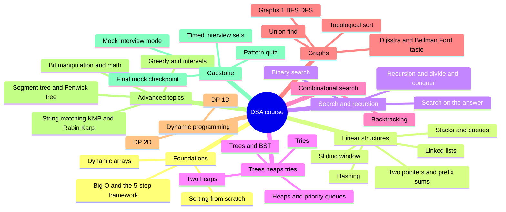

# 22 — Capstone Summary · Course Coverage Map

This SUMMARY is different from every other module's: it is the map of
the WHOLE course, not just this one. Use it as your final review sheet
and as the answer key to "which module do I revisit" when a pattern
quiz question or mock interview goes wrong.

## 1. Course coverage map

Every topic in the NeetCode beginner + advanced canon, traced back to
the module and exercises that drilled it.

| Interview topic | Module | Key exercises |
| --- | --- | --- |
| Big-O from code, amortized cost, 5-step framework | 01 | `ex01_growth_rates`, `ex02_count_ops`, `ex05_target_pair` |
| Dynamic arrays, in-place ops | 02 | `ex01_dynamic_array`, `ex02_reverse_in_place`, `ex03_remove_in_place` |
| Hash counting / grouping / complement lookup | 03 | `ex01_first_unique`, `ex02_pair_sum`, `ex03_group_anagrams` |
| Build a hash map from scratch | 03 | `ex06_build_hash_map` |
| Two pointers (opposite-ends, same-direction) | 04 | `ex01_sorted_pair_target`, `ex02_valid_palindrome`, `ex04_triplet_sum` |
| Prefix sums & range queries | 04 | `ex06_prefix_ranges`, `ex07_subarray_sum_k` |
| Fixed sliding window | 05 | `ex01_fixed_window_stats`, `ex06_window_anagram` |
| Variable sliding window | 05 | `ex03_longest_unique_run`, `ex05_smallest_window_sum`, `ex07_min_cover_window` |
| Build stack & queue; matching/nesting | 06 | `ex01_build_stack_queue`, `ex02_balanced_brackets` |
| Monotonic stack | 06 | `ex06_monotonic_warm_days`, `ex07_histogram_max_rect` |
| Linked lists, reversal, fast/slow pointers | 07 | `ex02_reverse_list`, `ex03_fast_slow` |
| LRU cache capstone | 07 | `ex07_lru_cache` |
| Recursion, call trees, divide & conquer | 08 | `ex03_fast_pow`, `ex05_merge_count_inversions` |
| Merge sort, quick sort, quickselect from scratch | 09 | `ex02_merge_sort`, `ex03_quick_sort`, `ex04_quickselect` |
| Binary search template, first/last occurrence | 10 | `ex01_classic_search`, `ex02_boundaries` |
| Search on the answer, rotated arrays | 10 | `ex03_rotated_search`, `ex04_rate_on_answer`, `ex05_capacity_on_answer` |
| BST build/insert/delete/validate; traversals | 11 | `ex01_build_bst`, `ex03_traversals` |
| Tree metrics (depth, diameter, LCA) | 11 | `ex04_tree_metrics` |
| Build a binary min-heap; heap sort | 12 | `ex01_build_min_heap`, `ex02_heap_sort` |
| Top-k, k-closest, kth-largest stream | 12 | `ex03_top_k_frequent`, `ex04_k_closest_points`, `ex05_kth_largest_stream` |
| Two heaps (running median); merge k sorted | 12 | `ex06_running_median`, `ex07_merge_k_sorted` |
| Build a trie; prefix search | 13 | `ex01_build_trie`, `ex02_wildcard_dictionary`, `ex03_prefix_counts` |
| Backtracking: subsets, combos, permutations | 14 | `ex01_subsets_drill`, `ex02_combo_sum`, `ex03_permutations_drill` |
| Backtracking: grid search, N-queens, pruning | 14 | `ex05_grid_word_search`, `ex07_n_queens` |
| Graph representations; DFS/BFS basics | 15 | `ex01_graph_repr`, `ex02_dfs_bfs_basics` |
| Islands / flood fill; multi-source BFS | 15 | `ex03_island_count`, `ex05_infection_spread` |
| Graph cloning; bipartite check | 15 | `ex06_clone_graph`, `ex07_bipartite_check` |
| Topological sort (Kahn's, cycle detection) | 16 | `ex01_topo_sort` |
| Build union-find (rank + path compression) | 16 | `ex02_build_union_find`, `ex03_redundant_link` |
| Minimum spanning tree (Kruskal, Prim) | 16 | `ex04_kruskal_mst`, `ex05_prim_connect_points` |
| Dijkstra; Bellman-Ford taste (k-stops) | 16 | `ex06_dijkstra_delivery`, `ex07_k_stops_cheapest` |
| Greedy reasoning, Kadane's | 17 | `ex01_kadane_max_run`, `ex02_jump_reach`, `ex03_fuel_circuit` |
| Interval patterns (merge, schedule, min rooms) | 17 | `ex05_merge_intervals`, `ex06_interval_scheduling`, `ex07_min_arrows` |
| DP-1D: stairs, robber, coin change, decode ways | 18 | `ex01_stairs_framework`, `ex03_robber_houses`, `ex04_coin_min` |
| DP-1D: LIS (O(n^2) then O(n log n)) | 18 | `ex07_longest_rising` |
| DP-2D: grid paths, LCS, edit distance | 19 | `ex01_grid_paths`, `ex02_common_subsequence`, `ex03_edit_distance` |
| DP-2D: 0/1 and unbounded knapsack, target sum | 19 | `ex04_knapsack_01`, `ex05_knapsack_unbounded`, `ex06_target_sum_ways` |
| Palindromic substrings (expand vs DP) | 19 | `ex07_palindrome_dp` |
| Bit tricks, XOR, essential math (gcd, sieve) | 20 | `ex02_xor_tricks`, `ex03_bit_tables`, `ex04_math_essentials` |
| Build a segment tree and a Fenwick tree | 21 | `ex01_build_segment_tree`, `ex03_build_fenwick` |
| Monotonic deque (sliding-window maximum) | 21 | `ex04_window_max_deque` |
| String matching (Rabin-Karp, KMP) | 21 | `ex05_rabin_karp`, `ex06_kmp_search` |

Every one of the topics above is rehearsed **unlabeled** in this
module's timed sets (`ex01`-`ex03`), the pattern quiz (`ex04`), and the
`checkpoint_22` final mock that gates the course.

## 2. Condensed cue map

| Pattern | Quick cue | Example problem shape |
| --- | --- | --- |
| hash-map/set | "count", "seen before", "group by" | how many times does X repeat |
| two-pointers | "sorted", "pair/triplet sums to target" | two sorted values meet a target |
| fixed-window | "exactly k consecutive" | best sum/average over k items |
| variable-window | "longest/shortest satisfying X" | longest run with at most k distinct |
| prefix-sums | "subarray sums to k", negatives allowed | count ranges with an exact total |
| monotonic-stack | "next greater/smaller", "until taller" | span until a bigger element appears |
| stack/queue | "nested", "matching", "undo" | balanced brackets |
| binary-search | "sorted", "find position", "minimize max" | leftmost/rightmost occurrence |
| BFS | "shortest path", "fewest moves", unweighted | maze / grid shortest route |
| DFS/backtracking | "generate all", "every configuration" | subsets, permutations, N-queens |
| heap/priority-queue | "top-k", "kth largest", "merge k sorted" | k most frequent |
| topological-sort | "prerequisite", "build order", "dependency" | course schedule, install order |
| union-find | "dynamic connectivity", "same group over time" | are X and Y connected now |
| greedy | "interval scheduling", "min rooms", provable local choice | max non-overlapping meetings |
| DP-1D | "count ways", "1-D optimum", choices build on smaller choices | coin change, climbing stairs |
| DP-2D | "two sequences", "grid path", "capacity limit" | edit distance, knapsack |
| Dijkstra | "cheapest path", weighted, non-negative | network delay, toll cost |
| segment-tree | "range query" AND "updates", both must be fast | range sum with corrections |
| trie | "word prefix", "autocomplete", "dictionary" | search-bar suggestions |
| two-heaps | "running median", "live middle value" | median of a live stream |

## 3. What next

- **Keep a problem journal.** Every new problem: date, source,
  difficulty, pattern used, time taken, what you missed. Review weekly.
- **Spaced repetition beats cramming.** Re-run this module's `ex04`
  quiz cold every couple of weeks; if a label doesn't surface in 5
  seconds, that pattern needs a fresh drill session in its module.
- **Harder platforms.** Once these sets feel comfortable, move to
  LeetCode Hard, NeetCode's full list, or a timed contest (Codeforces
  Div 3/2) to add real time pressure.
- **Mock interviews regularly.** Ask your instructor to "run a mock
  interview" weekly, or practice with a peer — saying the ritual out
  loud is a different skill than thinking it silently.
- **Log every miss in `NOTES.md`** — the misconception, not just the
  bug. Recognition mistakes (wrong pattern) matter more than syntax
  slips for interview prep.

## 4. The complete course mindmap

*What to notice: the course reads left to right as increasing
structural weight — plain loops, then two-input structures, then
trees and graphs, then optimization (DP, greedy) — and the capstone
sits at the far right because it needs every branch behind it.*

## 5. Self-quiz (10 mixed questions)

1. Why is a sorted-input two-pointer sweep O(n) instead of O(n^2), and
   what does it require of the array that hashing doesn't?
2. A subarray-sum problem allows negative numbers. Why does that rule
   out a plain sliding window, and what technique replaces it?
3. What's the difference between what a min-heap of size k gives you
   for "top-k largest" versus a max-heap of size k — and why is it
   backwards from what people expect?
4. In Kahn's topological sort, what does it mean if the final order
   has fewer nodes than the graph?
5. When would you reach for Dijkstra instead of plain BFS, and what
   breaks if you use BFS on a weighted graph?
6. State the 0/1 knapsack recurrence in one sentence: what does
   `dp[i][cap]` represent, and what are its two choices?
7. Why does building a heap via `heapify` cost O(n) instead of
   O(n log n) like pushing one at a time?
8. What invariant do the two heaps in a running-median tracker
   maintain, and why does that guarantee O(1) reads?
9. A problem says "minimum number of edits to turn string A into
   string B." Restate why this needs 2-D state instead of 1-D.
10. Give one interview cue that should make you suspect a Fenwick
    tree or segment tree over a plain prefix-sum array.

Answers

1. Sorted input lets you discard a whole side of the search space each
   step (if the sum's too small, the low end can only get bigger by
   moving right; too big, the high end can only get smaller). Hashing
   doesn't need sorted input but costs O(n) extra space; two pointers
   need the sort (or already-sorted input) but run in O(1) space.
2. A sliding window relies on shrinking from the left always making
   the running total move in one predictable direction. Negative
   values break that monotonicity — shrinking could make the sum go
   up. Prefix sums + a hash map of seen sums replaces it, since it
   doesn't depend on monotonic growth.
3. A min-heap of size k for "top-k largest" keeps the WORST of your
   current top-k at the root — the exact item to evict the instant
   something better arrives. A max-heap of size k would put the BEST
   item at the root, which is useless for deciding what to kick out.
   It feels backwards because you'd naively reach for a max-heap when
   you want "largest."
4. It means a cycle exists — nodes inside the cycle never reach
   in-degree zero, so they're never enqueued and never appear in the
   output.
5. Dijkstra when edges have non-negative weights and you need the
   actual cheapest path, not just fewest edges. Plain BFS on a
   weighted graph finds the path with the FEWEST edges, which is not
   necessarily the cheapest one if edge weights differ.
6. `dp[i][cap]` = the best total value achievable using items
   `0..i-1` within weight budget `cap`. Its two choices: skip item i
   (`dp[i-1][cap]`), or take it if it fits (`dp[i-1][cap-weight] + value`) —
   take the max of the two.
7. Because most nodes in a complete tree sit near the leaves, where a
   sift-down barely moves; only the handful of nodes near the root can
   sift the full O(log n) levels, and summing that imbalance across the
   whole tree telescopes to O(n).
8. A max-heap holds the smaller half, a min-heap holds the larger half,
   and their sizes are kept within 1 of each other. The median is
   therefore always sitting at one heap's top (or the average of both
   tops), so no scan or sort is needed to read it.
9. Because the answer at position `(i, j)` depends on BOTH how much of
   string A and how much of string B has been consumed so far — a
   single index can't capture "progress through two independent
   sequences at once," so the state needs two dimensions.
10. "Range query" (sum/min/max over a range) **combined with** frequent
    point updates. A plain prefix-sum array answers range queries in
    O(1) but needs O(n) to rebuild after an update — a segment tree or
    Fenwick tree keeps BOTH operations at O(log n).

## 6. Pattern-recognition drill — the hardest disambiguations

These are the mix-ups that trip people up even after finishing the
whole course. Name the pattern before opening the answer.

1. "Find the longest subarray with sum at most k, ALL VALUES POSITIVE." Window or prefix+hash?

**Variable window.** All-positive means shrinking from the left always
decreases the running sum — the monotonicity a window needs. O(n)
time, O(1) space; prefix+hash would work too but wastes O(n) space for
no benefit here.

2. "Count subarrays whose sum equals k. Values may be negative." Window or prefix+hash?

**Prefix sums + hash map.** Negative values break the window's
shrink-only-decreases-the-sum assumption. Track `prefix_sum[j] -
prefix_sum[i] == k` via a hash map of prefix sums seen so far.

3. "Minimum cost to connect every city with new roads." Dijkstra or greedy (MST)?

**Greedy — Kruskal's or Prim's (Minimum Spanning Tree).** Dijkstra
finds shortest paths from ONE source to every other node; MST connects
ALL nodes as cheaply as possible with no "from a source" framing —
different objective entirely.

4. "Fewest coin denominations to make change for amount N, coins reusable." Greedy or DP?

**DP-1D.** Greedy (always take the largest denomination) fails for
non-canonical coin systems, e.g. coins `[1, 3, 4]` and target `6` —
greedy picks `4+1+1` (3 coins) but the optimum is `3+3` (2 coins). DP
checks every combination's subproblem instead of committing early.

5. "Shortest path in a grid, but some cells cost more to enter than others." BFS or Dijkstra?

**Dijkstra** (or 0-1 BFS if costs are only 0 or 1). Plain BFS assumes
every step costs the same and only minimizes the NUMBER of steps —
wrong objective the moment costs vary.

6. "Generate every way to partition a string into palindromic pieces." Backtracking or DP?

**Backtracking (DFS).** The problem asks for ALL valid partitions
(enumeration), not a single count or optimum — DP is for counting/
optimizing, not for producing every configuration. (A DP table can
still help by precomputing "is this substring a palindrome" in O(1)
per check, but the enumeration itself is backtracking.)

7. "Count the number of DISTINCT ways to partition a string into palindromic pieces." Backtracking or DP?

**DP-1D** (or memoized recursion). This time it only asks for a COUNT,
not the actual partitions — no need to materialize every path, so
backtracking's exponential enumeration is wasted work; a DP over
string positions counts directly.

8. "Largest rectangle you can fit under a histogram skyline." Two-pointers or monotonic-stack?

**Monotonic stack.** Two-pointers has no notion of "the nearest bar to
the left/right that's shorter than me," which is exactly what the
monotonic stack tracks in O(n) total by pushing/popping each bar once.

9. "Are two given warehouses in the same delivery zone, and this gets asked repeatedly as new roads are built?" BFS/DFS each time, or union-find?

**Union-find.** Re-running BFS/DFS per query costs O(V+E) every time;
union-find answers each query in close to O(1) after incorporating
each new road in close to O(1) — built exactly for "connectivity
questions over time," not one-shot connectivity.

10. "Minimum number of intervals to remove so the rest don't overlap." Greedy or DP?

**Greedy.** Sort by end time, greedily keep whichever interval ends
earliest whenever a choice is possible. A DP solution exists (O(n^2))
but is strictly worse than the O(n log n) greedy, and the greedy is
provably optimal via an exchange argument (swapping any kept interval
for the earliest-ending one available never makes the schedule worse).

